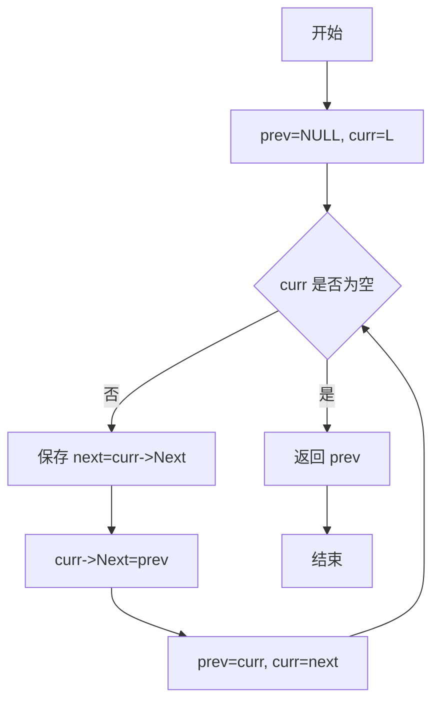
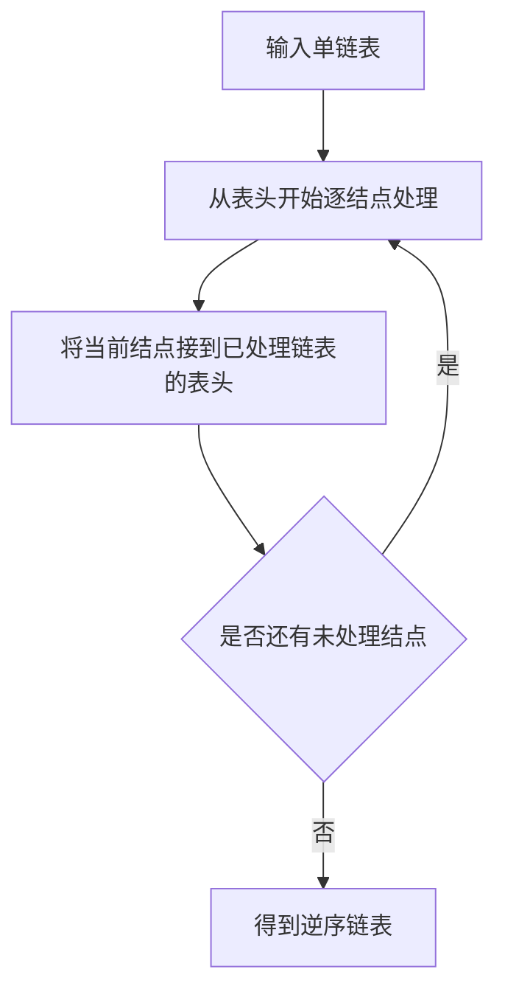

# 6-1 单链表逆转

- **分值：** 20分

## 题目描述

本题要求实现一个函数，将给定的单链表逆转。

## 函数接口定义
```c
List Reverse( List L );
```

其中`List`结构定义如下：

```c
typedef struct Node *PtrToNode;
struct Node {
    ElementType Data; /* 存储结点数据 */
    PtrToNode   Next; /* 指向下一个结点的指针 */
};
typedef PtrToNode List; /* 定义单链表类型 */
```

`L`是给定单链表，函数`Reverse`要返回被逆转后的链表。

## 裁判测试程序样例
```c
#include <stdio.h>
#include <stdlib.h>

typedef int ElementType;
typedef struct Node *PtrToNode;
struct Node {
    ElementType Data;
    PtrToNode   Next;
};
typedef PtrToNode List;

List Read(); /* 细节在此不表 */
void Print( List L ); /* 细节在此不表 */

List Reverse( List L );

int main()
{
    List L1, L2;
    L1 = Read();
    L2 = Reverse(L1);
    Print(L1);
    Print(L2);
    return 0;
}

/* 你的代码将被嵌在这里 */
```

## 输入样例
```
5
1 3 4 5 2
```

## 输出样例
```
1
2 5 4 3 1
```

### 函数部分

```c
List Reverse(List L)
{
    List prev = NULL;
    List curr = L;

    while (curr != NULL) {
        List next = curr->Next;
        curr->Next = prev;
        prev = curr;
        curr = next;
    }
    return prev;
}
```

### 解题思路

使用三个指针从头到尾遍历链表：`prev` 指向已经逆转的部分，`curr` 指向当前结点，`next` 暂存当前结点的后继。每次先保存后继，再把当前结点指向 `prev`，随后三个指针依次向后移动。遍历结束时，`prev` 就是逆转后的表头。时间复杂度为 `O(n)`，空间复杂度为 `O(1)`。

### 代码流程说明

1. 初始化 `prev = NULL`，`curr = L`。
2. 当 `curr` 不为空时，保存 `curr->Next`。
3. 将 `curr->Next` 改为 `prev`，完成当前指针的逆转。
4. 令 `prev = curr`、`curr = next`，继续处理下一个结点。
5. `curr` 为空时返回 `prev`。

### 代码流程图



### 解题流程图


