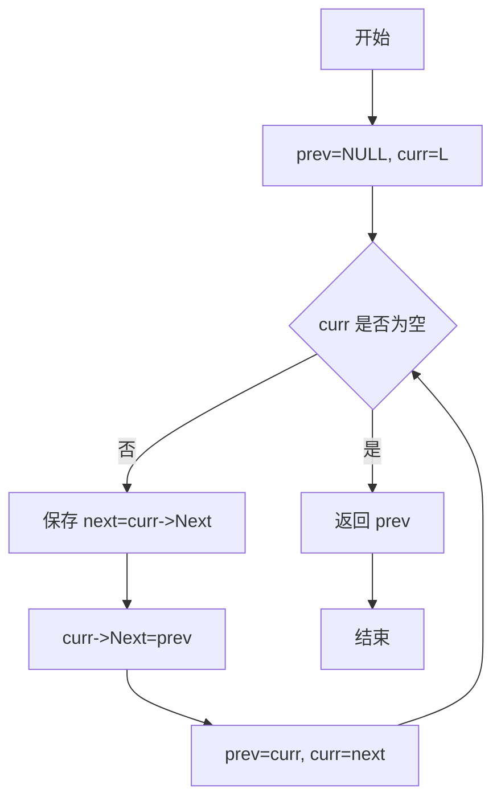
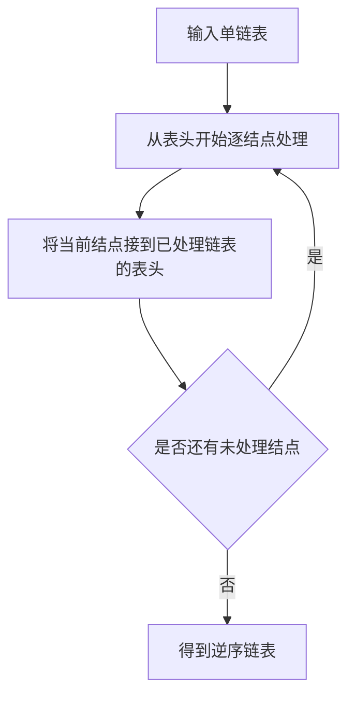

## 6-1 单链表逆转

- **分值：** 20分

## 题目描述

本题要求实现一个函数，将给定的单链表逆转。

## 函数接口定义
```javascript
// JavaScript 函数接口：返回逆转后的链表头结点
function Reverse(L) {
  /* 由考生实现 */
}
```

其中`List`结构定义如下：

```javascript
// 链表结点用对象表示，Next 为 null 表示链尾。
class Node {
  constructor(data, next = null) {
    this.Data = data;
    this.Next = next;
  }
}
// List 就是 Node | null。
```

`L`是给定单链表，函数`Reverse`要返回被逆转后的链表。

## 裁判测试程序样例
```javascript
const values = [1, 3, 4, 5, 2];
let L1 = null;
for (let i = values.length - 1; i >= 0; i--) L1 = new Node(values[i], L1);
const L2 = Reverse(L1);
console.log(values.join(" "));
const result = [];
for (let p = L2; p; p = p.Next) result.push(p.Data);
console.log(result.join(" "));
```

## 输入样例
```
5
1 3 4 5 2
```

## 输出样例
```
1
2 5 4 3 1
```

## 函数部分

```javascript
// 三指针原地反转：先保存后继，再改变当前结点的指向。
function Reverse(L) {
  let previous = null;
  let current = L;
  while (current !== null) {
    const next = current.Next;
    current.Next = previous;
    previous = current;
    current = next;
  }
  return previous;
}
```

## 解题思路

使用三个指针从头到尾遍历链表：`prev` 指向已经逆转的部分，`curr` 指向当前结点，`next` 暂存当前结点的后继。每次先保存后继，再把当前结点指向 `prev`，随后三个指针依次向后移动。遍历结束时，`prev` 就是逆转后的表头。时间复杂度为 `O(n)`，空间复杂度为 `O(1)`。

## 代码流程说明

1. 初始化 `prev = NULL`，`curr = L`。
2. 当 `curr` 不为空时，保存 `curr->Next`。
3. 将 `curr->Next` 改为 `prev`，完成当前指针的逆转。
4. 令 `prev = curr`、`curr = next`，继续处理下一个结点。
5. `curr` 为空时返回 `prev`。

## 代码流程图



## 解题流程图


