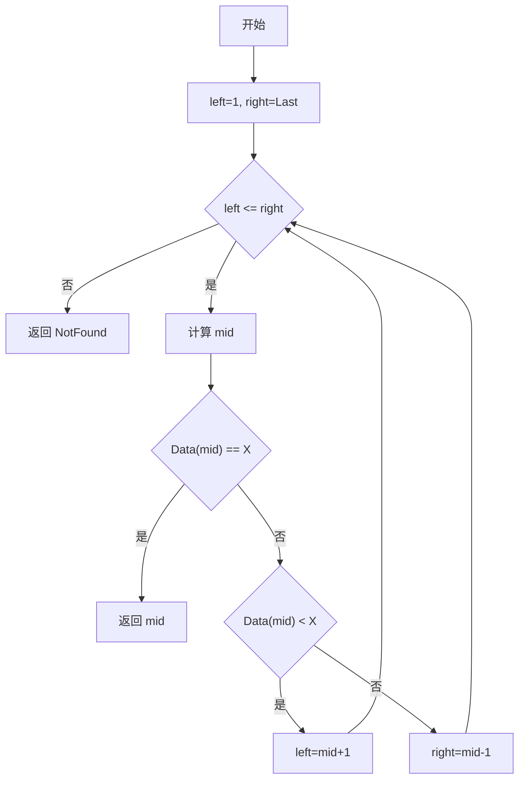
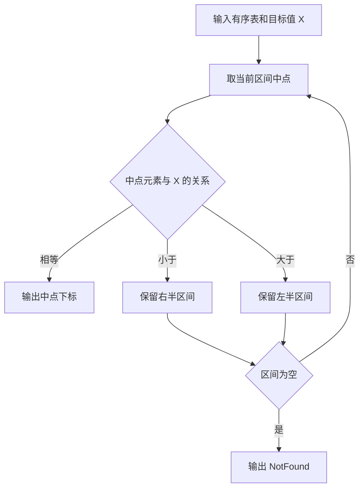

## 6-10 二分查找

- **分值：** 20分

## 题目描述

本题要求实现二分查找算法。

## 函数接口定义
```javascript
// JavaScript 函数接口
function BinarySearch(List, TableSize, X) {}
```

其中`List`结构定义如下：

```javascript
// List 为已按升序排列的数组；未找到时返回 -1。
```

`L`是用户传入的一个线性表，其中`ElementType`元素可以通过>、==、<进行比较，并且题目保证传入的数据是递增有序的。函数`BinarySearch`要查找`X`在`Data`中的位置，即数组下标（注意：元素从下标1开始存储）。找到则返回下标，否则返回一个特殊的失败标记`NotFound`。

## 裁判测试程序样例
```javascript
console.log(BinarySearch([null, 1, 3, 5, 7, 9], 5, 7));
```

## 输入样例
```
5
12 31 55 89 101
31
```

## 输出样例
```
2
```

## 输入样例
```
3
26 78 233
31
```

## 输出样例
```
0
```

**鸣谢宁波大学 Eyre-lemon-郎俊杰 同学修正原题！**

## 函数部分

```javascript
// 每轮将查找区间折半，比较中点后只保留可能包含 X 的一半。
function BinarySearch(List, TableSize, X) {
  let left = 1,
    right = TableSize;
  while (left <= right) {
    const mid = Math.floor((left + right) / 2);
    if (List[mid] === X) return mid;
    if (List[mid] < X) left = mid + 1;
    else right = mid - 1;
  }
  return NotFound;
}
const NotFound = -1;
```

## 解题思路

由于顺序表已经按递增顺序排列，可以使用二分查找。维护闭区间 `[left, right]`，每轮比较中间元素：相等则返回下标，目标更大时舍弃左半部分，目标更小时舍弃右半部分。题目规定有效数据从下标 1 开始，因此初始左边界为 1，右边界为 `Last`。时间复杂度为 `O(log n)`，空间复杂度为 `O(1)`。

## 代码流程说明

1. 将 `left` 设为 1，`right` 设为最后一个有效下标。
2. 当查找区间非空时计算中点 `mid`。
3. 若中点元素等于 `X`，返回 `mid`。
4. 若中点元素小于 `X`，令 `left = mid + 1`；否则令 `right = mid - 1`。
5. 区间为空仍未找到时返回 `NotFound`。

## 代码流程图



## 解题流程图


