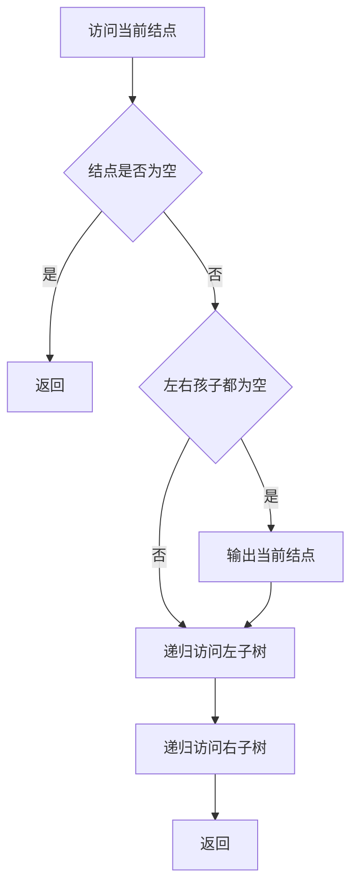
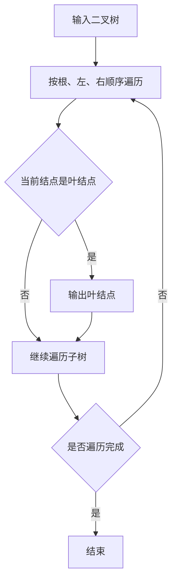

本题要求按照先序遍历的顺序输出给定二叉树的叶结点。

函数接口定义：
```c++
void PreorderPrintLeaves( BinTree BT );
```

其中BinTree结构定义如下：
```c++
typedef struct TNode *Position;
typedef Position BinTree;
struct TNode{
    ElementType Data;
    BinTree Left;
    BinTree Right;
};
```

函数PreorderPrintLeaves应按照先序遍历的顺序输出给定二叉树BT的叶结点，格式为一个空格跟着一个字符。

裁判测试程序样例：
```c++
#include <stdio.h>
#include <stdlib.h>

typedef char ElementType;
typedef struct TNode *Position;
typedef Position BinTree;
struct TNode{
    ElementType Data;
    BinTree Left;
    BinTree Right;
};

BinTree CreatBinTree(); /* 实现细节忽略 */
void PreorderPrintLeaves( BinTree BT );

int main()
{
    BinTree BT = CreatBinTree();
    printf("Leaf nodes are:");
    PreorderPrintLeaves(BT);
    printf("\n");

    return 0;
}
/* 你的代码将被嵌在这里 */
```
输出样例（对于图中给出的树）：


```out
Leaf nodes are: D E H I
```

### 函数部分

```c
void PreorderPrintLeaves(BinTree BT)
{
    if (BT == NULL)
        return;
    if (BT->Left == NULL && BT->Right == NULL)
        printf(" %c", BT->Data);
    PreorderPrintLeaves(BT->Left);
    PreorderPrintLeaves(BT->Right);
}
```

### 解题思路

按先序顺序访问二叉树，即“根、左、右”。访问当前结点时，若其左右孩子都为空，则它是叶结点，输出其数据；否则继续递归访问左右子树。每个结点只访问一次，时间复杂度为 `O(n)`，递归栈空间复杂度为 `O(h)`。

### 代码流程说明

1. 当前指针为空时返回。
2. 判断当前结点是否同时没有左右孩子，是则输出一个前导空格和结点数据。
3. 递归处理左子树，再递归处理右子树，从而保证叶结点输出符合先序顺序。

### 代码流程图



### 解题流程图


