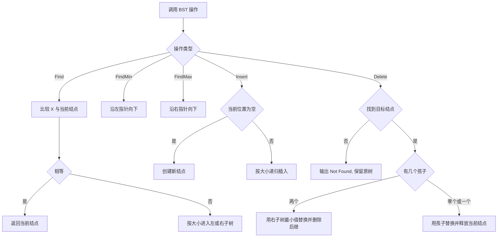
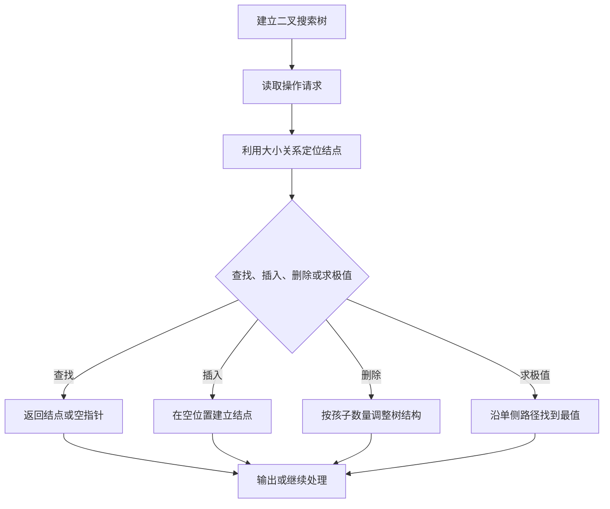

## 6-12 二叉搜索树的操作集

- **分值：** 30分

## 题目描述

本题要求实现给定二叉搜索树的5种常用操作。

## 函数接口定义
```javascript
// JavaScript 函数接口
function Insert(BST, X) {}
function Delete(BST, X) {}
function Find(BST, X) {}
function FindMin(BST) {}
function FindMax(BST) {}
```

其中`BinTree`结构定义如下：

```javascript
class TreeNode {
  constructor(data, left = null, right = null) {
    this.Data = data;
    this.Left = left;
    this.Right = right;
  }
}
// BinTree / Position 都是 TreeNode | null。
```

- 函数`Insert`将`X`插入二叉搜索树`BST`并返回结果树的根结点指针；
- 函数`Delete`将`X`从二叉搜索树`BST`中删除，并返回结果树的根结点指针；如果`X`不在树中，则打印一行`Not Found`并返回原树的根结点指针；
- 函数`Find`在二叉搜索树`BST`中找到`X`，返回该结点的指针；如果找不到则返回空指针；
- 函数`FindMin`返回二叉搜索树`BST`中最小元结点的指针；
- 函数`FindMax`返回二叉搜索树`BST`中最大元结点的指针。

## 裁判测试程序样例
```javascript
let BST = null;
for (const x of [5, 8, 6, 2, 4, 1, 0, 10, 9, 7]) BST = Insert(BST, x);
console.log(`Preorder: ${preorder(BST).join(" ")}`);
console.log(Find(BST, 6)?.Data ?? "6 is not found");
BST = Delete(BST, 5);
console.log(`Inorder: ${inorder(BST).join(" ")}`);
function preorder(node) {
  return node
    ? [node.Data, ...preorder(node.Left), ...preorder(node.Right)]
    : [];
}
function inorder(node) {
  return node ? [...inorder(node.Left), node.Data, ...inorder(node.Right)] : [];
}
```

## 输入样例
```
10
5 8 6 2 4 1 0 10 9 7
5
6 3 10 0 5
5
5 7 0 10 3
```

## 输出样例
```
Preorder: 5 2 1 0 4 8 6 7 10 9
6 is found
3 is not found
10 is found
10 is the largest key
0 is found
0 is the smallest key
5 is found
Not Found
Inorder: 1 2 4 6 8 9
```

## 函数部分

```javascript
// BST 的大小关系决定查找方向；删除双孩子结点时用右子树最小结点替换。
function Find(BST, X) {
  while (BST) {
    if (X === BST.Data) return BST;
    BST = X < BST.Data ? BST.Left : BST.Right;
  }
  return null;
}
function FindMin(BST) {
  if (!BST) return null;
  while (BST.Left) BST = BST.Left;
  return BST;
}
function FindMax(BST) {
  if (!BST) return null;
  while (BST.Right) BST = BST.Right;
  return BST;
}
function Insert(BST, X) {
  if (!BST) return new TreeNode(X);
  if (X < BST.Data) BST.Left = Insert(BST.Left, X);
  else if (X > BST.Data) BST.Right = Insert(BST.Right, X);
  return BST;
}
function Delete(BST, X) {
  if (!BST) {
    console.log("Not Found");
    return null;
  }
  if (X < BST.Data) BST.Left = Delete(BST.Left, X);
  else if (X > BST.Data) BST.Right = Delete(BST.Right, X);
  else if (BST.Left && BST.Right) {
    const next = FindMin(BST.Right);
    BST.Data = next.Data;
    BST.Right = removeMin(BST.Right);
  } else return BST.Left || BST.Right;
  return BST;
}
function removeMin(node) {
  if (!node.Left) return node.Right;
  node.Left = removeMin(node.Left);
  return node;
}
```

## 解题思路

二叉搜索树满足左子树所有关键字小于根、右子树所有关键字大于根，因此查找、插入、求最小值和求最大值都可以沿一条路径完成。删除时分三种情况：叶结点直接删除；只有一个孩子时让孩子顶替当前结点；有两个孩子时使用右子树的最小结点（中序后继）替换当前数据，再删除这个后继。插入遇到重复值时不重复建立结点。平均时间复杂度为 `O(log n)`，退化时为 `O(n)`。

## 代码流程说明

1. `Find` 比较 `X` 与当前结点，按大小递归进入左子树或右子树。
2. `FindMin` 沿左指针走到尽头，`FindMax` 沿右指针走到尽头。
3. `Insert` 找到空位置后申请新结点，并将递归结果重新接回父结点。
4. `Delete` 先定位目标；无孩子或只有一个孩子时直接调整指针，有两个孩子时复制后继数据并删除后继。
5. 删除查找路径上的空位置时输出 `Not Found`；沿递归返回值重新连接子树，保持原树结构。

## 代码流程图



## 解题流程图


