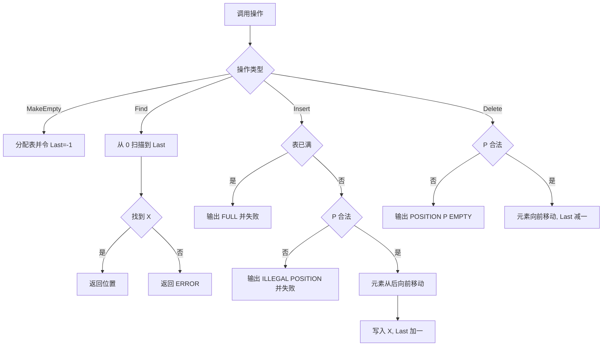
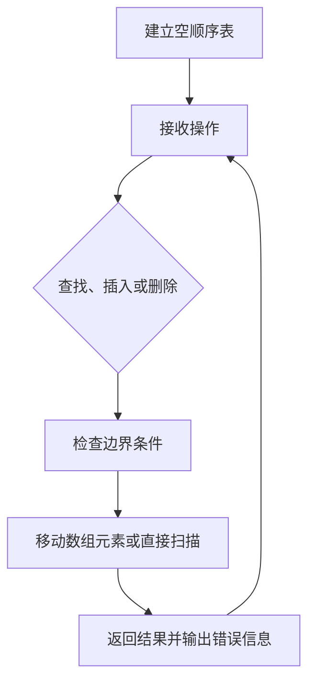

本题要求实现顺序表的操作集。

函数接口定义：
```c++
List MakeEmpty(); 
Position Find( List L, ElementType X );
bool Insert( List L, ElementType X, Position P );
bool Delete( List L, Position P );
```

其中List结构定义如下：
```c++
typedef int Position;
typedef struct LNode *List;
struct LNode {
    ElementType Data[MAXSIZE];
    Position Last; /* 保存线性表中最后一个元素的位置 */
};
```

各个操作函数的定义为：

List MakeEmpty()：创建并返回一个空的线性表；

Position Find( List L, ElementType X )：返回线性表中X的位置。若找不到则返回ERROR；

bool Insert( List L, ElementType X, Position P )：将X插入在位置P并返回true。若空间已满，则打印“FULL”并返回false；否则，如果参数P指向非法位置，则打印“ILLEGAL POSITION”并返回false；

bool Delete( List L, Position P )：将位置P的元素删除并返回true。若参数P指向非法位置，则打印“POSITION P EMPTY”（其中P是参数值）并返回false。

裁判测试程序样例：
```c++
#include <stdio.h>
#include <stdlib.h>

#define MAXSIZE 5
#define ERROR -1
typedef enum {false, true} bool;
typedef int ElementType;
typedef int Position;
typedef struct LNode *List;
struct LNode {
    ElementType Data[MAXSIZE];
    Position Last; /* 保存线性表中最后一个元素的位置 */
};

List MakeEmpty(); 
Position Find( List L, ElementType X );
bool Insert( List L, ElementType X, Position P );
bool Delete( List L, Position P );

int main()
{
    List L;
    ElementType X;
    Position P;
    int N;

    L = MakeEmpty();
    scanf("%d", &N);
    while ( N-- ) {
        scanf("%d", &X);
        if ( Insert(L, X, 0)==false )
            printf(" Insertion Error: %d is not in.\n", X);
    }
    scanf("%d", &N);
    while ( N-- ) {
        scanf("%d", &X);
        P = Find(L, X);
        if ( P == ERROR )
            printf("Finding Error: %d is not in.\n", X);
        else
            printf("%d is at position %d.\n", X, P);
    }
    scanf("%d", &N);
    while ( N-- ) {
        scanf("%d", &P);
        if ( Delete(L, P)==false )
            printf(" Deletion Error.\n");
        if ( Insert(L, 0, P)==false )
            printf(" Insertion Error: 0 is not in.\n");
    }
    return 0;
}

/* 你的代码将被嵌在这里 */
```
输入样例：
```in
6
1 2 3 4 5 6
3
6 5 1
2
-1 6
```

输出样例：
```out
FULL Insertion Error: 6 is not in.
Finding Error: 6 is not in.
5 is at position 0.
1 is at position 4.
POSITION -1 EMPTY Deletion Error.
FULL Insertion Error: 0 is not in.
POSITION 6 EMPTY Deletion Error.
FULL Insertion Error: 0 is not in.
```

### 函数部分

```c
List MakeEmpty()
{
    List L = (List)malloc(sizeof(struct LNode));
    L->Last = -1;
    return L;
}

Position Find(List L, ElementType X)
{
    for (Position i = 0; i <= L->Last; i++) {
        if (L->Data[i] == X)
            return i;
    }
    return ERROR;
}

bool Insert(List L, ElementType X, Position P)
{
    if (L->Last + 1 >= MAXSIZE) {
        printf("FULL");
        return false;
    }
    if (P < 0 || P > L->Last + 1) {
        printf("ILLEGAL POSITION");
        return false;
    }
    for (Position i = L->Last; i >= P; i--)
        L->Data[i + 1] = L->Data[i];
    L->Data[P] = X;
    L->Last++;
    return true;
}

bool Delete(List L, Position P)
{
    if (P < 0 || P > L->Last) {
        printf("POSITION %d EMPTY", P);
        return false;
    }
    for (Position i = P; i < L->Last; i++)
        L->Data[i] = L->Data[i + 1];
    L->Last--;
    return true;
}
```

### 解题思路

顺序表用 `Last` 记录最后一个有效元素的下标，空表时令 `Last = -1`。查找从下标 0 线性扫描；插入时先判断容量和位置合法性，再从后向前移动元素；删除时从被删位置开始，将后续元素依次前移。插入和删除都必须按照对应方向移动，避免覆盖尚未处理的数据。

### 代码流程说明

1. `MakeEmpty` 分配表结构并把 `Last` 初始化为 `-1`。
2. `Find` 遍历 `[0, Last]`，找到 `X` 返回下标，否则返回 `ERROR`。
3. `Insert` 先判断是否满表，再判断 `P` 是否在 `[0, Last + 1]`；从 `Last` 到 `P` 逆序移动，写入 `X` 并更新 `Last`。
4. `Delete` 判断 `P` 是否在 `[0, Last]`；将 `P` 后面的元素前移，最后减小 `Last`。

### 代码流程图



### 解题流程图


