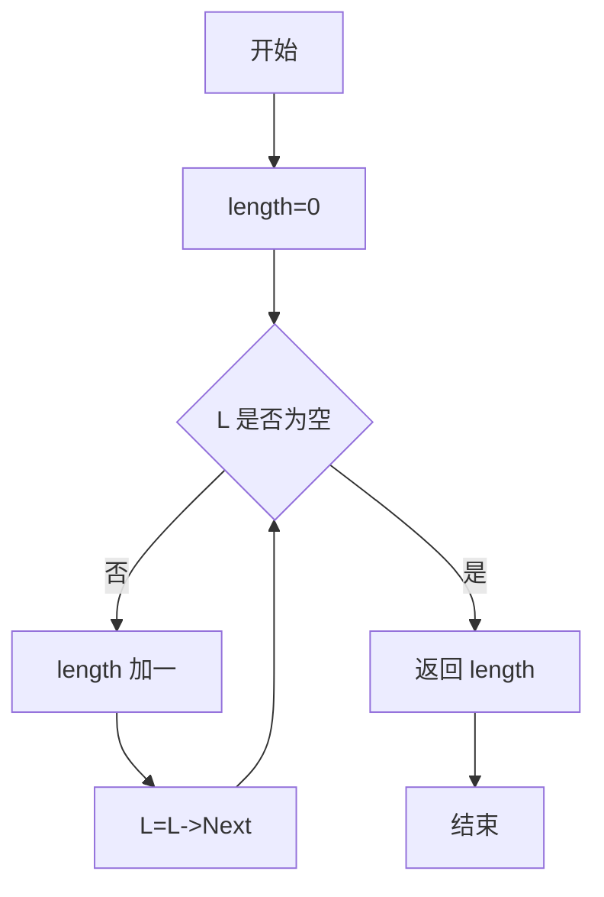
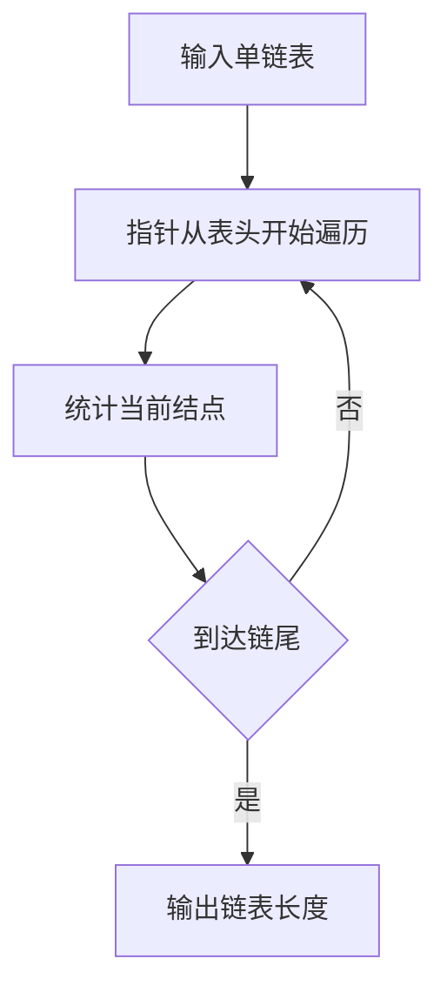

## 6-3 求链式表的表长

- **分值：** 10分

## 题目描述

本题要求实现一个函数，求链式表的表长。

## 函数接口定义
```javascript
// JavaScript 函数接口
function Length(L) {}
```

其中`List`结构定义如下：

```javascript
class Node {
  constructor(data, next = null) {
    this.Data = data;
    this.Next = next;
  }
}
// List 为 Node | null。
```

`L`是给定单链表，函数`Length`要返回链式表的长度。

## 裁判测试程序样例
```javascript
let L = null;
for (const value of [1, 2, 3]) L = new Node(value, L);
console.log(Length(L));
```

## 输入样例
```
1 3 4 5 2 -1
```

## 输出样例
```
5
```

## 函数部分

```javascript
// 沿 Next 指针遍历一次并累计结点数。
function Length(L) {
  let length = 0;
  for (let p = L; p !== null; p = p.Next) length++;
  return length;
}
```

## 解题思路

链表没有连续的下标，长度只能通过遍历结点统计。设置计数器 `length`，从表头开始，每访问一个结点就加 1，直到指针为空。空链表不会进入循环，因此返回 0。

## 代码流程说明

1. 将计数器初始化为 0。
2. 判断当前指针是否为空；不为空则计数并移动到下一个结点。
3. 当前指针为空时，返回计数器。

## 代码流程图



## 解题流程图


