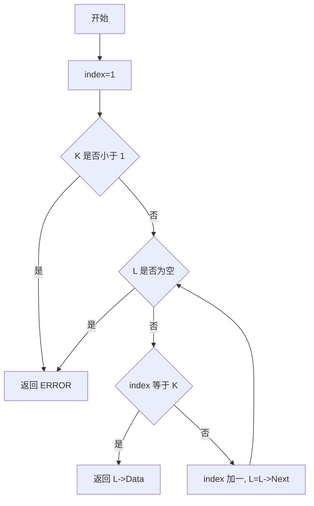
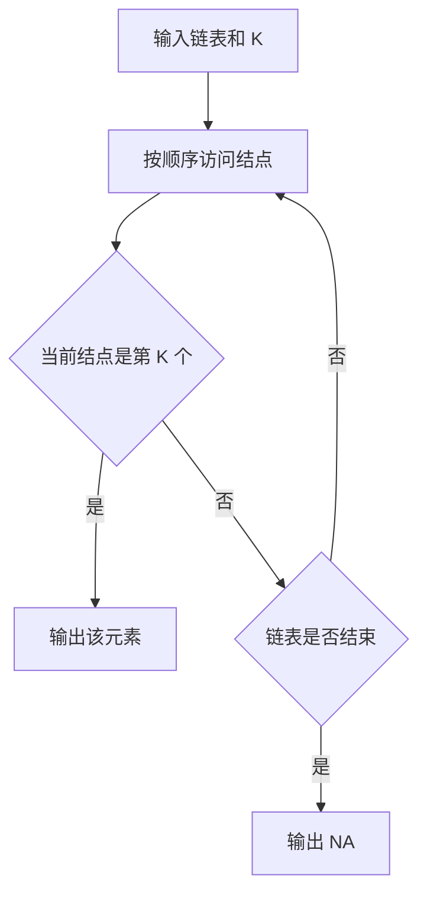

本题要求实现一个函数，找到并返回链式表的第K个元素。

函数接口定义：
```c++
ElementType FindKth( List L, int K );
```
其中List结构定义如下：
```c++
typedef struct LNode *PtrToLNode;
struct LNode {
    ElementType Data;
    PtrToLNode Next;
};
typedef PtrToLNode List;
```

L是给定单链表，函数FindKth要返回链式表的第K个元素。如果该元素不存在，则返回ERROR。

裁判测试程序样例：
```c++
#include <stdio.h>
#include <stdlib.h>

#define ERROR -1
typedef int ElementType;
typedef struct LNode *PtrToLNode;
struct LNode {
    ElementType Data;
    PtrToLNode Next;
};
typedef PtrToLNode List;

List Read(); /* 细节在此不表 */

ElementType FindKth( List L, int K );

int main()
{
    int N, K;
    ElementType X;
    List L = Read();
    scanf("%d", &N);
    while ( N-- ) {
        scanf("%d", &K);
        X = FindKth(L, K);
        if ( X!= ERROR )
            printf("%d ", X);
        else
            printf("NA ");
    }
    return 0;
}

/* 你的代码将被嵌在这里 */
```
输入样例：
```in
1 3 4 5 2 -1
6
3 6 1 5 4 2
```

输出样例：
```out
4 NA 1 2 5 3 
```

### 函数部分

```c
ElementType FindKth(List L, int K)
{
    int index = 1;
    if (K < 1)
        return ERROR;
    while (L != NULL) {
        if (index == K)
            return L->Data;
        index++;
        L = L->Next;
    }
    return ERROR;
}
```

### 解题思路

题目中的结点序号从 1 开始。使用指针遍历链表，同时用 `index` 记录当前结点序号；当 `index == K` 时返回该结点的数据。如果指针先到达空值，说明链表长度不足 `K`，返回 `ERROR`。

### 代码流程说明

1. 将当前序号设为 1，并检查 `K` 是否为合法序号。
2. 遍历链表，比较当前序号与 `K`。
3. 相等时返回当前结点数据；否则序号加一并移动指针。
4. 遍历结束仍未命中时返回 `ERROR`。

### 代码流程图



### 解题流程图


