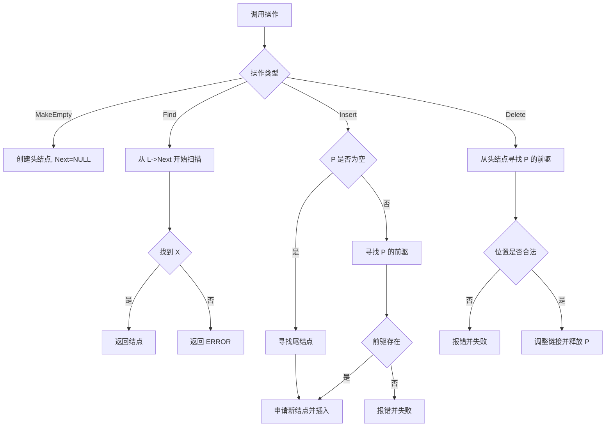
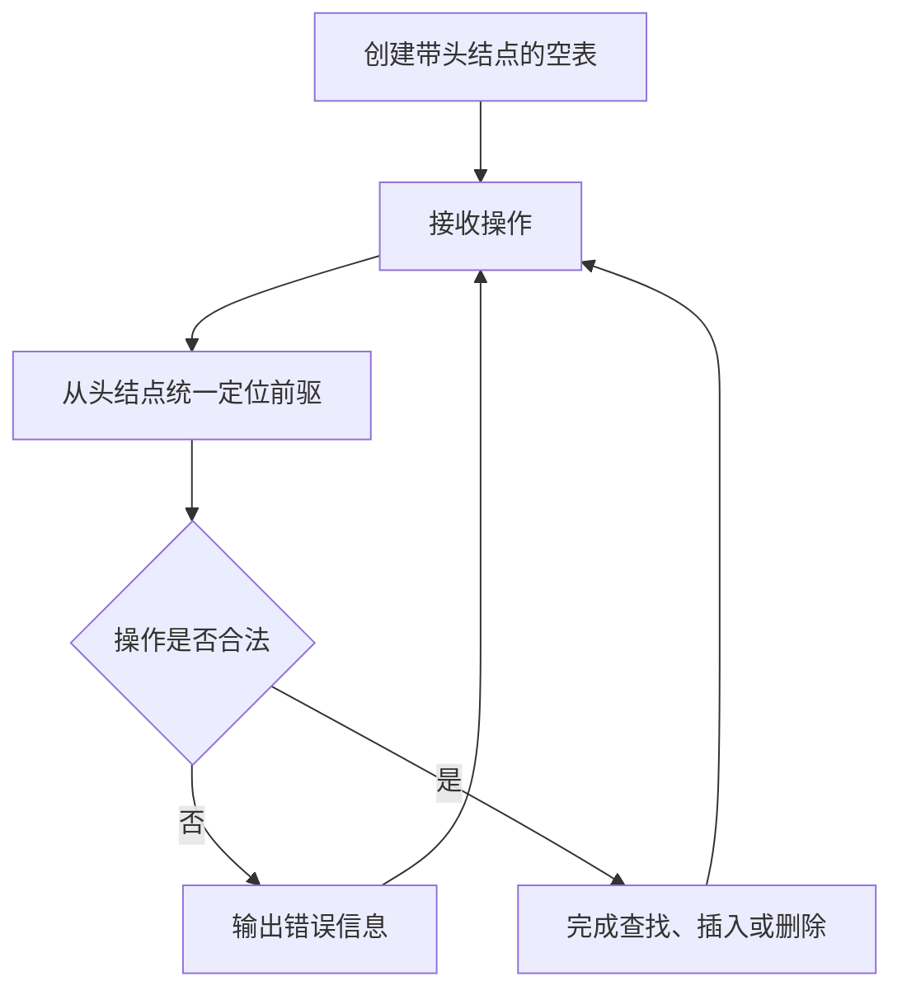

本题要求实现带头结点的链式表操作集。

函数接口定义：
```c++
List MakeEmpty(); 
Position Find( List L, ElementType X );
bool Insert( List L, ElementType X, Position P );
bool Delete( List L, Position P );
```
其中List结构定义如下：
```c++
typedef struct LNode *PtrToLNode;
struct LNode {
    ElementType Data;
    PtrToLNode Next;
};
typedef PtrToLNode Position;
typedef PtrToLNode List;
```
各个操作函数的定义为：

List MakeEmpty()：创建并返回一个空的线性表；

Position Find( List L, ElementType X )：返回线性表中X的位置。若找不到则返回ERROR；

bool Insert( List L, ElementType X, Position P )：将X插入在位置P指向的结点之前，返回true。如果参数P指向非法位置，则打印“Wrong Position for Insertion”，返回false；

bool Delete( List L, Position P )：将位置P的元素删除并返回true。若参数P指向非法位置，则打印“Wrong Position for Deletion”并返回false。

裁判测试程序样例：
```c++
#include <stdio.h>
#include <stdlib.h>

#define ERROR NULL
typedef enum {false, true} bool;
typedef int ElementType;
typedef struct LNode *PtrToLNode;
struct LNode {
    ElementType Data;
    PtrToLNode Next;
};
typedef PtrToLNode Position;
typedef PtrToLNode List;

List MakeEmpty(); 
Position Find( List L, ElementType X );
bool Insert( List L, ElementType X, Position P );
bool Delete( List L, Position P );

int main()
{
    List L;
    ElementType X;
    Position P;
    int N;
    bool flag;

    L = MakeEmpty();
    scanf("%d", &N);
    while ( N-- ) {
        scanf("%d", &X);
        flag = Insert(L, X, L->Next);
        if ( flag==false ) printf("Wrong Answer\n");
    }
    scanf("%d", &N);
    while ( N-- ) {
        scanf("%d", &X);
        P = Find(L, X);
        if ( P == ERROR )
            printf("Finding Error: %d is not in.\n", X);
        else {
            flag = Delete(L, P);
            printf("%d is found and deleted.\n", X);
            if ( flag==false )
                printf("Wrong Answer.\n");
        }
    }
    flag = Insert(L, X, NULL);
    if ( flag==false ) printf("Wrong Answer\n");
    else
        printf("%d is inserted as the last element.\n", X);
    P = (Position)malloc(sizeof(struct LNode));
    flag = Insert(L, X, P);
    if ( flag==true ) printf("Wrong Answer\n");
    flag = Delete(L, P);
    if ( flag==true ) printf("Wrong Answer\n");
    for ( P=L->Next; P; P = P->Next ) printf("%d ", P->Data);
    return 0;
}
/* 你的代码将被嵌在这里 */
```
输入样例：
```in
6
12 2 4 87 10 2
4
2 12 87 5
```

输出样例：
```out
2 is found and deleted.
12 is found and deleted.
87 is found and deleted.
Finding Error: 5 is not in.
5 is inserted as the last element.
Wrong Position for Insertion
Wrong Position for Deletion
10 4 2 5 
```

### 函数部分

```c
List MakeEmpty()
{
    List L = (List)malloc(sizeof(struct LNode));
    L->Next = NULL;
    return L;
}

Position Find(List L, ElementType X)
{
    Position p = L->Next;
    while (p != NULL) {
        if (p->Data == X)
            return p;
        p = p->Next;
    }
    return ERROR;
}

bool Insert(List L, ElementType X, Position P)
{
    Position prev = L;
    if (P != NULL) {
        while (prev != NULL && prev->Next != P)
            prev = prev->Next;
        if (prev == NULL) {
            printf("Wrong Position for Insertion\n");
            return false;
        }
    } else {
        while (prev->Next != NULL)
            prev = prev->Next;
    }

    Position node = (Position)malloc(sizeof(struct LNode));
    node->Data = X;
    node->Next = P;
    prev->Next = node;
    return true;
}

bool Delete(List L, Position P)
{
    Position prev = L;
    while (prev != NULL && prev->Next != P)
        prev = prev->Next;
    if (P == NULL || prev == NULL) {
        printf("Wrong Position for Deletion\n");
        return false;
    }
    prev->Next = P->Next;
    free(P);
    return true;
}
```

### 解题思路

头结点本身不存储有效数据，只负责统一处理表头位置。所有查找都从 `L->Next` 开始；插入和删除都从头结点开始寻找目标位置的前驱，因此不需要为删除首元结点额外修改表头。`P == NULL` 时按题意将元素插入表尾。

### 代码流程说明

1. `MakeEmpty` 分配头结点并令其 `Next` 为空。
2. `Find` 跳过头结点，从第一个有效结点开始查找。
3. `Insert`：指定 `P` 时寻找其前驱；`P == NULL` 时寻找最后一个结点；申请新结点并接入前驱之后。
4. `Delete` 从头结点寻找 `P` 的前驱，确认位置合法后调整链接并释放 `P`。

### 代码流程图



### 解题流程图


