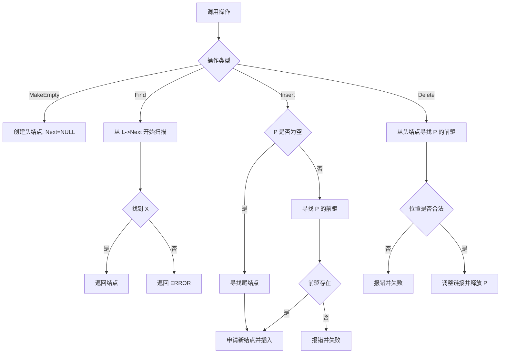
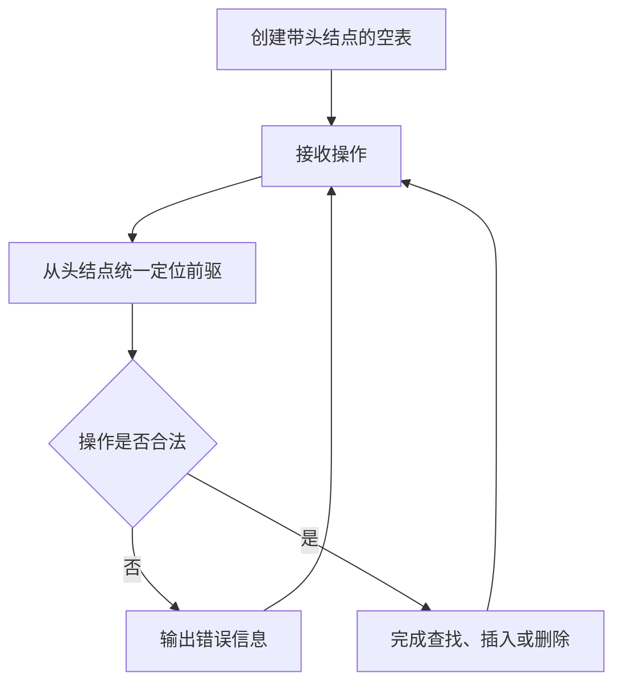

## 6-6 带头结点的链式表操作集

- **分值：** 20分

## 题目描述

本题要求实现带头结点的链式表操作集。

## 函数接口定义
```javascript
// JavaScript 函数接口（L 始终是头结点）
function MakeEmpty() {}
function Find(L, X) {}
function Insert(L, X, P) {}
function Delete(L, P) {}
```

其中`List`结构定义如下：

```javascript
class Node {
  constructor(data = null, next = null) {
    this.Data = data;
    this.Next = next;
  }
}
// 头结点自身不存放有效数据。
```

各个操作函数的定义为：

`List MakeEmpty()`：创建并返回一个空的线性表；

`Position Find( List L, ElementType X )`：返回线性表中X的位置。若找不到则返回ERROR；

`bool Insert( List L, ElementType X, Position P )`：将X插入在位置P指向的结点之前，返回true。如果参数P指向非法位置，则打印“Wrong Position for Insertion”，返回false；

`bool Delete( List L, Position P )`：将位置P的元素删除并返回true。若参数P指向非法位置，则打印“Wrong Position for Deletion”并返回false。

## 裁判测试程序样例
```javascript
const L = MakeEmpty();
for (const x of [1, 2, 3]) Insert(L, x, L.Next);
console.log(Find(L, 2).Data);
Delete(L, Find(L, 2));
const values = [];
for (let p = L.Next; p; p = p.Next) values.push(p.Data);
console.log(values.join(" "));
```

## 输入样例
```
6
12 2 4 87 10 2
4
2 12 87 5
```

## 输出样例
```
2 is found and deleted.
12 is found and deleted.
87 is found and deleted.
Finding Error: 5 is not in.
5 is inserted as the last element.
Wrong Position for Insertion
Wrong Position for Deletion
10 4 2 5
```

## 函数部分

```javascript
// 通过头结点统一处理首结点、尾部和中间位置的插入删除。
function MakeEmpty() {
  return new Node();
}
function Find(L, X) {
  for (let p = L.Next; p; p = p.Next) if (p.Data === X) return p;
  return null;
}
function Insert(L, X, P) {
  let prev = L;
  if (P !== null) {
    while (prev && prev.Next !== P) prev = prev.Next;
    if (!prev) {
      console.log("Wrong Position for Insertion");
      return false;
    }
  } else {
    while (prev.Next) prev = prev.Next;
  }
  prev.Next = new Node(X, P);
  return true;
}
function Delete(L, P) {
  let prev = L;
  while (prev && prev.Next !== P) prev = prev.Next;
  if (!P || !prev) {
    console.log("Wrong Position for Deletion");
    return false;
  }
  prev.Next = P.Next;
  return true;
}
```

## 解题思路

头结点本身不存储有效数据，只负责统一处理表头位置。所有查找都从 `L->Next` 开始；插入和删除都从头结点开始寻找目标位置的前驱，因此不需要为删除首元结点额外修改表头。`P == NULL` 时按题意将元素插入表尾。

## 代码流程说明

1. `MakeEmpty` 分配头结点并令其 `Next` 为空。
2. `Find` 跳过头结点，从第一个有效结点开始查找。
3. `Insert`：指定 `P` 时寻找其前驱；`P == NULL` 时寻找最后一个结点；申请新结点并接入前驱之后。
4. `Delete` 从头结点寻找 `P` 的前驱，确认位置合法后调整链接并释放 `P`。

## 代码流程图



## 解题流程图


