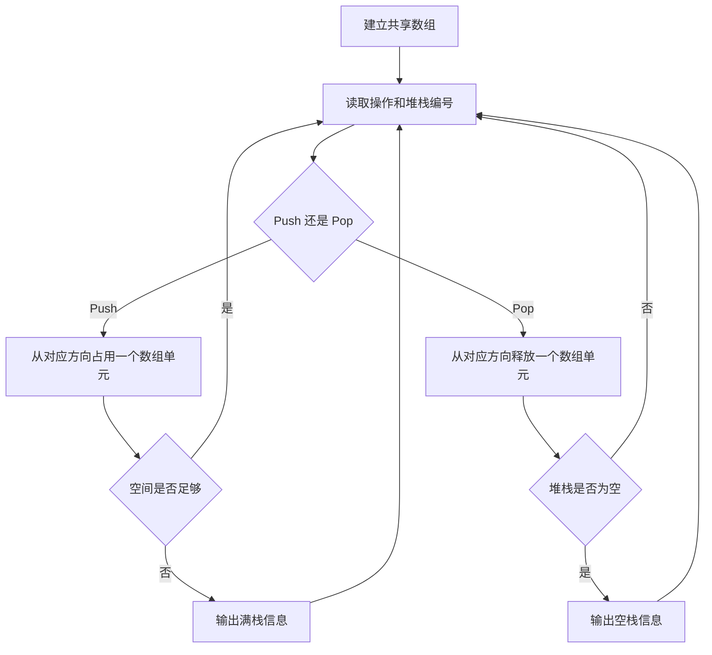

本题要求在一个数组中实现两个堆栈。

函数接口定义：
```c++
Stack CreateStack( int MaxSize );
bool Push( Stack S, ElementType X, int Tag );
ElementType Pop( Stack S, int Tag );
```

其中Tag是堆栈编号，取1或2；MaxSize堆栈数组的规模；Stack结构定义如下：
```c++
typedef int Position;
struct SNode {
    ElementType *Data;
    Position Top1, Top2;
    int MaxSize;
};
typedef struct SNode *Stack;
```
注意：如果堆栈已满，Push函数必须输出“Stack Full”并且返回false；如果某堆栈是空的，则Pop函数必须输出“Stack Tag Empty”（其中Tag是该堆栈的编号），并且返回ERROR。

裁判测试程序样例：
```c++
#include <stdio.h>
#include <stdlib.h>

#define ERROR 1e8
typedef int ElementType;
typedef enum { push, pop, end } Operation;
typedef enum { false, true } bool;
typedef int Position;
struct SNode {
    ElementType *Data;
    Position Top1, Top2;
    int MaxSize;
};
typedef struct SNode *Stack;

Stack CreateStack( int MaxSize );
bool Push( Stack S, ElementType X, int Tag );
ElementType Pop( Stack S, int Tag );

Operation GetOp();  /* details omitted */
void PrintStack( Stack S, int Tag ); /* details omitted */

int main()
{
    int N, Tag, X;
    Stack S;
    int done = 0;

    scanf("%d", &N);
    S = CreateStack(N);
    while ( !done ) {
        switch( GetOp() ) {
        case push: 
            scanf("%d %d", &Tag, &X);
            if (!Push(S, X, Tag)) printf("Stack %d is Full!\n", Tag);
            break;
        case pop:
            scanf("%d", &Tag);
            X = Pop(S, Tag);
            if ( X==ERROR ) printf("Stack %d is Empty!\n", Tag);
            break;
        case end:
            PrintStack(S, 1);
            PrintStack(S, 2);
            done = 1;
            break;
        }
    }
    return 0;
}

/* 你的代码将被嵌在这里 */
```
输入样例：
```in
5
Push 1 1
Pop 2
Push 2 11
Push 1 2
Push 2 12
Pop 1
Push 2 13
Push 2 14
Push 1 3
Pop 2
End
```

输出样例：
```out
Stack 2 Empty
Stack 2 is Empty!
Stack Full
Stack 1 is Full!
Pop from Stack 1: 1
Pop from Stack 2: 13 12 11
```

### 函数部分

```c
Stack CreateStack(int MaxSize)
{
    Stack S = (Stack)malloc(sizeof(struct SNode));
    S->Data = (ElementType *)malloc(sizeof(ElementType) * MaxSize);
    S->Top1 = -1;
    S->Top2 = MaxSize;
    S->MaxSize = MaxSize;
    return S;
}

bool Push(Stack S, ElementType X, int Tag)
{
    if (S->Top1 + 1 == S->Top2) {
        printf("Stack Full\n");
        return false;
    }
    if (Tag == 1)
        S->Data[++S->Top1] = X;
    else
        S->Data[--S->Top2] = X;
    return true;
}

ElementType Pop(Stack S, int Tag)
{
    if (Tag == 1) {
        if (S->Top1 == -1) {
            printf("Stack 1 Empty\n");
            return ERROR;
        }
        return S->Data[S->Top1--];
    }
    if (S->Top2 == S->MaxSize) {
        printf("Stack 2 Empty\n");
        return ERROR;
    }
    return S->Data[S->Top2++];
}
```

### 解题思路

让两个堆栈共享同一个数组：堆栈 1 从下标 0 向右增长，堆栈 2 从下标 `MaxSize - 1` 向左增长。初始时 `Top1 = -1`、`Top2 = MaxSize`；当 `Top1 + 1 == Top2` 时，两边栈顶相邻，数组没有剩余空间。这样可以动态共享未使用的空间。

### 代码流程说明

1. `CreateStack` 分配栈结构和数组，初始化两个栈顶。
2. `Push` 先检查两个栈顶是否相邻；未满时根据 `Tag` 移动对应栈顶并保存元素。
3. `Pop` 根据 `Tag` 检查对应堆栈是否为空；非空时取出栈顶元素并移动栈顶。
4. 满栈或空栈时输出规定信息，并返回相应失败值。

### 代码流程图

```mermaid
flowchart TD
    A[调用 Push 或 Pop] --> B{操作类型}
    B -- Push --> C{Top1+1 是否等于 Top2}
    C -- 是 --> D[输出 Stack Full, 返回 false]
    C -- 否 --> E{Tag=1}
    E -- 是 --> F[Top1 右移并入栈]
    E -- 否 --> G[Top2 左移并入栈]
    B -- Pop --> H{Tag=1}
    H -- 是 --> I{Top1 是否为 -1}
    H -- 否 --> J{Top2 是否为 MaxSize}
    I -- 是 --> K[输出 Stack 1 Empty]
    I -- 否 --> L[取出 Data[Top1], Top1 左移]
    J -- 是 --> M[输出 Stack 2 Empty]
    J -- 否 --> N[取出 Data[Top2], Top2 右移]
```

### 解题流程图


