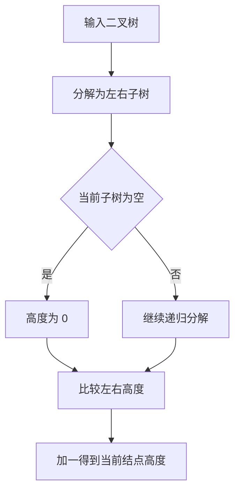

本题要求给定二叉树的高度。

函数接口定义：
```c++
int GetHeight( BinTree BT );
```

其中BinTree结构定义如下：
```c++
typedef struct TNode *Position;
typedef Position BinTree;
struct TNode{
    ElementType Data;
    BinTree Left;
    BinTree Right;
};
```
要求函数返回给定二叉树BT的高度值。

裁判测试程序样例：
```c++
#include <stdio.h>
#include <stdlib.h>

typedef char ElementType;
typedef struct TNode *Position;
typedef Position BinTree;
struct TNode{
    ElementType Data;
    BinTree Left;
    BinTree Right;
};

BinTree CreatBinTree(); /* 实现细节忽略 */
int GetHeight( BinTree BT );

int main()
{
    BinTree BT = CreatBinTree();
    printf("%d\n", GetHeight(BT));
    return 0;
}
/* 你的代码将被嵌在这里 */
```
输出样例（对于图中给出的树）：


```out
4
```

### 函数部分

```c
int GetHeight(BinTree BT)
{
    if (BT == NULL)
        return 0;
    int leftHeight = GetHeight(BT->Left);
    int rightHeight = GetHeight(BT->Right);
    return (leftHeight > rightHeight ? leftHeight : rightHeight) + 1;
}
```

### 解题思路

采用递归定义树高：空树高度为 0，非空树高度等于左右子树高度的较大值加 1。递归会覆盖每个结点一次，因此时间复杂度为 `O(n)`；递归栈的空间复杂度为 `O(h)`，其中 `h` 是树高。

### 代码流程说明

1. 若当前结点为空，返回 0。
2. 递归计算左子树和右子树的高度。
3. 取两个高度中的较大值并加 1，作为当前树高返回。

### 代码流程图

```mermaid
flowchart TD
    A[调用 GetHeight(BT)] --> B{BT 是否为空}
    B -- 是 --> C[返回 0]
    B -- 否 --> D[递归求左子树高度]
    D --> E[递归求右子树高度]
    E --> F[取较大值并加一]
    F --> G[返回当前树高]
```

### 解题流程图


