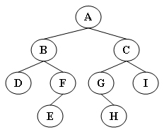

本题要求给定二叉树的高度。

函数接口定义：
```c++
int GetHeight( BinTree BT );
```

其中BinTree结构定义如下：
```c++
typedef struct TNode *Position;
typedef Position BinTree;
struct TNode{
    ElementType Data;
    BinTree Left;
    BinTree Right;
};
```
要求函数返回给定二叉树BT的高度值。

裁判测试程序样例：
```c++
#include <stdio.h>
#include <stdlib.h>

typedef char ElementType;
typedef struct TNode *Position;
typedef Position BinTree;
struct TNode{
    ElementType Data;
    BinTree Left;
    BinTree Right;
};

BinTree CreatBinTree(); /* 实现细节忽略 */
int GetHeight( BinTree BT );

int main()
{
    BinTree BT = CreatBinTree();
    printf("%d\n", GetHeight(BT));
    return 0;
}
/* 你的代码将被嵌在这里 */
```

输出样例（对于图中给出的树）：


```out
4
```