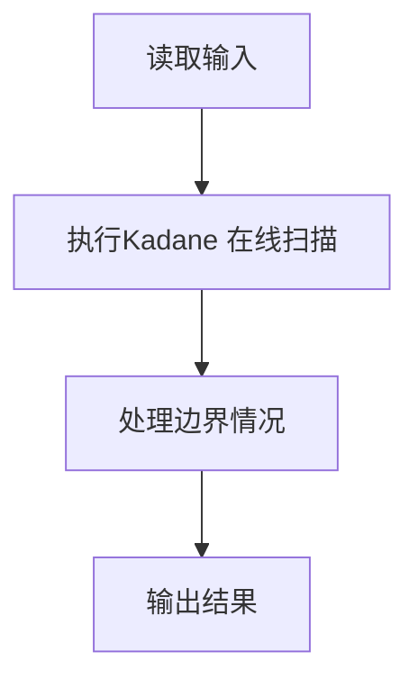
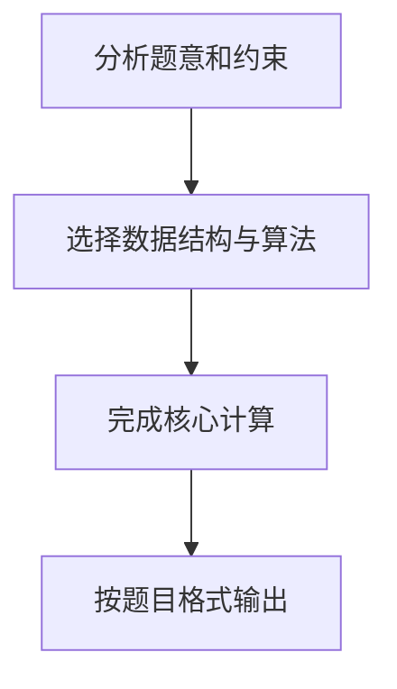

# 最大子列和问题

## 题目描述

给定 K 个整数组成的序列 { N₁, N₂, …, N_K }，**连续子列** 被定义为 { N_i, N_{i+1}, …, N_j }，其中 1 ≤ i ≤ j ≤ K。**最大子列和** 则被定义为所有连续子列元素的和中最大者。

例如给定序列 `{ -2, 11, -4, 13, -5, -2 }`，其连续子列 `{ 11, -4, 13 }` 有最大的和 **20**。

现要求编写程序，计算给定整数序列的最大子列和。

> **特别约定**：如果序列中所有整数皆为负数，则输出 **0**（即空子列的和）。

## 测试数据说明

本题旨在测试各种不同的算法在各种数据情况下的表现。各组测试数据特点如下：

| 测试点 | 数据规模 | 测试目的 |
|---|---|---|
| 数据 1 | 与样例等价 | 测试基本正确性 |
| 数据 2 | 10² 个随机整数 | 小数据基础算法 |
| 数据 3 | 10³ 个随机整数 | 中等规模 |
| 数据 4 | 10⁴ 个随机整数 | 较大规模 |
| 数据 5 | 10⁵ 个随机整数 | 最大规模，时间复杂度需 ≤ O(n log n) |

## 输入格式

- 第 1 行：给出正整数 K（≤ 100 000）
- 第 2 行：给出 K 个整数，其间以空格分隔

## 输出格式

在一行中输出最大子列和。

---

## 输入样例

```
6
-2 11 -4 13 -5 -2
```

## 输出样例

```
20
```

---

## 算法复杂度参考

| 算法 | 时间复杂度 | 空间复杂度 | 是否能通过所有测试点 |
|---|---|---|---|
| 暴力三重循环 | O(n³) | O(1) | ❌ 大数据超时 |
| 暴力二重循环 | O(n²) | O(1) | ❌ 大数据超时 |
| 分治法 | O(n log n) | O(log n) | ✅ |
| **在线处理（Kadane 算法）** | **O(n)** | **O(1)** | ✅ **推荐** |

## 核心思路（在线处理法）

维护两个变量：

- `ThisSum`：以当前位置结尾的连续子列的最大和
- `MaxSum`：全程记录到的最大值

遍历每个元素时：

1. 将当前元素加到 `ThisSum`
2. 若 `ThisSum < 0`，则说明前面的子列只会拖累后续，重置 `ThisSum = 0`
3. 若 `ThisSum > MaxSum`，更新 `MaxSum = ThisSum`

## 解题思路

本题采用Kadane 在线扫描，围绕题目给出的数据结构和约束完成核心计算，并处理边界情况。

## 代码流程说明

1. 读取题目规定的输入数据。
2. 使用Kadane 在线扫描完成主要处理。
3. 处理边界情况并整理结果。
4. 按指定格式输出结果。

## 代码实现


```c
/*
 * 实现过程：
 * 本题采用"在线处理"算法（Kadane算法），时间复杂度 O(K)，空间复杂度 O(1)。
 *
 * 核心思路：
 * 1. 用 ThisSum 记录当前子列和，MaxSum 记录历史最大子列和。
 * 2. 逐个读取元素，将每个元素累加到 ThisSum 中。
 * 3. 若 ThisSum < 0，说明当前前缀对后续子列和只有负贡献，果断抛弃（重置为0）。
 * 4. 若 ThisSum > MaxSum，则更新 MaxSum。
 * 5. 最终 MaxSum 即为最大子列和。若所有元素均为负数，MaxSum 保持为0。
 *
 * 为什么可以"在线处理"：
 * - 当 ThisSum 变为负数时，无论后面接什么正数，加上负前缀只会更小，
 *   因此不如从0重新开始累加，这就是"抛弃负前缀"的贪心策略。
 */

#include <stdio.h> // 引入标准输入输出库，用于 scanf 和 printf 函数

int main( void ) // 主函数，程序入口；void 表示不接收命令行参数
{
    int K, i, N; // 声明三个整型变量：K 为元素个数，i 为循环计数器，N 为当前读入的整数
    long long ThisSum = 0, MaxSum = 0; // 声明两个长整型变量：ThisSum 记录当前子列和，MaxSum 记录已知最大子列和，均初始化为 0

    scanf( "%d", &K ); // 从标准输入读取一个整数存入 K，表示序列中元素的个数
    for ( i = 0; i < K; i++ ) { // 循环 K 次，依次处理每个元素；i 从 0 开始，小于 K 时继续循环
        scanf( "%d", &N ); // 读取当前元素的值并存入 N
        ThisSum += N; // 将当前元素 N 累加到当前子列和 ThisSum 中
        if ( ThisSum < 0 ) // 判断当前子列和是否为负数
            ThisSum = 0; // 如果为负数，则重置当前子列和为 0（放弃该段前缀，重新开始累加）
        else if ( ThisSum > MaxSum ) // 否则判断当前子列和是否大于已知最大子列和
            MaxSum = ThisSum; // 如果更大，则更新最大子列和为当前子列和
    }
    printf( "%lld\n", MaxSum ); // 以 long long 格式输出最大子列和，并换行

    return 0; // 主函数正常结束，返回 0 表示程序执行成功
}
```

## 代码流程图



## 解题流程图


