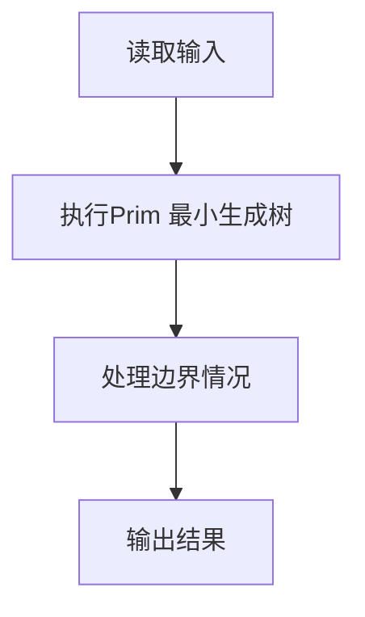
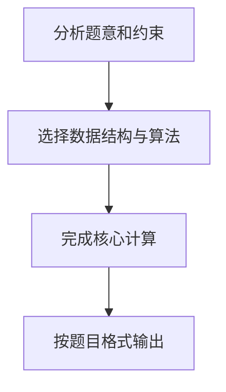

# 7-10 公路村村通

- **分值：** 30分

## 题目描述

现有村落间道路的统计数据表中，列出了有可能建设成标准公路的若干条道路的成本，求使每个村落都有公路连通所需要的最低成本。

## 输入格式

输入数据包括城镇数目正整数 $$n$$（$$\le 1000$$）和候选道路数目 $$m$$（$$\le 3n$$）；随后的 $$m$$ 行对应 $$m$$ 条道路，每行给出 3 个正整数，分别是该条道路直接连通的两个城镇的编号以及该道路改建的预算成本。为简单起见，城镇从 1 到 $$n$$ 编号。

## 输出格式

输出村村通需要的最低成本。如果输入数据不足以保证畅通，则输出 $$-1$$，表示需要建设更多公路。

## 输入样例
```
6 15
1 2 5
1 3 3
1 4 7
1 5 4
1 6 2
2 3 4
2 4 6
2 5 2
2 6 6
3 4 6
3 5 1
3 6 1
4 5 10
4 6 8
5 6 3
```

## 输出样例
```
12
```

## 解题思路

本题采用Prim 最小生成树，围绕题目给出的数据结构和约束完成核心计算，并处理边界情况。

## 代码流程说明

1. 读取题目规定的输入数据。
2. 使用Prim 最小生成树完成主要处理。
3. 处理边界情况并整理结果。
4. 按指定格式输出结果。

## 代码实现


```c
/*
 * 实现过程：
 * 本题要求用最低成本使所有城镇互通，即求无向图的最小生成树（MST）。
 * 若图不连通则输出-1。
 *
 * 算法：Prim（朴素版，邻接矩阵）。
 *
 * 数据结构：
 * - graph[N][N]：邻接矩阵，存储城镇间道路建设成本（重边取最小值）。
 * - dist[i]：从MST集合到顶点i的最小边权。
 * - visited[i]：顶点i是否已加入MST。
 *
 * 步骤：
 * 1. 读入城镇数n、道路数m，构建邻接矩阵。
 * 2. 以顶点1为起点，初始化dist为顶点1到各顶点的直接距离，标记1已访问。
 * 3. Prim主循环（重复n-1次）：
 *    a. 从未访问顶点中选出dist最小的顶点u。
 *    b. 若找不到（u==-1），说明图不连通，提前退出。
 *    c. 将u加入MST，累加边权到总成本。
 *    d. 松弛：用u更新其他未访问顶点的dist（若graph[u][v] < dist[v]则更新）。
 * 4. 若已加入MST的顶点数 < n，输出-1；否则输出总成本。
 *
 * 时间复杂度：O(N^2)，空间复杂度：O(N^2)。
 */

#include <stdio.h>   // 标准输入输出库
#include <string.h>  // 字符串处理库（memset 等）

#define N 1005        // 最大城镇数（含 1-based 索引）
#define INF 0x3f3f3f3f // 无穷大，表示不可达（约为 1e9）

int graph[N][N];      // 邻接矩阵：存储城镇间道路的建设成本
int dist[N];          // dist[i]：从已选 MST 集合到顶点 i 的最小边权
int visited[N];       // visited[i]：顶点 i 是否已加入最小生成树

int main() {
    int n, m;                                      // n：城镇数，m：候选道路数
    scanf("%d %d", &n, &m);                        // 读入城镇数和道路数

    // 初始化邻接矩阵：自己到自己的成本为 0，其余为 INF（不可达）
    for (int i = 1; i <= n; i++) {                 // 遍历所有行
        for (int j = 1; j <= n; j++) {             // 遍历所有列
            graph[i][j] = (i == j) ? 0 : INF;      // 对角线为 0，其余为无穷大
        }
    }

    // 读入 m 条候选道路
    for (int i = 0; i < m; i++) {
        int a, b, cost;                            // a、b：道路连通的两个城镇编号，cost：建设成本
        scanf("%d %d %d", &a, &b, &cost);          // 读入一条道路信息
        // 处理重边：若有多条边连接同一对城镇，只保留成本最低的那条
        if (cost < graph[a][b]) {
            graph[a][b] = cost;                    // 设置 a→b 的成本
            graph[b][a] = cost;                    // 无向图，对称设置 b→a 的成本
        }
    }

    // Prim 算法初始化：以顶点 1 为起点
    for (int i = 1; i <= n; i++) {
        dist[i] = graph[1][i];                     // 初始 dist = 顶点 1 到各顶点的直接距离
    }
    memset(visited, 0, sizeof(visited));           // 全部标记为未访问
    visited[1] = 1;                                // 将顶点 1 加入 MST

    int total_cost = 0;  // 最小生成树的总成本
    int count = 1;       // 已加入 MST 的顶点数量（初始包含顶点 1）

    // Prim 算法主循环：每次选一个未访问的最近顶点加入 MST
    for (int i = 1; i < n; i++) {                  // 最多需要 n-1 轮
        int u = -1;                                // 本轮选出的顶点，-1 表示未找到
        int min_cost = INF;                        // 当前找到的最小边权
        // 遍历所有顶点，从未访问的顶点中选出距离 MST 集合最近的
        for (int j = 1; j <= n; j++) {
            if (!visited[j] && dist[j] < min_cost) {  // 未访问且距离更小
                min_cost = dist[j];                   // 更新最小边权
                u = j;                                // 记录该顶点编号
            }
        }
        if (u == -1) break;  // 找不到可到达的未访问顶点，图不连通，提前退出

        visited[u] = 1;            // 将顶点 u 标记为已加入 MST
        total_cost += min_cost;    // 累加该边的成本到总成本
        count++;                   // 已加入 MST 的顶点数 +1

        // 松弛操作：用新加入的顶点 u 更新其他未访问顶点的 dist
        for (int v = 1; v <= n; v++) {
            if (!visited[v] && graph[u][v] < dist[v]) {  // v 未访问且经过 u 更近
                dist[v] = graph[u][v];                   // 更新 dist[v]
            }
        }
    }

    // 输出结果
    if (count < n) {         // 已加入 MST 的顶点数不足 n，说明图不连通
        printf("-1\n");      // 输出 -1，表示无法村村通
    } else {
        printf("%d\n", total_cost);  // 输出最小生成树的总成本
    }

    return 0;  // 程序正常结束
}
```

## 代码流程图



## 解题流程图


