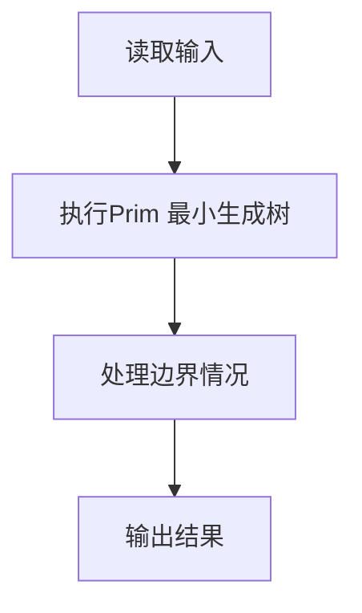
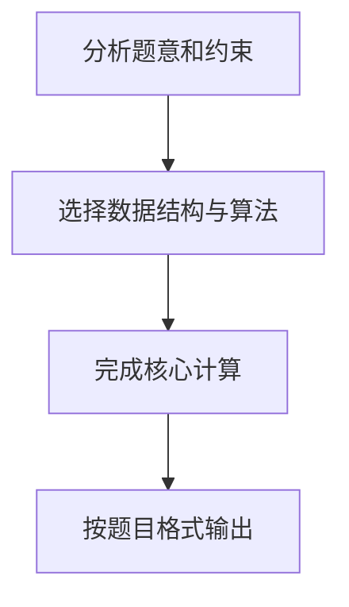

## 7-10 公路村村通

- **分值：** 30分

## 题目描述

现有村落间道路的统计数据表中，列出了有可能建设成标准公路的若干条道路的成本，求使每个村落都有公路连通所需要的最低成本。

## 输入格式

输入数据包括城镇数目正整数 n（\le 1000）和候选道路数目 m（\le 3n）；随后的 m 行对应 m 条道路，每行给出 3 个正整数，分别是该条道路直接连通的两个城镇的编号以及该道路改建的预算成本。为简单起见，城镇从 1 到 n 编号。

## 输出格式

输出村村通需要的最低成本。如果输入数据不足以保证畅通，则输出 -1，表示需要建设更多公路。

## 输入样例
```
6 15
1 2 5
1 3 3
1 4 7
1 5 4
1 6 2
2 3 4
2 4 6
2 5 2
2 6 6
3 4 6
3 5 1
3 6 1
4 5 10
4 6 8
5 6 3
```

## 输出样例
```
12
```

## 解题思路

本题采用Prim 最小生成树，围绕题目给出的数据结构和约束完成核心计算，并处理边界情况。

## 代码流程说明

1. 读取题目规定的输入数据。
2. 使用Prim 最小生成树完成主要处理。
3. 处理边界情况并整理结果。
4. 按指定格式输出结果。

## 代码实现


```javascript
const fs = require("fs");
const raw = fs.readFileSync(0, "utf8");
const tokens = raw.trim() ? raw.trim().split(/\s+/) : [];
let at = 0;

// Prim 每次把连接当前生成树代价最小的城镇加入，无法加入则图不连通。
const n = Number(tokens[at++]),
  m = Number(tokens[at++]),
  INF = 1e15;
const graph = Array.from({ length: n + 1 }, () => Array(n + 1).fill(INF));
for (let i = 1; i <= n; i++) graph[i][i] = 0;
for (let i = 0; i < m; i++) {
  const u = Number(tokens[at++]),
    v = Number(tokens[at++]),
    w = Number(tokens[at++]);
  graph[u][v] = graph[v][u] = Math.min(graph[u][v], w);
}
const minEdge = Array(n + 1).fill(INF),
  used = Array(n + 1).fill(false);
minEdge[1] = 0;
let answer = 0,
  count = 0;
for (let round = 0; round < n; round++) {
  let u = -1;
  for (let i = 1; i <= n; i++)
    if (!used[i] && (u < 0 || minEdge[i] < minEdge[u])) u = i;
  if (u < 0 || minEdge[u] === INF) break;
  used[u] = true;
  count++;
  answer += minEdge[u];
  for (let v = 1; v <= n; v++) minEdge[v] = Math.min(minEdge[v], graph[u][v]);
}
console.log(count === n ? answer.toString() : "-1");
```

## 代码流程图



## 解题流程图


