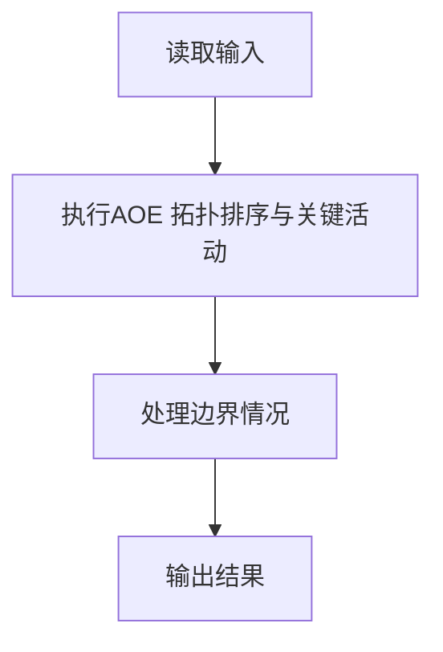
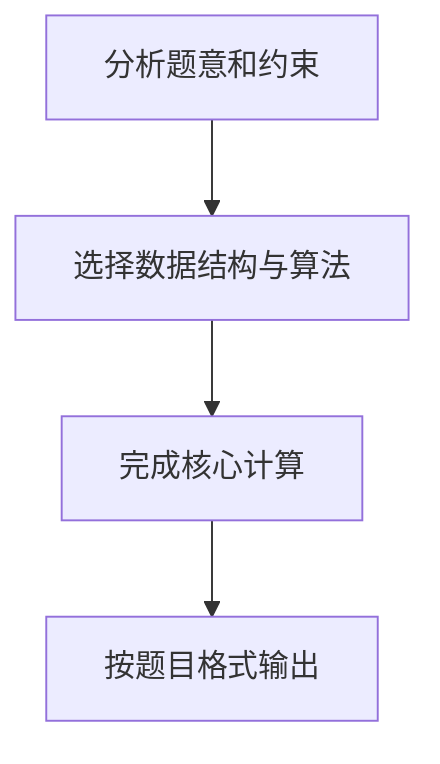

# 7-11 关键活动

- **分值：** 30分

## 题目描述

假定一个工程项目由一组子任务构成，子任务之间有的可以并行执行，有的必须在完成了其它一些子任务后才能执行。“任务调度”包括一组子任务、以及每个子任务可以执行所依赖的子任务集。

比如完成一个专业的所有课程学习和毕业设计可以看成一个本科生要完成的一项工程，各门课程可以看成是子任务。有些课程可以同时开设，比如英语和C程序设计，它们没有必须先修哪门的约束；有些课程则不可以同时开设，因为它们有先后的依赖关系，比如C程序设计和数据结构两门课，必须先学习前者。

但是需要注意的是，对一组子任务，并不是任意的任务调度都是一个可行的方案。比如方案中存在“子任务A依赖于子任务B，子任务B依赖于子任务C，子任务C又依赖于子任务A”，那么这三个任务哪个都不能先执行，这就是一个不可行的方案。

任务调度问题中，如果还给出了完成每个子任务需要的时间，则我们可以算出完成整个工程需要的最短时间。在这些子任务中，有些任务即使推迟几天完成，也不会影响全局的工期；但是有些任务必须准时完成，否则整个项目的工期就要因此延误，这种任务就叫“关键活动”。

请编写程序判定一个给定的工程项目的任务调度是否可行；如果该调度方案可行，则计算完成整个工程项目需要的最短时间，并输出所有的关键活动。

## 输入格式

输入第1行给出两个正整数$$N$$($$\le 100$$)和$$M$$，其中$$N$$是任务交接点（即衔接相互依赖的两个子任务的节点，例如：若任务2要在任务1完成后才开始，则两任务之间必有一个交接点）的数量。交接点按1 ~ $$N$$编号，$$M$$是子任务的数量，依次编号为1 ~ $$M$$。随后$$M$$行，每行给出了3个正整数，分别是该任务开始和完成涉及的交接点编号以及该任务所需的时间，整数间用空格分隔。

## 输出格式

如果任务调度不可行，则输出0；否则第1行输出完成整个工程项目需要的时间，第2行开始输出所有关键活动，每个关键活动占一行，按格式“V->W”输出，其中V和W为该任务开始和完成涉及的交接点编号。关键活动输出的顺序规则是：任务开始的交接点编号小者优先，起点编号相同时，与输入时任务的顺序相反。

## 输入样例
```
7 8
1 2 4
1 3 3
2 4 5
3 4 3
4 5 1
4 6 6
5 7 5
6 7 2
```

## 输出样例
```
17
1->2
2->4
4->6
6->7
```

## 解题思路

本题采用AOE 拓扑排序与关键活动，围绕题目给出的数据结构和约束完成核心计算，并处理边界情况。

## 代码流程说明

1. 读取题目规定的输入数据。
2. 使用AOE 拓扑排序与关键活动完成主要处理。
3. 处理边界情况并整理结果。
4. 按指定格式输出结果。

## 代码实现


```c
/*
 * 实现过程：
 * 本题要求在AOE网中求关键活动，即整个工程的最短工期及所有不可延误的活动。
 *
 * 算法：拓扑排序 + 最早/最晚开始时间（AOE网关键路径）。
 *
 * 数据结构：
 * - graph[N][N]：邻接矩阵，存储任务依赖关系和耗时。
 * - u_arr/v_arr/w_arr[]：按输入顺序保存所有边，用于最终按规则输出关键活动。
 * - ve[i]：事件（节点）i的最早发生时间。
 * - vl[i]：事件（节点）i的最晚发生时间。
 * - indegree[i]：节点i的入度，用于拓扑排序。
 * - topo_order[]：拓扑排序结果，用于逆序计算vl。
 *
 * 步骤：
 * 1. 读入节点数N、边数M，构建邻接矩阵，记录入度，保存边信息。
 * 2. 正向拓扑排序（BFS），计算ve[]：
 *    a. 入度为0的节点入队。
 *    b. 出队节点u，遍历其后继v，更新ve[v] = max(ve[v], ve[u] + graph[u][v])。
 *    c. v的入度减1，若为0则入队。
 *    d. 若拓扑排序访问节点数 < N，说明有环，输出0并结束。
 * 3. 反向计算vl[]：
 *    a. 总工期 = max(ve[])，所有vl初始化为总工期。
 *    b. 逆拓扑序遍历节点u，对每条边u->v，更新vl[u] = min(vl[u], vl[v] - graph[u][v])。
 * 4. 输出关键活动：
 *    a. 第一行输出总工期。
 *    b. 对每条边u->v权重w，若ve[u] + w == vl[v]则为关键活动。
 *    c. 输出顺序：起点编号小优先，起点相同时与输入顺序相反。
 *
 * 时间复杂度：O(N^2 + M)，空间复杂度：O(N^2 + M)。
 */

#include <stdio.h>   // 标准输入输出（scanf, printf）
#include <stdlib.h>  // 标准库
#include <string.h>  // 字符串和内存操作（memset）

#define MAXN 105        // 最大节点数（N ≤ 100，多留余量）
#define INF 0x3f3f3f3f  // 无穷大常量（约1e9，安全不溢出）

int main() {
    int N, M;                                // N: 交接点数量, M: 子任务数量
    scanf("%d %d", &N, &M);                  // 读入N和M

    int u_arr[M], v_arr[M], w_arr[M];        // 保存所有边的起点、终点、权重（按输入顺序）
    int graph[MAXN][MAXN];                   // 邻接矩阵，graph[u][v] = 从u到v的任务耗时
    memset(graph, 0, sizeof(graph));         // 初始化邻接矩阵为0（0表示无边）

    int indegree[MAXN] = {0};                // 各节点的入度（有多少条边指向该节点）
    int outdegree[MAXN] = {0};               // 各节点的出度（有多少条边从该节点出发）

    for (int i = 0; i < M; i++) {            // 读入M条边
        int u, v, w;                         // 起点u, 终点v, 耗时w
        scanf("%d %d %d", &u, &v, &w);       // 读入一条边的信息
        u_arr[i] = u;                        // 保存起点（用于后续按输入顺序输出）
        v_arr[i] = v;                        // 保存终点
        w_arr[i] = w;                        // 保存权重/耗时
        graph[u][v] = w;                     // 填充邻接矩阵
        indegree[v]++;                       // 终点v的入度+1
        outdegree[u]++;                      // 起点u的出度+1
    }

    // ===== 正向拓扑排序，计算 ve[]（最早开始时间）=====
    int ve[MAXN] = {0};                      // ve[i]: 节点i的最早开始时间，初始为0
    int queue[MAXN];                         // 用数组模拟队列（BFS拓扑排序用）
    int front = 0, rear = 0;                 // 队列的头尾指针
    int topo_order[MAXN];                    // 保存拓扑排序的结果顺序
    int topo_cnt = 0;                        // 拓扑排序已输出的节点数量

    for (int i = 1; i <= N; i++) {           // 遍历所有节点（编号1~N）
        if (indegree[i] == 0) {              // 入度为0的节点可作为起点
            queue[rear++] = i;               // 入队
        }
    }

    while (front < rear) {                   // 队列非空时继续
        int u = queue[front++];              // 出队一个节点u
        topo_order[topo_cnt++] = u;          // 记录拓扑序
        for (int v = 1; v <= N; v++) {       // 遍历u的所有邻接节点v
            if (graph[u][v] > 0) {           // 存在边 u->v
                indegree[v]--;               // v的入度-1（移除边u->v）
                if (ve[u] + graph[u][v] > ve[v]) { // 若通过u到达v的时间更晚
                    ve[v] = ve[u] + graph[u][v];   // 更新v的最早开始时间
                }
                if (indegree[v] == 0) {      // v的入度变为0
                    queue[rear++] = v;       // v入队等待处理
                }
            }
        }
    }

    // 有环，调度不可行：拓扑排序未能处理全部N个节点
    if (topo_cnt < N) {
        printf("0\n");                       // 输出0表示方案不可行
        return 0;
    }

    // ===== 反向计算 vl[]（最晚开始时间）=====
    int vl[MAXN];                            // vl[i]: 节点i的最晚开始时间
    int max_ve = 0;                          // 整个工程的最早完成时间（ve数组最大值）
    for (int i = 1; i <= N; i++) {           // 遍历所有节点
        if (ve[i] > max_ve) max_ve = ve[i];  // 找ve[]的最大值作为工期
    }
    for (int i = 1; i <= N; i++) {           // 初始化所有节点的vl为总工期
        vl[i] = max_ve;                      // 最晚开始时间初始化为总工期
    }

    for (int i = topo_cnt - 1; i >= 0; i--) { // 逆拓扑序处理（从汇点回推到源点）
        int u = topo_order[i];               // 当前处理的节点u
        for (int v = 1; v <= N; v++) {       // 遍历u的所有后继节点v
            if (graph[u][v] > 0) {           // 存在边 u->v
                if (vl[v] - graph[u][v] < vl[u]) { // 若v的最晚时间-边权比当前u更早
                    vl[u] = vl[v] - graph[u][v];   // 更新u的最晚开始时间
                }
            }
        }
    }

    // ===== 输出结果 =====
    printf("%d\n", max_ve);                  // 第一行输出整个工程的最短工期

    // 关键活动判定条件：ve[u] + w == vl[v]（最早=最晚，无时间余量）
    // 输出顺序规则：
    //   1. 起点编号小者优先
    //   2. 起点编号相同时，与输入顺序相反（后输入的边先输出）
    for (int start = 1; start <= N; start++) {        // 按起点编号从小到大遍历
        for (int i = M - 1; i >= 0; i--) {            // 从后往前遍历输入边（实现"相反顺序"）
            int u = u_arr[i], v = v_arr[i], w = w_arr[i]; // 取出边u->v权重w
            if (u == start && ve[u] + w == vl[v]) {   // 起点匹配且满足关键活动条件
                printf("%d->%d\n", u, v);              // 输出关键活动
            }
        }
    }

    return 0;
}
```

## 代码流程图



## 解题流程图


