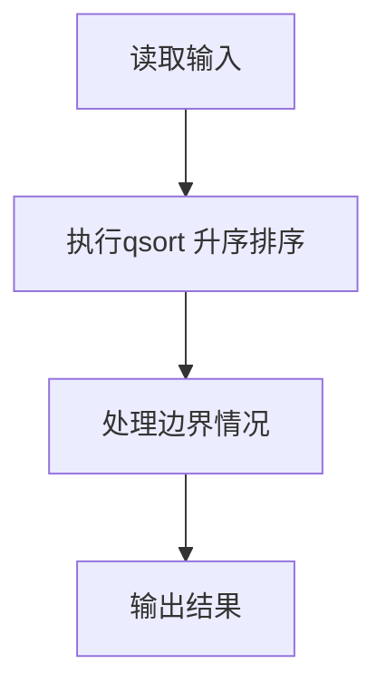
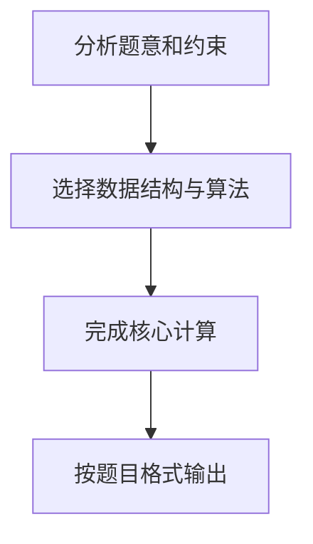

给定 n 个（长整型范围内的）整数，要求输出从小到大排序后的结果。

本题旨在测试各种不同的排序算法在各种数据情况下的表现。各组测试数据特点如下：

- 数据1：只有 1 个元素
- 数据2：11 个不相同的整数，测试基本正确性
- 数据3：10^3 个随机整数
- 数据4：10^4 个随机整数
- 数据5：10^5 个随机整数
- 数据6：10^5 个顺序整数
- 数据7：10^5 个逆序整数
- 数据8：10^5 个基本有序的整数
- 数据9：10^5 个随机正整数，每个数字不超过 1000

**输入格式**

输入第一行给出正整数 n（≤ 10^5），随后一行给出 n 个（长整型范围内的）整数，其间以空格分隔。

**输出格式**

在一行中输出从小到大排序后的结果，数字间以 1 个空格分隔，行末不得有多余空格。

**输入样例**

```
11
4 981 10 -17 0 -20 29 50 8 43 -5
```

**输出样例**

```
-20 -17 -5 0 4 8 10 29 43 50 981
```

## 解题思路

本题采用qsort 升序排序，围绕题目给出的数据结构和约束完成核心计算，并处理边界情况。

## 代码流程说明

1. 读取题目规定的输入数据。
2. 使用qsort 升序排序完成主要处理。
3. 处理边界情况并整理结果。
4. 按指定格式输出结果。

## 代码实现


```c
/*
 * 实现过程：
 * 本题要求对N个整数进行升序排序并输出。
 *
 * 算法：C标准库qsort（快速排序）。
 *
 * 数据结构：
 * - a[]：动态分配的long long数组，存储待排序元素。
 *
 * 步骤：
 * 1. 读入元素个数n。
 * 2. 动态分配数组a，读入n个整数。
 * 3. 调用qsort对数组升序排序（自定义比较函数cmp）。
 * 4. 输出排序结果，元素间用空格分隔，末尾换行。
 * 5. 释放动态分配的内存。
 *
 * 时间复杂度：O(N log N)，空间复杂度：O(N)。
 */

#include <stdio.h>   // 引入标准输入输出库，用于 scanf 和 printf
#include <stdlib.h>  // 引入标准库，用于 malloc、free 和 qsort

// qsort 需要的比较函数：返回负数表示 a < b，正数表示 a > b，0 表示相等
int cmp(const void *a, const void *b) {
    long long x = *(const long long *)a;  // 从 void 指针解包出第一个 long long 值
    long long y = *(const long long *)b;  // 从 void 指针解包出第二个 long long 值
    if (x < y) return -1;                 // 若第一个值小于第二个，返回 -1（升序）
    if (x > y) return 1;                  // 若第一个值大于第二个，返回 1（升序）
    return 0;                             // 两值相等，返回 0
}

int main() {
    int n;                               // 声明整数 n，用于存储元素个数
    scanf("%d", &n);                     // 从标准输入读取 n
    long long *a = (long long *)malloc(sizeof(long long) * n);  // 动态分配 n 个 long long 的数组
    for (int i = 0; i < n; i++) {        // 循环 n 次
        scanf("%lld", &a[i]);            // 逐个读取整数存入数组 a
    }
    qsort(a, n, sizeof(long long), cmp); // 调用 C 标准库的快速排序对 a 排序
    for (int i = 0; i < n; i++) {        // 遍历排序后的数组
        printf("%lld%c", a[i], i == n - 1 ? '\n' : ' ');  // 输出元素，末尾换行，其余用空格分隔
    }
    free(a);                             // 释放动态分配的内存
    return 0;                            // 程序正常结束，返回 0
}
```

## 代码流程图



## 解题流程图


