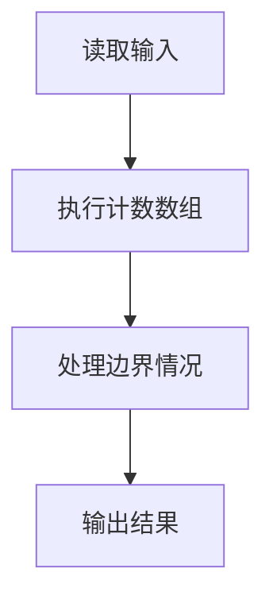
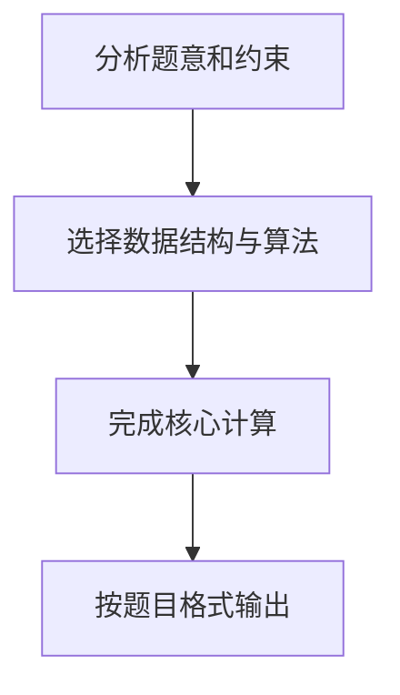

# 7-13 统计工龄

- **分值：** 20分

## 题目描述

给定公司 $$n$$ 名员工的工龄，要求按工龄增序输出每个工龄段有多少员工。

## 输入格式

输入首先给出正整数 $$n$$（$$\le 10^5$$），即员工总人数；随后给出 $$n$$ 个整数，即每个员工的工龄，范围在 [0, 50]。

## 输出格式

按工龄的递增顺序输出每个工龄的员工个数，格式为：“工龄:人数”。每项占一行。如果人数为 0 则不输出该项。

## 输入样例
```
8
10 2 0 5 7 2 5 2
```

## 输出样例
```
0:1
2:3
5:2
7:1
10:1

```

## 解题思路

本题采用计数数组，围绕题目给出的数据结构和约束完成核心计算，并处理边界情况。

## 代码流程说明

1. 读取题目规定的输入数据。
2. 使用计数数组完成主要处理。
3. 处理边界情况并整理结果。
4. 按指定格式输出结果。

## 代码实现


```c
/*
 * 实现过程：
 * 本题要求统计每个工龄的员工人数，按工龄从小到大输出。
 *
 * 算法：计数排序思想（桶计数）。
 *
 * 数据结构：
 * - cnt[51]：计数数组，下标0~50对应工龄，值对应该工龄的人数。
 *
 * 步骤：
 * 1. 读入员工总人数n。
 * 2. 循环读入每个员工的工龄x，执行cnt[x]++。
 * 3. 按工龄0~50顺序遍历，若cnt[i] > 0则输出"i:cnt[i]"。
 *
 * 时间复杂度：O(N + W)，W为工龄范围（50），空间复杂度：O(W)。
 */

#include <stdio.h>   // 引入标准输入输出库，用于 scanf 和 printf

int main() {
    int n, x;                           // n：员工总人数；x：临时存储每个员工的工龄
    int cnt[51] = {0};                  // 计数数组，下标 0~50 对应工龄，初始值全部为 0
    scanf("%d", &n);                    // 从标准输入读取员工总人数 n
    for (int i = 0; i < n; i++) {       // 循环 n 次，逐个读取工龄
        scanf("%d", &x);                // 读取一个工龄值
        cnt[x]++;                       // 对应工龄的计数器加 1
    }
    for (int i = 0; i <= 50; i++) {     // 按工龄从小到大遍历（0 到 50）
        if (cnt[i] > 0) {               // 若该工龄有员工
            printf("%d:%d\n", i, cnt[i]);  // 按 "工龄:人数" 格式输出
        }
    }
    return 0;                           // 程序正常结束
}
```

## 代码流程图



## 解题流程图


