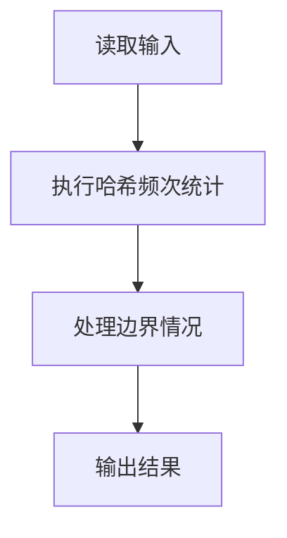
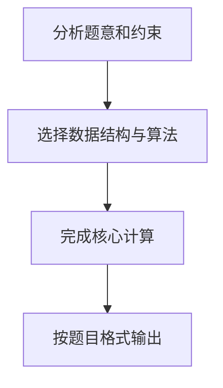

## 7-14 电话聊天狂人

- **分值：** 25分

## 题目描述

给定大量手机用户通话记录，找出其中通话次数最多的聊天狂人。

## 输入格式

输入首先给出正整数N（\le 10^5），为通话记录条数。随后N行，每行给出一条通话记录。简单起见，这里只列出拨出方和接收方的11位数字构成的手机号码，其中以空格分隔。

## 输出格式

在一行中给出聊天狂人的手机号码及其通话次数，其间以空格分隔。如果这样的人不唯一，则输出狂人中最小的号码及其通话次数，并且附加给出并列狂人的人数。

## 输入样例
```
4
13005711862 13588625832
13505711862 13088625832
13588625832 18087925832
15005713862 13588625832
```

## 输出样例
```
13588625832 3
```

## 解题思路

本题采用哈希频次统计，围绕题目给出的数据结构和约束完成核心计算，并处理边界情况。

## 代码流程说明

1. 读取题目规定的输入数据。
2. 使用哈希频次统计完成主要处理。
3. 处理边界情况并整理结果。
4. 按指定格式输出结果。

## 代码实现


```c
/*
 * 实现过程：
 * 本题要求找出通话次数最多的号码（聊天狂人），若有多人并列则输出号码最小的及并列人数。
 *
 * 算法：哈希表（拉链法）+ 遍历求最大值。
 *
 * 数据结构：
 * - table[MOD]：哈希表桶数组，MOD取大于2N的质数以减少冲突。
 * - Node链表：每个节点存储号码字符串、通话次数、next指针，拉链法解决冲突。
 *
 * 步骤：
 * 1. 读入通话记录数n。
 * 2. 对每条记录的两个号码，调用find_or_insert在哈希表中查找或插入，cnt++。
 *    - 哈希函数采用BKDR字符串哈希，基数131。
 *    - 查找时遍历链表，未找到则创建新节点插入链表头部。
 * 3. 遍历哈希表所有桶和链表，找出cnt最大的号码：
 *    - cnt更大则更新max_cnt、max_num，重置tie_count=1。
 *    - cnt相等则tie_count++，若号码更小则更新max_num。
 * 4. 若tie_count==1输出"号码 次数"，否则输出"号码 次数 并列人数"。
 *
 * 时间复杂度：O(N)（平均），空间复杂度：O(N)。
 */

#include <stdio.h>   // 引入标准输入输出库，用于 scanf、printf
#include <stdlib.h>  // 引入标准库，用于 malloc、free 动态内存管理
#include <string.h>  // 引入字符串库，用于 strcpy、strcmp 字符串操作

#define MOD 199999   // 哈希表桶数，选用大于 2×10^5 的质数，减少冲突

// 哈希表链表节点：存储一个号码及其通话次数
typedef struct Node {
    char num[12];       // 11 位手机号码，末尾留 1 位给 '\0'
    int cnt;            // 该号码的通话次数
    struct Node *next;  // 链表指针，拉链法解决哈希冲突
} Node;

Node *table[MOD];      // 哈希表数组，每个元素是对应桶的链表头指针

// BKDR 字符串哈希函数：将号码转换为哈希索引
unsigned long long hash_func(const char *s) {
    unsigned long long h = 0;  // 初始化哈希值
    for (int i = 0; s[i]; i++) {  // 遍历号码的每个字符
        h = h * 131 + s[i];       // 经典 BKDR 哈希：累加 基数*当前值 + 字符
    }
    return h % MOD;  // 对表长取模得到桶索引
}

// 在哈希表中查找号码，不存在则创建；返回节点指针（新节点 cnt 初始为 0）
Node *find_or_insert(const char *num) {
    unsigned long long idx = hash_func(num);  // 计算号码的哈希索引
    Node *p = table[idx];                      // 取该桶的链表头
    while (p) {                                // 遍历链表查找
        if (strcmp(p->num, num) == 0) {        // 找到相同号码
            return p;                          // 直接返回已有节点
        }
        p = p->next;                           // 继续检查下一个节点
    }
    // 未找到该号码，创建新节点并插入链表头部
    Node *node = (Node *)malloc(sizeof(Node));  // 分配节点内存
    strcpy(node->num, num);                      // 复制号码字符串到节点
    node->cnt = 0;                               // 新节点初始计数为 0（由外部 ++）
    node->next = table[idx];                     // 新节点 next 指向原链表头
    table[idx] = node;                           // 将新节点设为链表头
    return node;                                 // 返回新创建的节点
}

int main() {
    int n;                    // 通话记录条数
    scanf("%d", &n);          // 从标准输入读取 n
    char a[12], b[12];        // 临时存储每行的两个手机号码

    // 遍历每条通话记录，统计两个号码的出现次数
    for (int i = 0; i < n; i++) {
        scanf("%s %s", a, b);          // 读取拨出方和接收方号码
        find_or_insert(a)->cnt++;      // 拨出方号码计数加 1
        find_or_insert(b)->cnt++;      // 接收方号码计数加 1
    }

    // 遍历哈希表，找出通话次数最多的狂人
    int max_cnt = 0;                    // 当前最大通话次数
    char max_num[12] = "";              // 当前通话次数最多的号码（并列时取最小）
    int tie_count = 0;                  // 并列狂人的人数

    for (int i = 0; i < MOD; i++) {     // 遍历哈希表的每个桶
        Node *p = table[i];              // 取该桶的链表头
        while (p) {                      // 遍历链表中的每个节点
            if (p->cnt > max_cnt) {      // 发现比当前更大的通话次数
                max_cnt = p->cnt;        // 更新最大通话次数
                strcpy(max_num, p->num); // 更新对应的号码
                tie_count = 1;           // 并列人数重置为 1
            } else if (p->cnt == max_cnt) {  // 发现与最大次数并列的号码
                tie_count++;              // 并列人数加 1
                if (strcmp(p->num, max_num) < 0) {  // 比较号码字典序（同为11位等价于数值序）
                    strcpy(max_num, p->num);  // 保留较小的号码
                }
            }
            p = p->next;                  // 移动到链表下一个节点
        }
    }

    // 按格式输出结果
    if (tie_count == 1) {               // 只有一个狂人
        printf("%s %d\n", max_num, max_cnt);
    } else {                            // 有多个狂人并列
        printf("%s %d %d\n", max_num, max_cnt, tie_count);
    }

    // 释放哈希表占用的内存（OJ 上可省略，但养成良好编程习惯）
    for (int i = 0; i < MOD; i++) {
        Node *p = table[i];
        while (p) {
            Node *next = p->next;
            free(p);
            p = next;
        }
    }

    return 0;   // 程序正常结束
}
```

## 代码流程图



## 解题流程图


