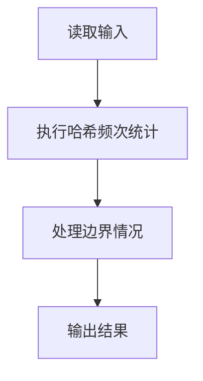
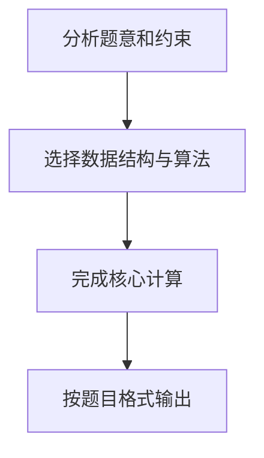

## 7-14 电话聊天狂人

- **分值：** 25分

## 题目描述

给定大量手机用户通话记录，找出其中通话次数最多的聊天狂人。

## 输入格式

输入首先给出正整数N（\le 10^5），为通话记录条数。随后N行，每行给出一条通话记录。简单起见，这里只列出拨出方和接收方的11位数字构成的手机号码，其中以空格分隔。

## 输出格式

在一行中给出聊天狂人的手机号码及其通话次数，其间以空格分隔。如果这样的人不唯一，则输出狂人中最小的号码及其通话次数，并且附加给出并列狂人的人数。

## 输入样例
```
4
13005711862 13588625832
13505711862 13088625832
13588625832 18087925832
15005713862 13588625832
```

## 输出样例
```
13588625832 3
```

## 解题思路

本题采用哈希频次统计，围绕题目给出的数据结构和约束完成核心计算，并处理边界情况。

## 代码流程说明

1. 读取题目规定的输入数据。
2. 使用哈希频次统计完成主要处理。
3. 处理边界情况并整理结果。
4. 按指定格式输出结果。

## 代码实现


```javascript
const fs = require("fs");
const raw = fs.readFileSync(0, "utf8");
const tokens = raw.trim() ? raw.trim().split(/\s+/) : [];
let at = 0;

// 每个号码出现一次就代表一端通话；Map 负责频次统计。
const n = Number(tokens[at++]),
  count = new Map();
for (let i = 0; i < n; i++)
  for (let j = 0; j < 2; j++) {
    const phone = tokens[at++];
    count.set(phone, (count.get(phone) || 0) + 1);
  }
let max = 0,
  best = "",
  ties = 0;
for (const [phone, value] of count) {
  if (value > max) {
    max = value;
    best = phone;
    ties = 1;
  } else if (value === max) {
    ties++;
    if (phone < best) best = phone;
  }
}
console.log(ties === 1 ? `${best} ${max}` : `${best} ${max} ${ties}`);
```

## 代码流程图



## 解题流程图


