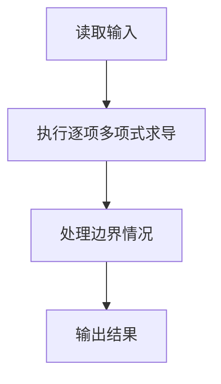
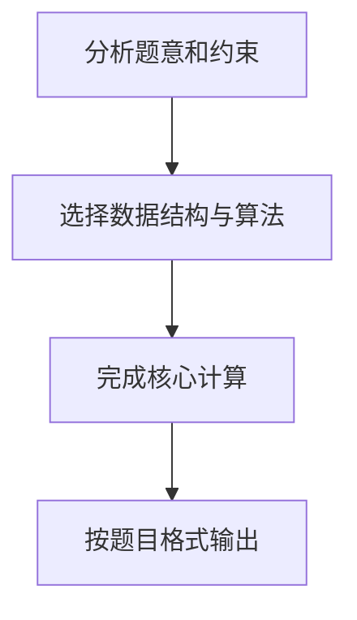

## 7-16 一元多项式求导

- **分值：** 20分

## 题目描述

设计函数求一元多项式的导数。

## 输入格式

以指数递降方式输入多项式非零项系数和指数（绝对值均为不超过1000的整数）。数字间以空格分隔。
注意：零多项式用 `0 0` 表示。

## 输出格式

以与输入相同的格式输出导数多项式非零项的系数和指数。数字间以空格分隔，但结尾不能有多余空格。

## 输入样例
```
3 4 -5 2 6 1 -2 0
```

## 输出样例
```
12 3 -10 1 6 0
```

## 解题思路

本题采用逐项多项式求导，围绕题目给出的数据结构和约束完成核心计算，并处理边界情况。

## 代码流程说明

1. 读取题目规定的输入数据。
2. 使用逐项多项式求导完成主要处理。
3. 处理边界情况并整理结果。
4. 按指定格式输出结果。

## 代码实现


```javascript
const fs = require("fs");
const raw = fs.readFileSync(0, "utf8");
const tokens = raw.trim() ? raw.trim().split(/\s+/) : [];
let at = 0;

// 对每一项 c*x^e 求导为 (c*e)*x^(e-1)，常数项直接消失。
const out = [];
while (at + 1 < tokens.length) {
  const c = Number(tokens[at++]),
    e = Number(tokens[at++]);
  if (!c && !e) break;
  if (e) out.push(c * e, e - 1);
}
console.log(out.length ? out.join(" ") : "0 0");
```

## 代码流程图



## 解题流程图


