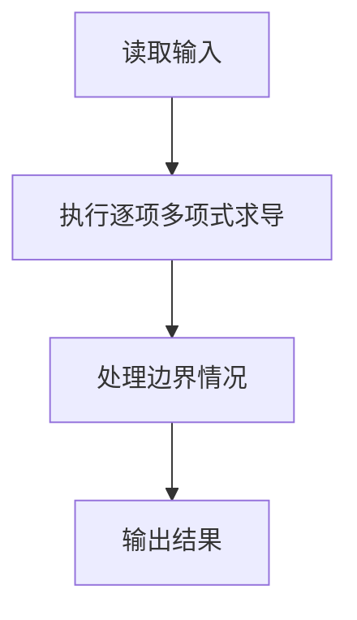
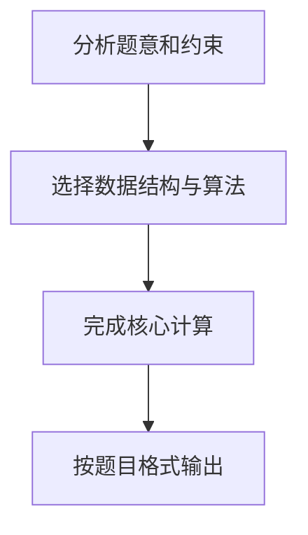

# 7-16 一元多项式求导

- **分值：** 20分

## 题目描述

设计函数求一元多项式的导数。

## 输入格式

以指数递降方式输入多项式非零项系数和指数（绝对值均为不超过1000的整数）。数字间以空格分隔。
注意：零多项式用 `0 0` 表示。

## 输出格式

以与输入相同的格式输出导数多项式非零项的系数和指数。数字间以空格分隔，但结尾不能有多余空格。

## 输入样例
```
3 4 -5 2 6 1 -2 0
```

## 输出样例
```
12 3 -10 1 6 0
```

## 解题思路

本题采用逐项多项式求导，围绕题目给出的数据结构和约束完成核心计算，并处理边界情况。

## 代码流程说明

1. 读取题目规定的输入数据。
2. 使用逐项多项式求导完成主要处理。
3. 处理边界情况并整理结果。
4. 按指定格式输出结果。

## 代码实现


```c
/*
 * 实现过程：
 * 本题要求对一元多项式求导，输出求导后的多项式（系数 指数 格式）。
 * 若求导结果为零多项式，则输出"0 0"。
 *
 * 算法：逐项求导，直接输出。
 *
 * 求导规则：
 * - 对每一项 c*x^e，求导后为 (c*e)*x^(e-1)。
 * - 指数e=0的常数项求导后为0，跳过不输出。
 *
 * 步骤：
 * 1. 循环读取每对（系数coef, 指数exp），直到指数为0或输入结束。
 * 2. 若exp > 0，计算新系数=coef*exp，新指数=exp-1，输出该导数项。
 * 3. 用first标记控制项间空格，用has_output标记是否有非零导数项。
 * 4. 若has_output为0（所有项求导后消失），输出"0 0"表示零多项式。
 *
 * 时间复杂度：O(N)，N为项数。空间复杂度：O(1)。
 */

#include <stdio.h>   // 引入标准输入输出库

int main() {
    int coef, exp;           // 系数、指数
    int first = 1;           // 标记是否为第一个输出项（控制空格分隔）
    int has_output = 0;      // 标记是否有任何非零导数项输出

    // 读取每一对（系数, 指数），直到读到的指数为 0 或 EOF
    // 注意：0 0 表示零多项式；读到指数为 0 时仍需处理该项的导数（为 0，即跳过）
    while (scanf("%d %d", &coef, &exp) == 2) {
        if (exp > 0) {                    // 指数 > 0 的项才有非零导数
            int new_coef = coef * exp;    // 新系数 = 原系数 * 指数
            int new_exp = exp - 1;        // 新指数 = 原指数 - 1
            if (new_coef != 0) {          // 新系数非零才输出（理论上 exp>0 且 coef!=0 时必然非零，额外保险）
                if (!first) printf(" ");  // 非首项，先输出空格
                printf("%d %d", new_coef, new_exp);  // 输出导数项
                first = 0;                 // 之后都是非首项
                has_output = 1;            // 标记有输出
            }
        }
        // 指数 == 0 的项是常数，导数为 0，直接跳过
        if (exp == 0) break;              // 读到最后一项（指数 0）即结束
    }

    if (!has_output) {                    // 若导数为零多项式（所有项都消失了）
        printf("0 0");                    // 输出零多项式
    }
    printf("\n");                          // 换行收尾

    return 0;   // 程序正常结束
}
```

## 代码流程图



## 解题流程图


