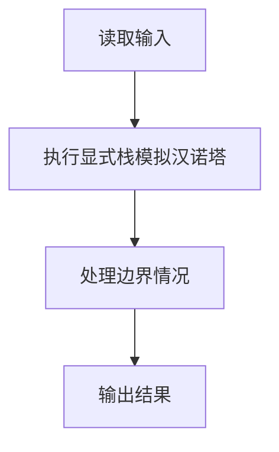
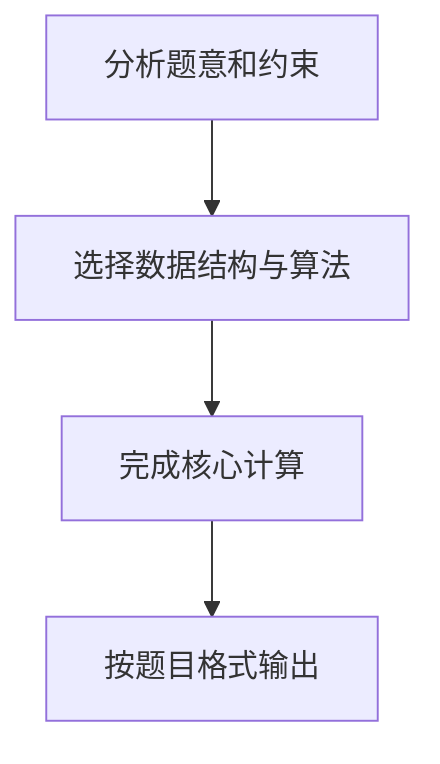

## 7-17 汉诺塔的非递归实现

- **分值：** 25分

## 题目描述

借助堆栈以非递归（循环）方式求解汉诺塔的问题（n, a, b, c），即将N个盘子从起始柱（标记为“a”）通过借助柱（标记为“b”）移动到目标柱（标记为“c”），并保证每个移动符合汉诺塔问题的要求。

## 输入格式

输入为一个正整数N，即起始柱上的盘数。

## 输出格式

每个操作（移动）占一行，按`柱1 -> 柱2`的格式输出。

## 输入样例
```
3
```

## 输出样例
```
a -> c
a -> b
c -> b
a -> c
b -> a
b -> c
a -> c
```

## 解题思路

本题采用显式栈模拟汉诺塔，围绕题目给出的数据结构和约束完成核心计算，并处理边界情况。

## 代码流程说明

1. 读取题目规定的输入数据。
2. 使用显式栈模拟汉诺塔完成主要处理。
3. 处理边界情况并整理结果。
4. 按指定格式输出结果。

## 代码实现


```javascript
const fs = require("fs");
const raw = fs.readFileSync(0, "utf8");
const tokens = raw.trim() ? raw.trim().split(/\s+/) : [];
let at = 0;

// 显式栈保存递归调用帧；逆序压入三个子任务即可保持递归执行顺序。
const n = Number(tokens[at++]),
  stack = [{ n, src: "a", aux: "b", dst: "c" }],
  out = [];
while (stack.length) {
  const task = stack.pop();
  if (task.n === 1) out.push(`${task.src} -> ${task.dst}`);
  else {
    stack.push({ n: task.n - 1, src: task.aux, aux: task.src, dst: task.dst });
    stack.push({ n: 1, src: task.src, aux: task.aux, dst: task.dst });
    stack.push({ n: task.n - 1, src: task.src, aux: task.dst, dst: task.aux });
  }
}
console.log(out.join("\n"));
```

## 代码流程图



## 解题流程图


