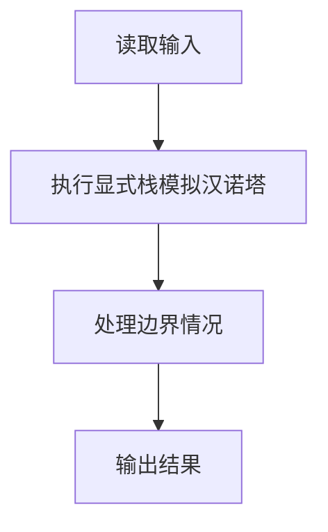
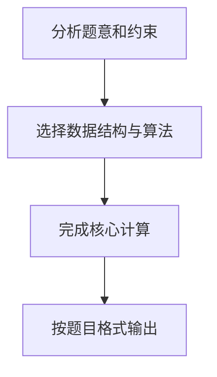

# 7-17 汉诺塔的非递归实现

- **分值：** 25分

## 题目描述

借助堆栈以非递归（循环）方式求解汉诺塔的问题（n, a, b, c），即将N个盘子从起始柱（标记为“a”）通过借助柱（标记为“b”）移动到目标柱（标记为“c”），并保证每个移动符合汉诺塔问题的要求。

## 输入格式

输入为一个正整数N，即起始柱上的盘数。

## 输出格式

每个操作（移动）占一行，按`柱1 -> 柱2`的格式输出。

## 输入样例
```
3
```

## 输出样例
```
a -> c
a -> b
c -> b
a -> c
b -> a
b -> c
a -> c
```

## 解题思路

本题采用显式栈模拟汉诺塔，围绕题目给出的数据结构和约束完成核心计算，并处理边界情况。

## 代码流程说明

1. 读取题目规定的输入数据。
2. 使用显式栈模拟汉诺塔完成主要处理。
3. 处理边界情况并整理结果。
4. 按指定格式输出结果。

## 代码实现


```c
/*
 * 实现过程：
 * 本题要求用非递归方式输出汉诺塔的移动步骤。
 *
 * 算法：栈模拟递归（手动管理调用栈）。
 *
 * 核心思路：
 * 递归 hanoi(n, src, aux, dst) 等价于三步：
 *   1. hanoi(n-1, src, dst, aux)  —— 把上面n-1个盘从src借dst移到aux
 *   2. move(src, dst)              —— 把最底下的盘从src移到dst
 *   3. hanoi(n-1, aux, src, dst)  —— 把n-1个盘从aux借src移到dst
 * 用栈模拟时，由于LIFO特性，需反向压入这三步，才能保证执行顺序正确。
 *
 * 数据结构：
 * - Task结构体：存储盘子数n、起始柱src、借助柱aux、目标柱dst。
 * - stack数组：手写栈，预分配2n+16个元素。
 *
 * 步骤：
 * 1. 读入盘子数n，初始任务{n, a, b, c}入栈。
 * 2. 循环弹栈：
 *    a. 若n==1，直接输出"src -> dst"。
 *    b. 若n>1，反向压入三种子任务：第三步、第二步、第一步。
 * 3. 设置64KB输出缓冲减少系统调用，用fwrite直接写字节跳过格式解析。
 *
 * 时间复杂度：O(2^n)，空间复杂度：O(n)（栈深度）。
 */

#include <stdio.h>    // 引入标准输入输出库
#include <stdlib.h>   // 引入标准库，用于 malloc、free

// 栈元素用 char 存储柱索引(0='a',1='b',2='c')，每个元素仅需 8 字节
// 相比 char+char+char+int = 12 字节更紧凑，且利于 CPU 缓存
typedef struct {
    int n;            // 盘子数
    char src;         // 起始柱索引 0/1/2
    char aux;         // 借助柱索引
    char dst;         // 目标柱索引
} Task;

int main() {
    int n;
    scanf("%d", &n);   // 读取盘子数

    // 预分配栈：最大深度约为 2n（每次分解净增2个元素）
    Task *stack = (Task *)malloc(sizeof(Task) * (2LL * n + 16));  // 2LL防止整数溢出
    if (!stack) return 1;  // 分配失败则退出
    int top = 0;

    // 初始压入整个任务：n 个盘从 a 经 b 到 c
    stack[top].n = n;
    stack[top].src = 0;  // 'a'
    stack[top].aux = 1;  // 'b'
    stack[top].dst = 2;  // 'c'
    top++;

    // 设置 64KB 大块输出缓冲，减少系统调用
    static char outbuf[65536];
    setvbuf(stdout, outbuf, _IOFBF, sizeof(outbuf));

    // 非递归主循环
    while (top > 0) {
        top--;
        int cn = stack[top].n;
        char csrc = stack[top].src;
        char caux = stack[top].aux;
        char cdst = stack[top].dst;

        if (cn == 1) {
            // 直接用 fputs 输出，比 printf 省掉格式解析开销
            // 预组合：柱名用 'a' + 索引 计算
            char line[10];
            int len = 0;
            line[len++] = 'a' + csrc;
            line[len++] = ' '; line[len++] = '-'; line[len++] = '>'; line[len++] = ' ';
            line[len++] = 'a' + cdst;
            line[len++] = '\n';
            fwrite(line, 1, len, stdout);
        } else {
            // n > 1: 反向压入三种子任务
            // 第三步: hanoi(n-1, aux, src, dst)
            stack[top].n = cn - 1;
            stack[top].src = caux;
            stack[top].aux = csrc;
            stack[top].dst = cdst;
            top++;
            // 第二步: move(src, dst)
            stack[top].n = 1;
            stack[top].src = csrc;
            stack[top].aux = caux;
            stack[top].dst = cdst;
            top++;
            // 第一步: hanoi(n-1, src, dst, aux)
            stack[top].n = cn - 1;
            stack[top].src = csrc;
            stack[top].aux = cdst;
            stack[top].dst = caux;
            top++;
        }
    }

    fflush(stdout);  // 确保输出缓冲全部刷新
    free(stack);     // 释放栈内存
    return 0;
}
```

## 代码流程图



## 解题流程图


