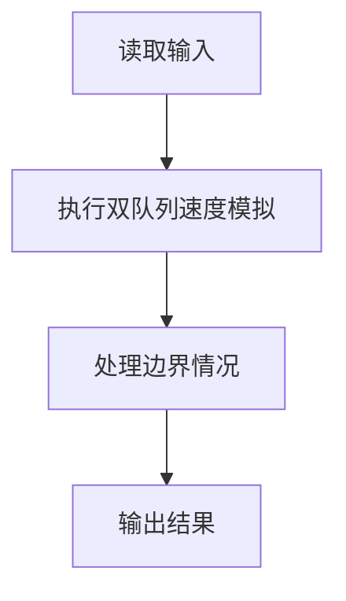
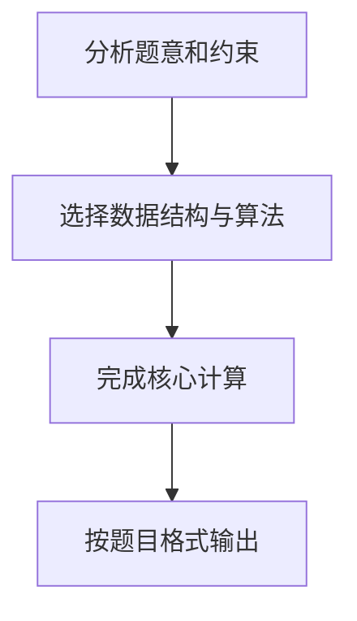

# 7-18 银行业务队列简单模拟

- **分值：** 25分

## 题目描述

设某银行有A、B两个业务窗口，且处理业务的速度不一样，其中A窗口处理速度是B窗口的2倍 —— 即当A窗口每处理完2个顾客时，B窗口处理完1个顾客。给定到达银行的顾客序列，请按业务完成的顺序输出顾客序列。假定不考虑顾客先后到达的时间间隔，并且当不同窗口同时处理完2个顾客时，A窗口顾客优先输出。

## 输入格式

输入为一行正整数，其中第1个数字N($$\le$$1000)为顾客总数，后面跟着N位顾客的编号。编号为奇数的顾客需要到A窗口办理业务，为偶数的顾客则去B窗口。数字间以空格分隔。

## 输出格式

按业务处理完成的顺序输出顾客的编号。数字间以空格分隔，但最后一个编号后不能有多余的空格。

## 输入样例
```
8 2 1 3 9 4 11 13 15
```

## 输出样例
```
1 3 2 9 11 4 13 15
```

## 解题思路

本题采用双队列速度模拟，围绕题目给出的数据结构和约束完成核心计算，并处理边界情况。

## 代码流程说明

1. 读取题目规定的输入数据。
2. 使用双队列速度模拟完成主要处理。
3. 处理边界情况并整理结果。
4. 按指定格式输出结果。

## 代码实现


```c
/*
 * 实现过程：
 * 本题模拟银行两个窗口的排队业务：A窗口处理奇数编号顾客，每轮2个；
 * B窗口处理偶数编号顾客，每轮1个。按处理完成顺序输出顾客编号。
 *
 * 算法：双队列模拟。
 *
 * 数据结构：
 * - qa[1005] / qb[1005]：数组模拟队列，分别存A窗口和B窗口的顾客编号。
 * - fa/ra、fb/rb：A队列和B队列的队首/队尾指针。
 *
 * 步骤：
 * 1. 读入顾客总数n和n个编号，奇数入A队列，偶数入B队列。
 * 2. 主循环（A或B队列非空时）：
 *    a. A窗口出队最多2个顾客。
 *    b. B窗口出队1个顾客。
 * 3. 用first标记控制输出空格分隔，最终换行。
 *
 * 时间复杂度：O(N)，空间复杂度：O(N)。
 */

#include <stdio.h>              // 引入标准输入输出头文件

int main() {                     // 主函数入口
    int n;                       // 定义变量n，存储顾客总数
    scanf("%d", &n);             // 从标准输入读取顾客总数

    int qa[1005], qb[1005];      // 定义两个数组分别作为A窗口和B窗口的队列（n≤1000）
    int fa = 0, ra = 0;          // fa为A队列队首指针，ra为A队列队尾指针（初始都为0，表示空队列）
    int fb = 0, rb = 0;          // fb为B队列队首指针，rb为B队列队尾指针（初始都为0，表示空队列）

    // 循环读取n个顾客编号，按奇偶分入两个队列
    for (int i = 0; i < n; i++) {   // 遍历n个顾客
        int x;                       // 定义变量x，存储当前顾客编号
        scanf("%d", &x);             // 读取一个顾客编号
        if (x % 2 == 1) {            // 判断编号是否为奇数
            qa[ra++] = x;            // 奇数编号进入A窗口队列，队尾指针后移
        } else {                     // 否则编号为偶数
            qb[rb++] = x;            // 偶数编号进入B窗口队列，队尾指针后移
        }
    }

    int first = 1;               // 输出标记：1表示尚未输出过任何数字，用于控制空格格式

    // 主循环：只要A队列或B队列还有顾客就继续处理
    while (fa < ra || fb < rb) {     // 当A队列非空或B队列非空时
        // A窗口每轮最多处理2个顾客
        for (int i = 0; i < 2; i++) {   // 循环2次，A窗口一轮处理2个
            if (fa < ra) {              // 如果A队列还有顾客
                if (!first) printf(" ");   // 如果不是第一个输出，先打印空格分隔
                printf("%d", qa[fa++]);     // 输出A队列队首顾客编号，队首指针后移
                first = 0;                  // 标记已经输出过数字
            }
        }
        // B窗口每轮处理1个顾客
        if (fb < rb) {                 // 如果B队列还有顾客
            if (!first) printf(" ");   // 如果不是第一个输出，先打印空格分隔
            printf("%d", qb[fb++]);    // 输出B队列队首顾客编号，队首指针后移
            first = 0;                 // 标记已经输出过数字
        }
    }

    printf("\n");                 // 输出换行符
    return 0;                     // 程序正常结束
}
```

## 代码流程图



## 解题流程图


