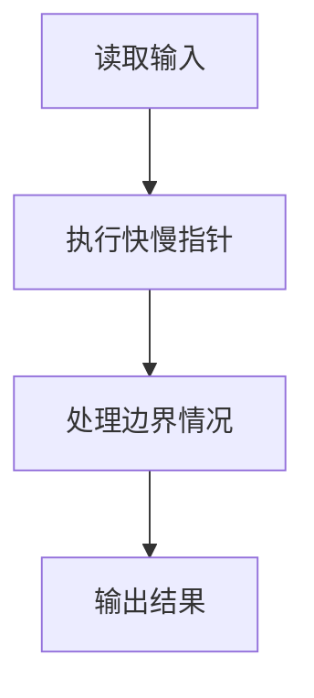
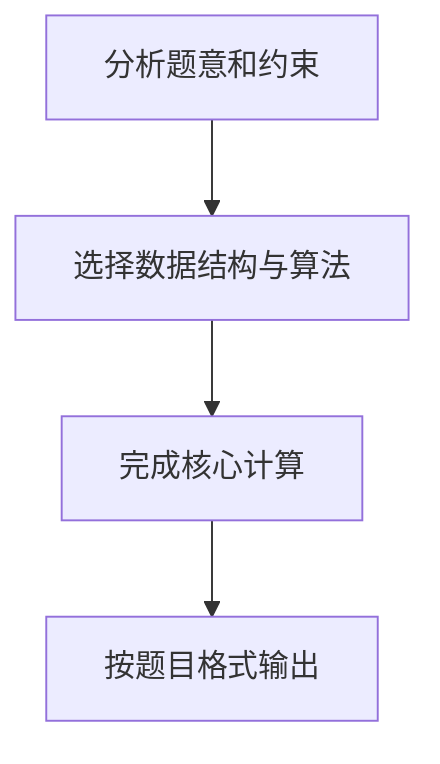

## 7-19 求链式线性表的倒数第K项

- **分值：** 20分

## 题目描述

给定一系列正整数，请设计一个尽可能高效的算法，查找倒数第K个位置上的数字。

## 输入格式

输入首先给出一个正整数K，随后是若干非负整数，最后以一个负整数表示结尾（该负数不算在序列内，不要处理）。

## 输出格式

输出倒数第K个位置上的数据。如果这个位置不存在，输出错误信息`NULL`。

## 输入样例
```
4 1 2 3 4 5 6 7 8 9 0 -1
```

## 输出样例
```
7
```

## 解题思路

本题采用快慢指针，围绕题目给出的数据结构和约束完成核心计算，并处理边界情况。

## 代码流程说明

1. 读取题目规定的输入数据。
2. 使用快慢指针完成主要处理。
3. 处理边界情况并整理结果。
4. 按指定格式输出结果。

## 代码实现


```c
/*
 * 实现过程：
 * 本题要求找出链式线性表中倒数第K个元素的值，若K超出链表长度则输出NULL。
 *
 * 算法：双指针法（快慢指针）。
 *
 * 核心思路：
 * 指针p先走K步，然后p和q同时走。当p到达链表末尾（NULL）时，
 * q恰好指向倒数第K个节点。因为p和q之间始终保持着K的距离。
 *
 * 数据结构：
 * - Node链表：单链表，尾插法构建，存储输入的非负整数。
 *
 * 步骤：
 * 1. 读入K值，循环读入非负整数构建链表（遇负数停止）。
 * 2. p指针先走K步，若中途p为NULL则链表长度不足K，输出NULL。
 * 3. p和q同步后移，直到p为NULL，此时q指向倒数第K个节点。
 * 4. 若q非空输出q->data，否则输出NULL。
 *
 * 时间复杂度：O(N)，空间复杂度：O(N)（链表节点）。
 */

#include <stdio.h>              // 引入标准输入输出头文件
#include <stdlib.h>             // 引入标准库头文件，提供malloc函数

typedef struct Node {           // 定义链表节点结构体
    int data;                   // 节点存储的数据
    struct Node *next;          // 指向下一个节点的指针
} Node;                         // 使用typedef起别名为Node

Node *createNode(int data) {    // 创建新节点的函数，参数为节点数据
    Node *node = (Node *)malloc(sizeof(Node));  // 动态分配一个Node大小的内存
    node->data = data;          // 将数据赋值给节点的data域
    node->next = NULL;          // 将节点的next指针初始化为NULL
    return node;                // 返回新创建节点的指针
}

void freeList(Node *head) {
    while (head != NULL) {
        Node *next = head->next;
        free(head);
        head = next;
    }
}

int main() {                    // 主函数入口
    int k, val;                 // k为倒数第K个的位置，val为读取的每个数值
    scanf("%d", &k);            // 读取K值

    Node *head = NULL, *tail = NULL;  // head为链表头指针，tail为链表尾指针，初始都为空
    while (scanf("%d", &val) && val >= 0) {  // 循环读取数值，遇到负数时停止
        Node *node = createNode(val);  // 为当前数值创建一个新节点
        if (head == NULL) {             // 如果链表为空（第一个节点）
            head = tail = node;         // 头指针和尾指针都指向新节点
        } else {                        // 如果链表不为空
            tail->next = node;          // 将新节点链接到链表尾部
            tail = node;                // 更新尾指针指向新的尾节点
        }
    }

    // 双指针法：p先走k步，然后p和q一起走，p到末尾时q即为倒数第k个
    Node *p = head, *q = head;  // 初始化两个指针p和q，都指向链表头部
    for (int i = 0; i < k; i++) {  // p指针先向前走k步
        if (p == NULL) {            // 如果p还没走完k步就到了链表末尾
            printf("NULL\n");       // 说明链表长度不足K，输出NULL
            freeList(head);
            return 0;               // 程序结束
        }
        p = p->next;                // p向后移动一步
    }
    while (p != NULL) {            // 当p还没到达链表末尾时
        p = p->next;               // p向后移动一步
        q = q->next;               // q也向后移动一步，保持p和q之间距离为k
    }

    if (q != NULL) {               // 如果q指针有效
        printf("%d\n", q->data);   // 输出q指向节点的数据，即倒数第K个值
    } else {                       // 否则q为空（链表为空的边界情况）
        printf("NULL\n");          // 输出NULL
    }

    freeList(head);
    return 0;                     // 程序正常结束
}
```

## 代码流程图



## 解题流程图


