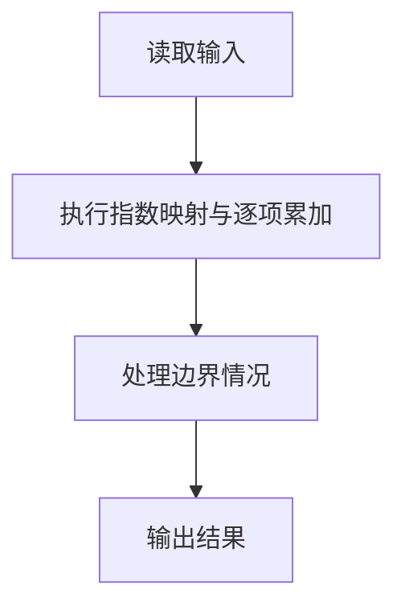
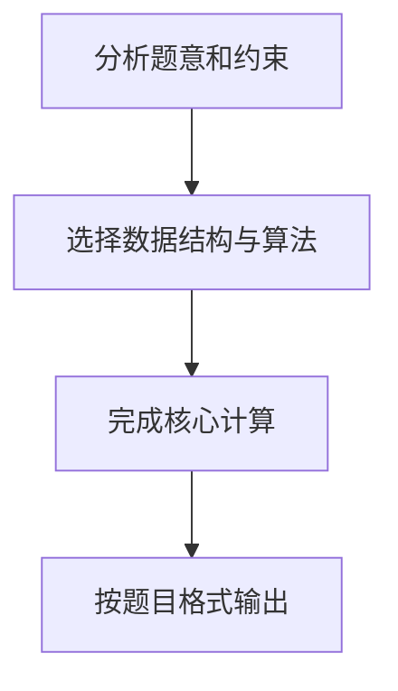

## 7-2 一元多项式的乘法与加法运算

- **分值：** 20分

## 题目描述

设计函数分别求两个一元多项式的乘积与和。

## 输入格式

输入分2行，每行分别先给出多项式非零项的个数，再以指数递降方式输入一个多项式非零项系数和指数（绝对值均为不超过1000的整数）。数字间以空格分隔。

## 输出格式

输出分2行，分别以指数递降方式输出乘积多项式以及和多项式非零项的系数和指数。数字间以空格分隔，但结尾不能有多余空格。零多项式应输出`0 0`。

## 输入样例
```
4 3 4 -5 2  6 1  -2 0
3 5 20  -7 4  3 1
```

## 输出样例
```
15 24 -25 22 30 21 -10 20 -21 8 35 6 -33 5 14 4 -15 3 18 2 -6 1
5 20 -4 4 -5 2 9 1 -2 0
```

## 解题思路

本题采用指数映射与逐项累加，围绕题目给出的数据结构和约束完成核心计算，并处理边界情况。

## 代码流程说明

1. 读取题目规定的输入数据。
2. 使用指数映射与逐项累加完成主要处理。
3. 处理边界情况并整理结果。
4. 按指定格式输出结果。

## 代码实现


```c
/*
 * 实现过程：
 * 本题采用"数组下标映射指数"的方法表示多项式，时间复杂度 O(N^2)（乘法），空间复杂度 O(MAX_EXP)。
 *
 * 数据结构：
 * - 用一维数组存储多项式，数组下标表示指数，数组值表示系数。
 *   例如 poly[3] = 5 表示 5x^3 这一项。
 * - 单个多项式最大指数为 1000，乘积最大指数为 2000。
 *
 * 加法实现：
 * - 遍历所有指数，将两个多项式对应指数的系数相加即可：sum[e] = poly1[e] + poly2[e]。
 *
 * 乘法实现：
 * - 双重循环遍历两个多项式的所有非零项。
 * - 每一对非零项：系数相乘，指数相加（i+j），结果累加到乘积数组的对应位置。
 *   即 prod[i+j] += poly1[i] * poly2[j]。
 *
 * 输出：
 * - 从最高指数到 0 降序遍历，跳过系数为 0 的项。
 * - 若所有系数均为 0（零多项式），输出 "0 0"。
 */

#include <stdio.h> // 引入标准输入输出库，用于 scanf 和 printf 函数

#define MAX_ABS_EXP 1000
#define OFFSET (MAX_ABS_EXP * 2)
#define WIDTH (OFFSET * 2 + 1)

/* 下标 e + OFFSET 对应指数 e，覆盖 -2000 到 2000。 */
static long long poly1[WIDTH];
static long long poly2[WIDTH];
static long long sum[WIDTH];
static long long prod[WIDTH];

void readPoly( long long arr[] )
{
    int n;
    scanf("%d", &n);
    for (int i = 0; i < n; i++) {
        int coefficient, exponent;
        scanf("%d %d", &coefficient, &exponent);
        arr[exponent + OFFSET] = coefficient;
    }
}

void printPoly(const long long arr[], int min_exp, int max_exp)
{
    int first = 1;
    for (int exponent = max_exp; exponent >= min_exp; exponent--) {
        long long coefficient = arr[exponent + OFFSET];
        if (coefficient != 0) {
            if (!first) printf(" ");
            printf("%lld %d", coefficient, exponent);
            first = 0;
        }
    }
    if (first) printf("0 0");
    printf("\n");
}

int main( void ) // 主函数，程序入口
{
    readPoly(poly1);
    readPoly(poly2);

    for (int exponent = -MAX_ABS_EXP; exponent <= MAX_ABS_EXP; exponent++) {
        sum[exponent + OFFSET] = poly1[exponent + OFFSET] + poly2[exponent + OFFSET];
    }

    for (int e1 = -MAX_ABS_EXP; e1 <= MAX_ABS_EXP; e1++) {
        if (poly1[e1 + OFFSET] == 0) continue;
        for (int e2 = -MAX_ABS_EXP; e2 <= MAX_ABS_EXP; e2++) {
            if (poly2[e2 + OFFSET] == 0) continue;
            prod[e1 + e2 + OFFSET] += poly1[e1 + OFFSET] * poly2[e2 + OFFSET];
        }
    }

    printPoly(prod, -OFFSET, OFFSET);
    printPoly(sum, -MAX_ABS_EXP, MAX_ABS_EXP);

    return 0; // 主函数正常结束，返回 0 表示程序执行成功
}
```

## 代码流程图



## 解题流程图


