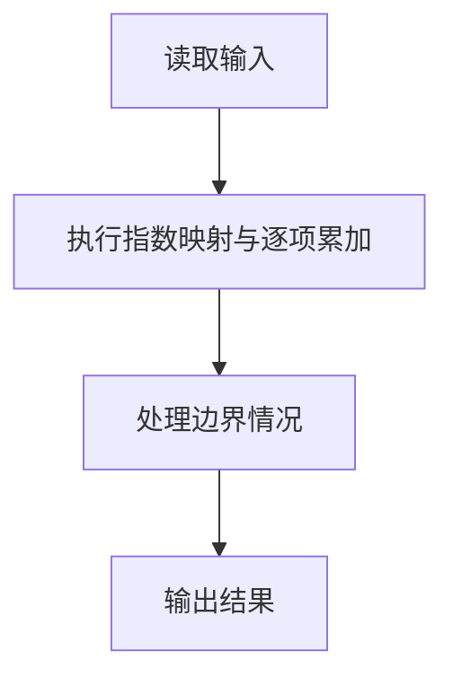
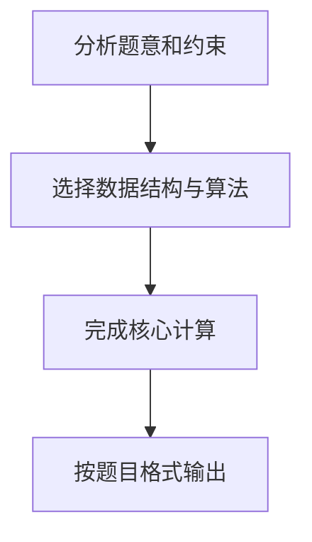

## 7-2 一元多项式的乘法与加法运算

- **分值：** 20分

## 题目描述

设计函数分别求两个一元多项式的乘积与和。

## 输入格式

输入分2行，每行分别先给出多项式非零项的个数，再以指数递降方式输入一个多项式非零项系数和指数（绝对值均为不超过1000的整数）。数字间以空格分隔。

## 输出格式

输出分2行，分别以指数递降方式输出乘积多项式以及和多项式非零项的系数和指数。数字间以空格分隔，但结尾不能有多余空格。零多项式应输出`0 0`。

## 输入样例
```
4 3 4 -5 2  6 1  -2 0
3 5 20  -7 4  3 1
```

## 输出样例
```
15 24 -25 22 30 21 -10 20 -21 8 35 6 -33 5 14 4 -15 3 18 2 -6 1
5 20 -4 4 -5 2 9 1 -2 0
```

## 解题思路

本题采用指数映射与逐项累加，围绕题目给出的数据结构和约束完成核心计算，并处理边界情况。

## 代码流程说明

1. 读取题目规定的输入数据。
2. 使用指数映射与逐项累加完成主要处理。
3. 处理边界情况并整理结果。
4. 按指定格式输出结果。

## 代码实现


```javascript
const fs = require("fs");
const raw = fs.readFileSync(0, "utf8");
const tokens = raw.trim() ? raw.trim().split(/\s+/) : [];
let at = 0;

// 用 Map 按指数存储系数；乘法的同指数项在写入时直接合并。
function readPoly() {
  const count = Number(tokens[at++]);
  const poly = new Map();
  for (let i = 0; i < count; i++) {
    const coefficient = Number(tokens[at++]);
    const exponent = Number(tokens[at++]);
    poly.set(exponent, (poly.get(exponent) || 0) + coefficient);
  }
  return poly;
}
function addTerm(poly, exponent, coefficient) {
  poly.set(exponent, (poly.get(exponent) || 0) + coefficient);
  if (poly.get(exponent) === 0) poly.delete(exponent);
}
function formatPoly(poly) {
  const result = [];
  [...poly.keys()]
    .sort((a, b) => b - a)
    .forEach((e) => {
      if (poly.get(e) !== 0) result.push(poly.get(e), e);
    });
  return result.length ? result.join(" ") : "0 0";
}
const first = readPoly();
const second = readPoly();
const sum = new Map(first);
for (const [e, c] of second) addTerm(sum, e, c);
const product = new Map();
for (const [e1, c1] of first)
  for (const [e2, c2] of second) addTerm(product, e1 + e2, c1 * c2);
console.log(`${formatPoly(product)}\n${formatPoly(sum)}`);
```

## 代码流程图



## 解题流程图


