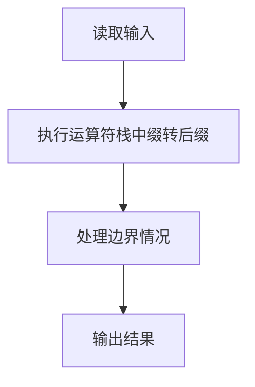
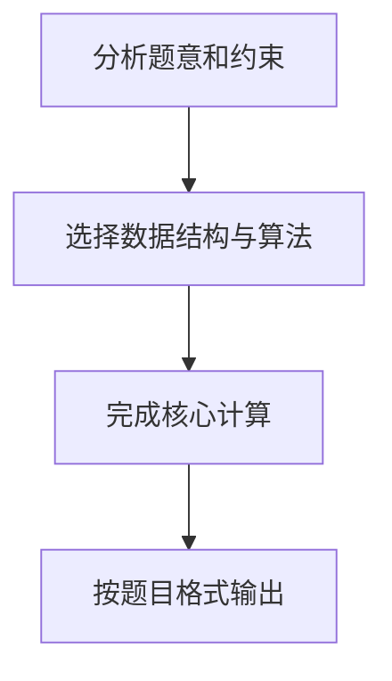

## 7-20 表达式转换

- **分值：** 25分

## 题目描述

算术表达式有前缀表示法、中缀表示法和后缀表示法等形式。日常使用的算术表达式是采用中缀表示法，即二元运算符位于两个运算数中间。请设计程序将中缀表达式转换为后缀表达式。

## 输入格式

输入在一行中给出不含空格的中缀表达式，可包含`+`、`-`、`*`、`/`以及左右括号`()`，表达式不超过20个字符。

## 输出格式

在一行中输出转换后的后缀表达式，要求不同对象（运算数、运算符号）之间以空格分隔，但结尾不得有多余空格。

## 输入样例
```
2+3*(7-4)+8/4
```

## 输出样例
```
2 3 7 4 - * + 8 4 / +
```

## 解题思路

本题采用运算符栈中缀转后缀，围绕题目给出的数据结构和约束完成核心计算，并处理边界情况。

## 代码流程说明

1. 读取题目规定的输入数据。
2. 使用运算符栈中缀转后缀完成主要处理。
3. 处理边界情况并整理结果。
4. 按指定格式输出结果。

## 代码实现


```c
#include <stdio.h>              // 引入标准输入输出头文件
#include <string.h>             // 引入字符串处理头文件，提供strlen函数
#include <ctype.h>              // 引入字符类型判断头文件，提供isdigit函数

char stack[30];                 // 运算符栈，存储运算符和左括号
int top = -1;                   // 栈顶指针，-1表示栈为空

void push(char c) { stack[++top] = c; }  // 入栈操作：栈顶指针先加1，再存入元素
char pop() { return stack[top--]; }      // 出栈操作：返回栈顶元素，栈顶指针减1
char peek() { return stack[top]; }       // 查看栈顶元素但不弹出
int isEmpty() { return top == -1; }      // 判断栈是否为空

int priority(char op) {         // 返回运算符的优先级
    if (op == '+' || op == '-') return 1;  // 加减优先级为1
    if (op == '*' || op == '/') return 2;  // 乘除优先级为2
    return 0;                   // 其他字符（如左括号）优先级为0
}

int isOperator(char c) {        // 判断字符是否为四则运算符
    return c == '+' || c == '-' || c == '*' || c == '/';
}

int main() {                    // 主函数入口
    char expr[30];              // 存储输入的中缀表达式
    scanf("%s", expr);          // 读取中缀表达式（不含空格）
    int len = strlen(expr);     // 获取表达式长度

    int first = 1;              // 输出标记：1表示尚未输出过任何内容，用于控制空格格式
    for (int i = 0; i < len; i++) {  // 从左到右遍历中缀表达式的每个字符
        char c = expr[i];       // 当前字符
        char prev = (i > 0) ? expr[i - 1] : '\0';  // 前一个字符，用于判断一元正负号

        // 判断是否为操作数（数字、小数点，或正负号作为一元运算符）
        if (isdigit(c) || c == '.' ||
            ((c == '+' || c == '-') && (i == 0 || prev == '('))) {
            // 一元正号不输出，一元负号输出
            if (c != '+') {             // 如果不是一元正号（一元负号或数字需要输出）
                if (!first) printf(" "); // 如果不是第一个输出，先打印空格分隔
                printf("%c", c);         // 输出当前字符（数字或负号）
                first = 0;               // 标记已经输出过内容
            }
            // 输出后续数字和小数点（处理多位数和小数）
            while (i + 1 < len && (isdigit(expr[i + 1]) || expr[i + 1] == '.')) {
                printf("%c", expr[++i]); // 继续输出下一个数字字符或小数点
            }
        } else if (c == '(') {          // 遇到左括号
            push(c);                     // 左括号直接入栈
        } else if (c == ')') {          // 遇到右括号
            while (!isEmpty() && peek() != '(') {  // 将栈顶到左括号之间的运算符全部弹出
                if (!first) printf(" "); // 输出空格分隔
                printf("%c", pop());     // 弹出并输出栈顶运算符
                first = 0;               // 标记已经输出过内容
            }
            pop();                       // 弹出左括号（不输出）
        } else if (isOperator(c)) {      // 遇到四则运算符
            // 当前运算符优先级不高于栈顶时，弹出栈顶运算符
            while (!isEmpty() && peek() != '(' && priority(peek()) >= priority(c)) {
                if (!first) printf(" "); // 输出空格分隔
                printf("%c", pop());     // 弹出并输出栈顶运算符
                first = 0;               // 标记已经输出过内容
            }
            push(c);                     // 将当前运算符入栈
        }
    }

    // 遍历结束后，将栈中剩余的运算符依次弹出
    while (!isEmpty()) {
        if (!first) printf(" ");         // 输出空格分隔
        printf("%c", pop());             // 弹出并输出栈顶运算符
        first = 0;                       // 标记已经输出过内容
    }

    printf("\n");                // 输出换行符
    return 0;                    // 程序正常结束
}
```

## 代码流程图



## 解题流程图


