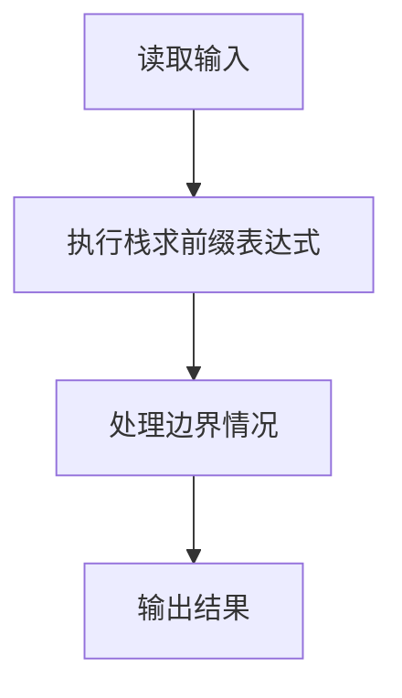
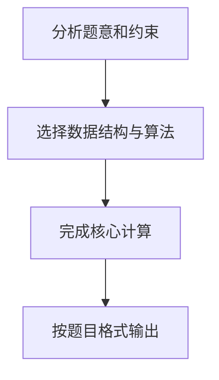

## 7-21 求前缀表达式的值

- **分值：** 25分

## 题目描述

算术表达式有前缀表示法、中缀表示法和后缀表示法等形式。前缀表达式指二元运算符位于两个运算数之前，例如`2+3*(7-4)+8/4`的前缀表达式是：`+ + 2 * 3 - 7 4 / 8 4`。请设计程序计算前缀表达式的结果值。

## 输入格式

输入在一行内给出不超过30个字符的前缀表达式，只包含`+`、`-`、`*`、`/`以及运算数，不同对象（运算数、运算符号）之间以空格分隔。

## 输出格式

输出前缀表达式的运算结果，保留小数点后1位，或错误信息`ERROR`。

## 输入样例
```
+ + 2 * 3 - 7 4 / 8 4
```

## 输出样例
```
13.0
```

## 解题思路

本题采用栈求前缀表达式，围绕题目给出的数据结构和约束完成核心计算，并处理边界情况。

## 代码流程说明

1. 读取题目规定的输入数据。
2. 使用栈求前缀表达式完成主要处理。
3. 处理边界情况并整理结果。
4. 按指定格式输出结果。

## 代码实现


```c
#include <stdio.h>              // 引入标准输入输出头文件
#include <string.h>             // 引入字符串处理头文件，提供strlen、strtok函数
#include <stdlib.h>             // 引入标准库头文件，提供atof函数
#include <ctype.h>              // 引入字符类型判断头文件

double stack[30];               // 操作数栈，存储中间计算结果
int top = -1;                   // 栈顶指针，-1表示栈为空

void push(double val) { stack[++top] = val; }  // 入栈操作：栈顶指针先加1，再存入元素
double pop() { return stack[top--]; }           // 出栈操作：返回栈顶元素，栈顶指针减1

int main() {                    // 主函数入口
    char line[100];             // 存储输入的一整行前缀表达式
    fgets(line, sizeof(line), stdin);  // 读取整行输入

    char *tokens[30];           // 存储拆分后的各个token（运算符或操作数）
    int cnt = 0;                // token计数器
    char *tok = strtok(line, " \n");  // 用空格和换行符分割第一个token
    while (tok != NULL) {       // 循环获取所有token
        tokens[cnt++] = tok;    // 将当前token存入数组，计数器加1
        tok = strtok(NULL, " \n");  // 继续分割获取下一个token
    }

    int error = 0;              // 错误标记，0表示无错误
    for (int i = cnt - 1; i >= 0; i--) {  // 从右往左遍历前缀表达式
        char *s = tokens[i];    // 当前token
        // 判断是否为运算符（长度为1且为+-*/，排除负数如-5）
        if (strlen(s) == 1 && (s[0] == '+' || s[0] == '-' || s[0] == '*' || s[0] == '/')) {
            if (top < 1) { error = 1; break; }  // 栈中不足两个操作数，表达式非法
            double a = pop();   // 弹出第一个操作数（前缀从右往左，先弹出的是左操作数）
            double b = pop();   // 弹出第二个操作数（右操作数）
            if (s[0] == '+') push(a + b);       // 加法运算，结果入栈
            else if (s[0] == '-') push(a - b);  // 减法运算，结果入栈
            else if (s[0] == '*') push(a * b);  // 乘法运算，结果入栈
            else if (s[0] == '/') {             // 除法运算
                if (b == 0.0) { error = 1; break; }  // 除数为0，表达式非法
                push(a / b);   // 除法运算，结果入栈
            }
        } else {
            push(atof(s));      // 操作数：转为double后入栈
        }
    }

    if (error || top != 0) {    // 如果有错误或栈中不止一个元素，表达式非法
        printf("ERROR\n");      // 输出错误信息
    } else {
        printf("%.1f\n", pop()); // 输出最终结果，保留1位小数
    }

    return 0;                   // 程序正常结束
}
```

## 代码流程图



## 解题流程图


