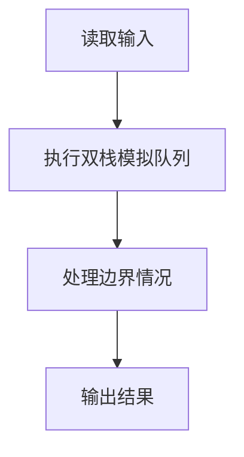
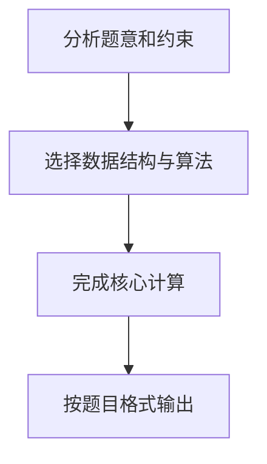

## 7-22 堆栈模拟队列

- **分值：** 25分

## 题目描述

设已知有两个堆栈S1和S2，请用这两个堆栈模拟出一个队列Q。

所谓用堆栈模拟队列，实际上就是通过调用堆栈的下列操作函数:

- `int IsFull(Stack S)`：判断堆栈`S`是否已满，返回1或0；
- `int IsEmpty (Stack S )`：判断堆栈`S`是否为空，返回1或0；
- `void Push(Stack S, ElementType item )`：将元素`item`压入堆栈`S`；
- `ElementType Pop(Stack S )`：删除并返回`S`的栈顶元素。

实现队列的操作，即入队`void AddQ(ElementType item)`和出队`ElementType DeleteQ()`。

## 输入格式

输入首先给出两个正整数`N1`和`N2`，表示堆栈`S1`和`S2`的最大容量。随后给出一系列的队列操作：`A  item`表示将`item`入列（这里假设`item`为整型数字）；`D`表示出队操作；`T`表示输入结束。

## 输出格式

对输入中的每个`D`操作，输出相应出队的数字，或者错误信息`ERROR:Empty`。如果入队操作无法执行，也需要输出`ERROR:Full`。每个输出占1行。

## 输入样例
```
3 2
A 1 A 2 A 3 A 4 A 5 D A 6 D A 7 D A 8 D D D D T
```

## 输出样例
```
ERROR:Full
1
ERROR:Full
2
3
4
7
8
ERROR:Empty
```

## 解题思路

本题采用双栈模拟队列，围绕题目给出的数据结构和约束完成核心计算，并处理边界情况。

## 代码流程说明

1. 读取题目规定的输入数据。
2. 使用双栈模拟队列完成主要处理。
3. 处理边界情况并整理结果。
4. 按指定格式输出结果。

## 代码实现


```c
#include <stdio.h>              // 引入标准输入输出头文件

int inStack[1000], outStack[1000];  // 输入栈和输出栈的数组
int inTop = -1, outTop = -1;   // 输入栈和输出栈的栈顶指针，-1表示栈为空
int inCap, outCap;              // 输入栈和输出栈的最大容量

void inPush(int val) { inStack[++inTop] = val; }  // 输入栈入栈：栈顶指针先加1，再存入元素
int inPop() { return inStack[inTop--]; }           // 输入栈出栈：返回栈顶元素，栈顶指针减1
int inFull() { return inTop == inCap - 1; }        // 判断输入栈是否已满
int inEmpty() { return inTop == -1; }              // 判断输入栈是否为空

void outPush(int val) { outStack[++outTop] = val; }  // 输出栈入栈：栈顶指针先加1，再存入元素
int outPop() { return outStack[outTop--]; }           // 输出栈出栈：返回栈顶元素，栈顶指针减1
int outFull() { return outTop == outCap - 1; }        // 判断输出栈是否已满
int outEmpty() { return outTop == -1; }               // 判断输出栈是否为空

void transfer() {               // 转移操作：将输入栈的所有元素依次弹出并压入输出栈
    while (!inEmpty()) {        // 当输入栈不为空时
        outPush(inPop());       // 从输入栈弹出一个元素，压入输出栈（实现顺序反转）
    }
}

void AddQ(int item) {           // 入队操作
    if (!inFull()) {             // 如果输入栈未满
        inPush(item);           // 直接将元素压入输入栈
    } else if (outEmpty()) {    // 如果输入栈已满但输出栈为空
        transfer();             // 将输入栈元素全部转移到输出栈
        inPush(item);           // 转移后输入栈有空位，将元素压入输入栈
    } else {                    // 输入栈满且输出栈非空，无法入队
        printf("ERROR:Full\n"); // 输出队满错误信息
    }
}

void DeleteQ() {                // 出队操作
    if (!outEmpty()) {          // 如果输出栈不为空
        printf("%d\n", outPop()); // 直接从输出栈弹出栈顶元素（即队首元素）
    } else if (!inEmpty()) {    // 如果输出栈为空但输入栈不为空
        transfer();             // 将输入栈元素全部转移到输出栈
        printf("%d\n", outPop()); // 转移后从输出栈弹出队首元素
    } else {                    // 两个栈都为空，队列为空
        printf("ERROR:Empty\n"); // 输出队空错误信息
    }
}

int main() {                    // 主函数入口
    int n1, n2;                 // 两个栈的容量
    scanf("%d %d", &n1, &n2);   // 读取两个栈的容量

    // 较小的栈作为输入栈，较大的栈作为输出栈
    // 原因：转移时输入栈所有元素都要压入输出栈，输出栈必须能容纳
    if (n1 <= n2) {             // 如果n1较小
        inCap = n1; outCap = n2; // n1作为输入栈容量，n2作为输出栈容量
    } else {                    // 如果n2较小
        inCap = n2; outCap = n1; // n2作为输入栈容量，n1作为输出栈容量
    }

    char op;                    // 操作类型字符
    while (scanf(" %c", &op) && op != 'T') {  // 循环读取操作，遇到T结束
        if (op == 'A') {        // A操作：入队
            int item;           // 入队元素
            scanf("%d", &item); // 读取入队元素
            AddQ(item);         // 调用入队函数
        } else if (op == 'D') { // D操作：出队
            DeleteQ();          // 调用出队函数
        }
    }

    return 0;                   // 程序正常结束
}
```

## 代码流程图



## 解题流程图


