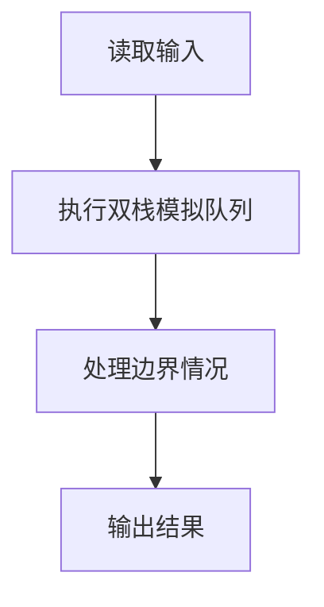
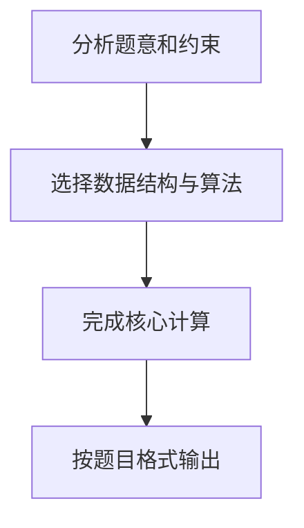

## 7-22 堆栈模拟队列

- **分值：** 25分

## 题目描述

设已知有两个堆栈S1和S2，请用这两个堆栈模拟出一个队列Q。

所谓用堆栈模拟队列，实际上就是通过调用堆栈的下列操作函数:

- `int IsFull(Stack S)`：判断堆栈`S`是否已满，返回1或0；
- `int IsEmpty (Stack S )`：判断堆栈`S`是否为空，返回1或0；
- `void Push(Stack S, ElementType item )`：将元素`item`压入堆栈`S`；
- `ElementType Pop(Stack S )`：删除并返回`S`的栈顶元素。

实现队列的操作，即入队`void AddQ(ElementType item)`和出队`ElementType DeleteQ()`。

## 输入格式

输入首先给出两个正整数`N1`和`N2`，表示堆栈`S1`和`S2`的最大容量。随后给出一系列的队列操作：`A  item`表示将`item`入列（这里假设`item`为整型数字）；`D`表示出队操作；`T`表示输入结束。

## 输出格式

对输入中的每个`D`操作，输出相应出队的数字，或者错误信息`ERROR:Empty`。如果入队操作无法执行，也需要输出`ERROR:Full`。每个输出占1行。

## 输入样例
```
3 2
A 1 A 2 A 3 A 4 A 5 D A 6 D A 7 D A 8 D D D D T
```

## 输出样例
```
ERROR:Full
1
ERROR:Full
2
3
4
7
8
ERROR:Empty
```

## 解题思路

本题采用双栈模拟队列，围绕题目给出的数据结构和约束完成核心计算，并处理边界情况。

## 代码流程说明

1. 读取题目规定的输入数据。
2. 使用双栈模拟队列完成主要处理。
3. 处理边界情况并整理结果。
4. 按指定格式输出结果。

## 代码实现


```javascript
const fs = require("fs");
const raw = fs.readFileSync(0, "utf8");
const tokens = raw.trim() ? raw.trim().split(/\s+/) : [];
let at = 0;

// 两栈容量较小者作为输入栈；输出栈为空时整体转移，保持队列先进先出。
let cap1 = Number(tokens[at++]),
  cap2 = Number(tokens[at++]);
if (cap1 > cap2) [cap1, cap2] = [cap2, cap1];
const input = [],
  output = [],
  result = [];
function transfer() {
  while (input.length) output.push(input.pop());
}
while (at < tokens.length) {
  const op = tokens[at++];
  if (op === "T") break;
  if (op === "A") {
    const value = Number(tokens[at++]);
    if (input.length < cap1) input.push(value);
    else if (!output.length && input.length <= cap2) {
      transfer();
      input.push(value);
    } else result.push("ERROR:Full");
  } else if (op === "D") {
    if (!output.length) transfer();
    result.push(output.length ? String(output.pop()) : "ERROR:Empty");
  }
}
console.log(result.join("\n"));
```

## 代码流程图



## 解题流程图


