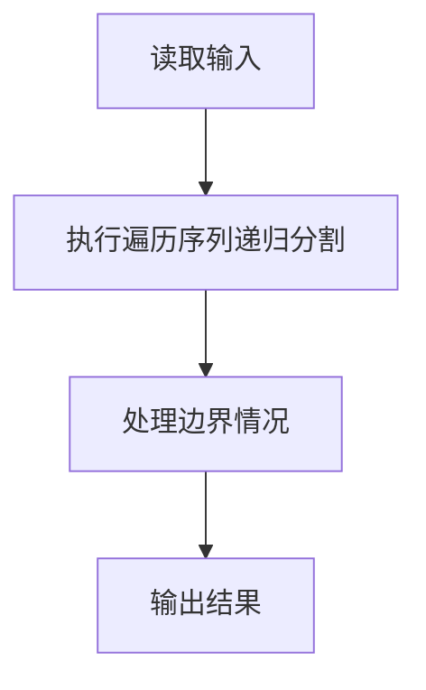
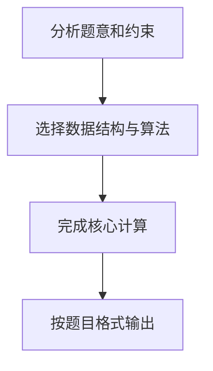

# 7-23 还原二叉树

- **分值：** 25分

## 题目描述

给定一棵二叉树的前序遍历序列和中序遍历序列，要求计算该二叉树的高度。

## 输入格式

输入首先给出正整数 $n$（$$\le$$50），为树中结点总数。随后 2 行先后给出前序和中序遍历序列，均是长度为 $n$ 的不包含重复英文字母（区别大小写）的字符串。

## 输出格式

输出为一个整数，即该二叉树的高度。

## 输入样例
```
9
ABDFGHIEC
FDHGIBEAC
```

## 输出样例
```
5
```

## 解题思路

本题采用遍历序列递归分割，围绕题目给出的数据结构和约束完成核心计算，并处理边界情况。

## 代码流程说明

1. 读取题目规定的输入数据。
2. 使用遍历序列递归分割完成主要处理。
3. 处理边界情况并整理结果。
4. 按指定格式输出结果。

## 代码实现


```c
/*
 * 实现原理：
 * 给定二叉树的前序遍历和中序遍历序列，求二叉树的高度。
 * 核心思路：前序遍历的第一个元素即为根节点，在中序遍历中找到该根节点的位置 k，
 * 则中序遍历中 k 左侧为左子树（k 个节点），右侧为右子树（n-1-k 个节点）。
 * 前序遍历中，根节点之后的前 k 个为左子树的前序，再之后为右子树的前序。
 * 递归计算左右子树的高度，取较大值加 1 即为当前树的高度。
 * 递归终止条件：节点数为 0 时高度为 0。
 */

#include <stdio.h>   // 标准输入输出
#include <string.h>  // 字符串操作

// 在字符串 s 的前 len 个字符中查找字符 c 的位置
int find(char *s, char c, int len) {
    for (int i = 0; i < len; i++)  // 遍历前 len 个字符
        if (s[i] == c) return i;   // 找到则返回下标
    return -1;                     // 未找到返回 -1
}

// 递归计算二叉树高度：pre 为前序序列，in 为中序序列，n 为节点数
int height(char *pre, char *in, int n) {
    if (n == 0) return 0;                          // 空树高度为 0
    int k = find(in, pre[0], n);                   // 在中序中找到根节点位置，划分左右子树
    int left = height(pre + 1, in, k);             // 递归计算左子树高度（前序跳过根，中序取前 k 个）
    int right = height(pre + 1 + k, in + 1 + k, n - 1 - k); // 递归计算右子树高度（前序和中序都跳过根和左子树部分）
    return 1 + (left > right ? left : right);      // 当前树高度 = 1 + max(左子树高度, 右子树高度)
}

int main() {
    int n;                       // 节点总数
    char pre[55], in[55];        // 前序和中序遍历序列
    scanf("%d", &n);             // 读入节点数
    scanf("%s %s", pre, in);     // 读入前序和中序序列
    printf("%d\n", height(pre, in, n)); // 输出二叉树高度
    return 0;                    // 程序正常结束
}
```

## 代码流程图



## 解题流程图


