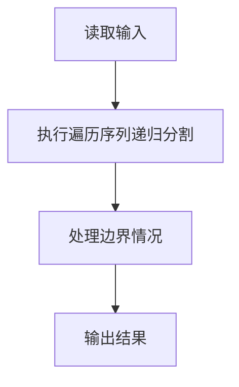
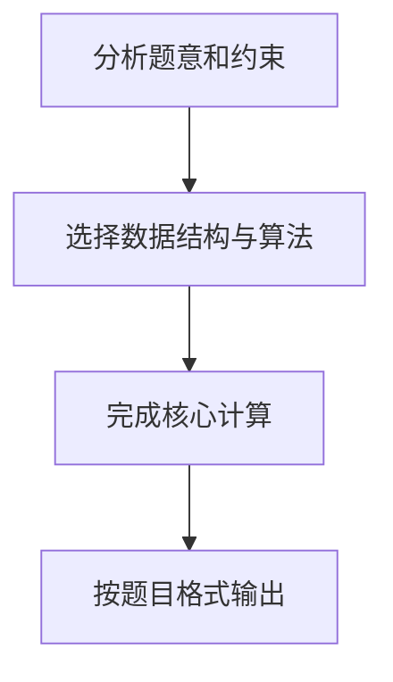

## 7-23 还原二叉树

- **分值：** 25分

## 题目描述

给定一棵二叉树的前序遍历序列和中序遍历序列，要求计算该二叉树的高度。

## 输入格式

输入首先给出正整数 n（\le50），为树中结点总数。随后 2 行先后给出前序和中序遍历序列，均是长度为 n 的不包含重复英文字母（区别大小写）的字符串。

## 输出格式

输出为一个整数，即该二叉树的高度。

## 输入样例
```
9
ABDFGHIEC
FDHGIBEAC
```

## 输出样例
```
5
```

## 解题思路

本题采用遍历序列递归分割，围绕题目给出的数据结构和约束完成核心计算，并处理边界情况。

## 代码流程说明

1. 读取题目规定的输入数据。
2. 使用遍历序列递归分割完成主要处理。
3. 处理边界情况并整理结果。
4. 按指定格式输出结果。

## 代码实现


```javascript
const fs = require("fs");
const raw = fs.readFileSync(0, "utf8");
const tokens = raw.trim() ? raw.trim().split(/\s+/) : [];
let at = 0;

// 前序首元素是根，在中序中切分左右子树并递归构造；后序访问根即可输出答案。
const n = Number(tokens[at++]),
  preorder = (tokens[at++] || "").split(""),
  inorder = (tokens[at++] || "").split(""),
  position = new Map(inorder.map((x, i) => [x, i]));
function height(pl, pr, il, ir) {
  if (pl >= pr || il >= ir) return 0;
  const mid = position.get(preorder[pl]),
    leftSize = mid - il;
  return (
    1 +
    Math.max(
      height(pl + 1, pl + 1 + leftSize, il, mid),
      height(pl + 1 + leftSize, pr, mid + 1, ir),
    )
  );
}
console.log(height(0, n, 0, n).toString());
```

## 代码流程图



## 解题流程图


