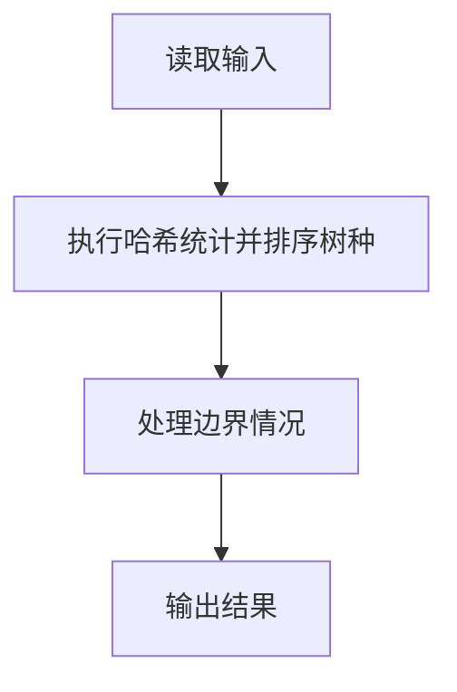
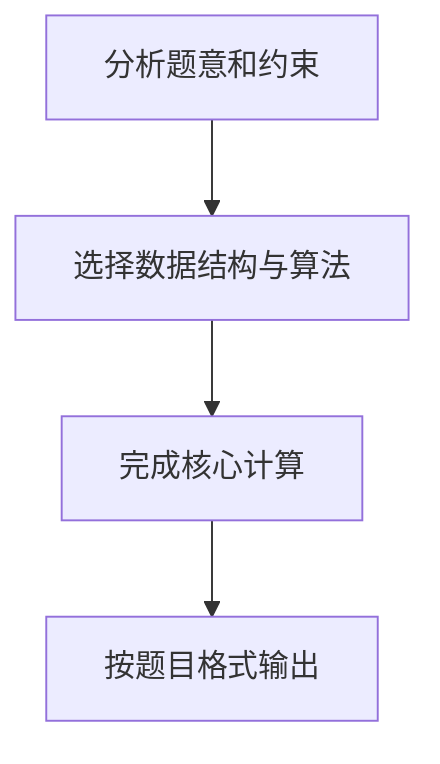

# 7-24 树种统计

- **分值：** 25分

## 题目描述

随着卫星成像技术的应用，自然资源研究机构可以识别每一棵树的种类。请编写程序帮助研究人员统计每种树的数量，计算每种树占总数的百分比。

## 输入格式

输入首先给出正整数 $n$（$\le 10^5$），随后 $n$ 行，每行给出卫星观测到的一棵树的种类名称。种类名称由不超过 30 个英文字母和空格组成（大小写有区分）。

## 输出格式

按字典序递增输出各种树的种类名称及其所占总数的百分比，其间以空格分隔，保留小数点后 4 位。

## 输入样例
```
29
Red Alder
Ash
Aspen
Basswood
Ash
Beech
Yellow Birch
Ash
Cherry
Cottonwood
Ash
Cypress
Red Elm
Gum
Hackberry
White Oak
Hickory
Pecan
Hard Maple
White Oak
Soft Maple
Red Oak
Red Oak
White Oak
Poplan
Sassafras
Sycamore
Black Walnut
Willow
```

## 输出样例
```
Ash 13.7931%
Aspen 3.4483%
Basswood 3.4483%
Beech 3.4483%
Black Walnut 3.4483%
Cherry 3.4483%
Cottonwood 3.4483%
Cypress 3.4483%
Gum 3.4483%
Hackberry 3.4483%
Hard Maple 3.4483%
Hickory 3.4483%
Pecan 3.4483%
Poplan 3.4483%
Red Alder 3.4483%
Red Elm 3.4483%
Red Oak 6.8966%
Sassafras 3.4483%
Soft Maple 3.4483%
Sycamore 3.4483%
White Oak 10.3448%
Willow 3.4483%
Yellow Birch 3.4483%
```

**鸣谢青岛大学周强老师修正题面！**

## 解题思路

本题采用哈希统计并排序树种，围绕题目给出的数据结构和约束完成核心计算，并处理边界情况。

## 代码流程说明

1. 读取题目规定的输入数据。
2. 使用哈希统计并排序树种完成主要处理。
3. 处理边界情况并整理结果。
4. 按指定格式输出结果。

## 代码实现


```c
/*
 * 实现原理：
 * 将 n 个树种名称存入数组，使用 qsort 按字典序排序，
 * 排序后相同树种连续相邻，只需一次扫描即可统计每种出现次数，
 * 然后按字典序输出树种名称及其百分比（次数 * 100.0 / n，保留 4 位小数）。
 * 时间复杂度 O(n log n)，空间复杂度 O(n)。
 */

#include <stdio.h>   // 标准输入输出
#include <stdlib.h>  // malloc/free/qsort
#include <string.h>  // 字符串操作

#define MAX_LEN 32   // 每个树种名称最大字符数

static int compare_names(const void *a, const void *b) {
    return strcmp((const char *)a, (const char *)b);
}

int main() {
    int n;                        // 树的总数
    scanf("%d", &n);              // 读入 n
    int ch;
    while ((ch = getchar()) != '\n' && ch != EOF) { }

    // 动态分配二维字符数组，存储所有树种名称
    char (*arr)[MAX_LEN] = malloc(sizeof(char) * MAX_LEN * n);

    // 逐行读入 n 个树种名称
    for (int i = 0; i < n; i++) {
        fgets(arr[i], MAX_LEN, stdin);            // 读取一行（可能含空格）
        arr[i][strcspn(arr[i], "\r\n")] = '\0';   // 去掉尾部的换行符
    }

    // 使用标准库 qsort 对数组按字典序排序
    qsort(arr, (size_t)n, sizeof(arr[0]), compare_names);

    // 一次扫描：排序后相同名称相邻，统计每种的数量并输出
    int i = 0;                     // 当前扫描位置
    while (i < n) {                // 遍历所有树种
        int j = i;                 // 从当前位置向后查找相同名称
        while (j < n && strcmp(arr[j], arr[i]) == 0) j++; // 找到相同名称的下边界
        int cnt = j - i;           // 当前树种的出现次数
        // 输出：树种名称 + 百分比（保留 4 位小数）
        printf("%s %.4f%%\n", arr[i], (double)cnt * 100.0 / n);
        i = j;                     // 跳到下一种树种
    }

    free(arr);                    // 释放动态分配的内存
    return 0;                     // 程序正常结束
}
```

## 代码流程图



## 解题流程图


