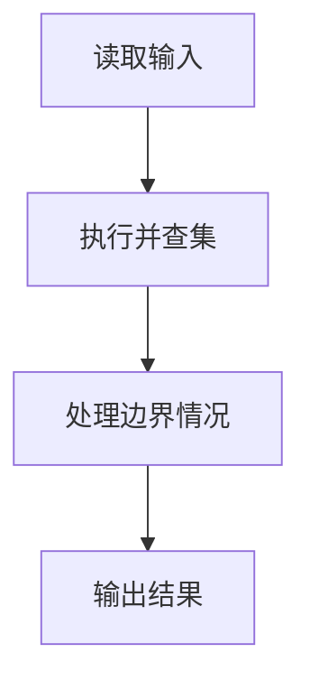
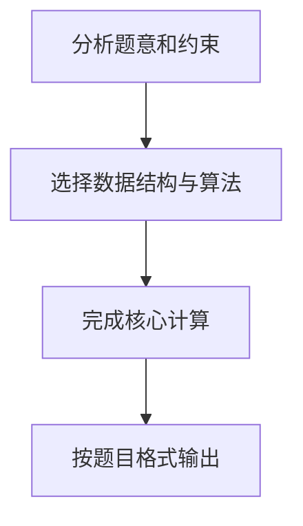

## 7-25 朋友圈

- **分值：** 25分

## 题目描述

某学校有N个学生，形成M个俱乐部。每个俱乐部里的学生有着一定相似的兴趣爱好，形成一个朋友圈。一个学生可以同时属于若干个不同的俱乐部。根据“我的朋友的朋友也是我的朋友”这个推论可以得出，如果A和B是朋友，且B和C是朋友，则A和C也是朋友。请编写程序计算最大朋友圈中有多少人。

## 输入格式

输入的第一行包含两个正整数N（\le30000）和M（\le1000），分别代表学校的学生总数和俱乐部的个数。后面的M行每行按以下格式给出1个俱乐部的信息，其中学生从1~N编号：

`第i个俱乐部的人数Mi（空格）学生1（空格）学生2 … 学生Mi`

## 输出格式

输出给出一个整数，表示在最大朋友圈中有多少人。

## 输入样例
```
7 4
3 1 2 3
2 1 4
3 5 6 7
1 6
```

## 输出样例
```
4
```

## 解题思路

本题采用并查集，围绕题目给出的数据结构和约束完成核心计算，并处理边界情况。

## 代码流程说明

1. 读取题目规定的输入数据。
2. 使用并查集完成主要处理。
3. 处理边界情况并整理结果。
4. 按指定格式输出结果。

## 代码实现


```javascript
const fs = require("fs");
const raw = fs.readFileSync(0, "utf8");
const tokens = raw.trim() ? raw.trim().split(/\s+/) : [];
let at = 0;

// 并查集把同一俱乐部中的学生合并，最大集合大小就是最大朋友圈。
const [n, m] = [Number(tokens[at++]), Number(tokens[at++])],
  parent = Array.from({ length: n + 1 }, (_, i) => i),
  size = Array(n + 1).fill(1);
function find(x) {
  while (parent[x] !== x) {
    parent[x] = parent[parent[x]];
    x = parent[x];
  }
  return x;
}
function union(a, b) {
  a = find(a);
  b = find(b);
  if (a === b) return;
  if (size[a] < size[b]) [a, b] = [b, a];
  parent[b] = a;
  size[a] += size[b];
}
for (let i = 0; i < m; i++) {
  const k = Number(tokens[at++]),
    first = Number(tokens[at++]);
  for (let j = 1; j < k; j++) union(first, Number(tokens[at++]));
}
console.log(Math.max(...size.slice(1)).toString());
```

## 代码流程图



## 解题流程图


