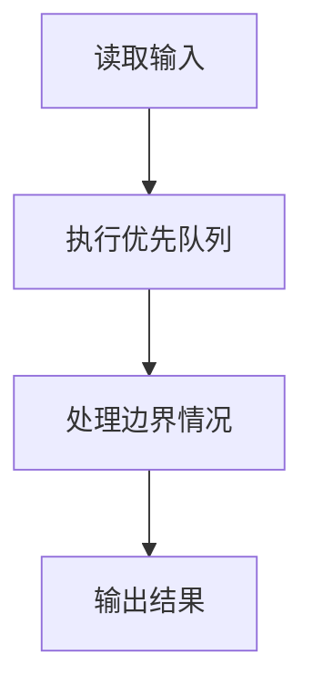
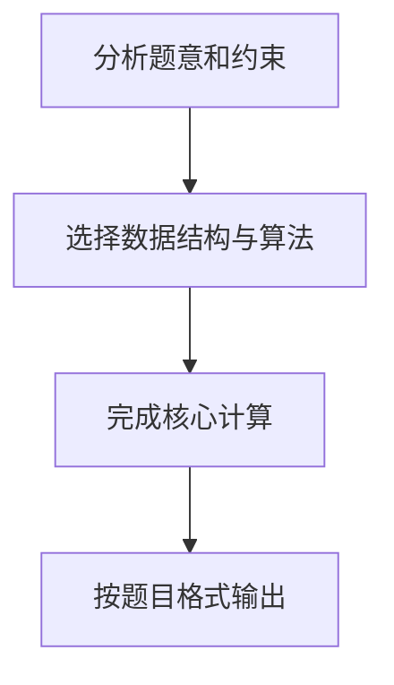

# 7-26 Windows消息队列

- **分值：** 25分

## 题目描述

消息队列是 Windows 系统的基础。对于每个进程，系统维护一个消息队列。如果在进程中有特定事件发生，如点击鼠标、文字改变等，系统将把这个消息连同表示此消息优先级高低的正整数（称为优先级值）加到队列当中。同时，如果队列不是空的，这一进程循环地从队列中按照优先级获取消息。请注意优先级值低意味着优先级高。请编辑程序模拟消息队列，将消息加到队列中以及从队列中获取消息。

## 输入格式

输入第 1 行给出正整数 $n$（$$\le 10^5$$），随后 $n$ 行，每行给出一个指令——`GET` 或 `PUT`，分别表示从队列中取出消息或将消息添加到队列中。如果指令是 `PUT`，后面就有一个消息名称、以及一个正整数表示消息的优先级，此数越小表示优先级越高。消息名称是长度不超过 10 个字符且不含空格的字符串；题目保证队列中消息的优先级无重复，且输入至少有一个 `GET`。

## 输出格式

对于每个 `GET` 指令，在一行中输出消息队列中优先级最高的消息的名称和参数。如果消息队列中没有消息，输出 `EMPTY QUEUE!`。对于 `PUT` 指令则没有输出。

## 输入样例
```
9
PUT msg1 5
PUT msg2 4
GET
PUT msg3 2
PUT msg4 4
GET
GET
GET
GET
```

## 输出样例
```
msg2
msg3
msg4
msg1
EMPTY QUEUE!
```

## 解题思路

本题采用优先队列，围绕题目给出的数据结构和约束完成核心计算，并处理边界情况。

## 代码流程说明

1. 读取题目规定的输入数据。
2. 使用优先队列完成主要处理。
3. 处理边界情况并整理结果。
4. 按指定格式输出结果。

## 代码实现


```c
/*
 * 实现方式：
 * 使用数组模拟最小堆（1-based索引），手动实现push和pop操作。
 * 堆节点存储消息的优先级和名称。push时新元素从堆底上浮，pop时堆顶元素下沉。
 * 使用scanf读取输入，printf输出结果，时间复杂度O(n log n)。
 */
#include <stdio.h>      // 标准输入输出库
#include <stdlib.h>     // 标准库（malloc等）
#include <string.h>     // 字符串处理库

#define MAXN 100005     // 队列最大容量，对应题目n≤10^5

// 消息结构体，存储优先级和名称
typedef struct {
    int priority;       // 优先级值（越小优先级越高）
    char name[16];      // 消息名称（最大10字符，留冗余）
} Msg;

static Msg heap[MAXN];  // 堆数组，1-based索引
static int heap_size;   // 当前堆大小

// 交换两个Msg结构体的值
void swap(Msg *a, Msg *b) {
    Msg t = *a;         // 临时变量保存a的值
    *a = *b;            // 将b的值赋给a
    *b = t;             // 将临时变量的值赋给b
}

// 向堆中插入元素（最小堆上浮操作）
void push(int priority, const char *name) {
    heap_size++;                    // 堆大小加1
    heap[heap_size].priority = priority;  // 设置新节点的优先级
    strcpy(heap[heap_size].name, name);   // 复制消息名称到堆节点
    int i = heap_size;              // 当前节点索引
    // 向上调整：如果当前节点优先级小于父节点，则交换
    while (i > 1 && heap[i].priority < heap[i / 2].priority) {
        swap(&heap[i], &heap[i / 2]);    // 与父节点交换
        i /= 2;                     // 移动到父节点位置
    }
}

// 删除堆顶元素（最小堆下沉操作）
void pop(void) {
    if (heap_size == 0) return;     // 堆为空，直接返回
    heap[1] = heap[heap_size];      // 将最后一个元素移到堆顶
    heap_size--;                    // 堆大小减1
    int i = 1;                      // 当前节点索引（从堆顶开始）
    // 向下调整：找到更小的子节点进行交换
    while (2 * i <= heap_size) {
        int child = 2 * i;          // 左子节点索引
        // 如果右子节点存在且优先级更小，选择右子节点
        if (child + 1 <= heap_size && heap[child + 1].priority < heap[child].priority)
            child++;
        // 如果当前节点优先级不大于子节点，调整结束
        if (heap[i].priority <= heap[child].priority) break;
        swap(&heap[i], &heap[child]);    // 与子节点交换
        i = child;                  // 移动到子节点位置
    }
}

int main(void) {
    int n;                          // 指令数量
    scanf("%d", &n);                // 读取指令数量
    heap_size = 0;                  // 初始化堆为空
    char op[8];                     // 存储操作指令（GET或PUT）
    while (n--) {                   // 循环处理每条指令
        scanf("%s", op);            // 读取操作指令
        if (op[0] == 'P') {         // 判断是否为PUT操作
            char name[16];          // 存储消息名称
            int p;                  // 存储消息优先级
            scanf("%s %d", name, &p);   // 读取消息名称和优先级
            push(p, name);          // 将消息插入堆中
        } else {                    // GET操作
            if (heap_size == 0)     // 判断堆是否为空
                printf("EMPTY QUEUE!\n");  // 堆空输出提示
            else {
                printf("%s\n", heap[1].name);  // 输出堆顶元素（优先级最高）
                pop();              // 删除堆顶元素
            }
        }
    }
    return 0;                       // 程序正常结束
}
```

## 代码流程图



## 解题流程图


