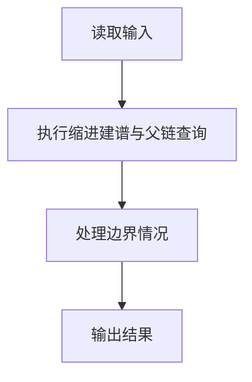
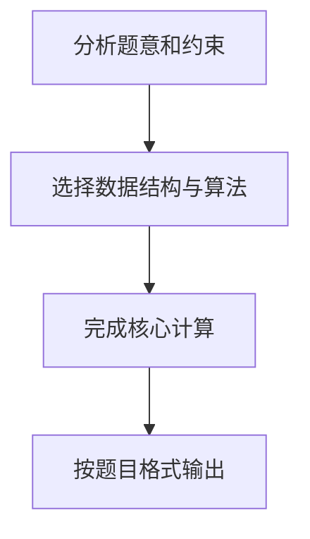

## 7-27 家谱处理

- **分值：** 30分

## 题目描述

人类学研究对于家族很感兴趣，于是研究人员搜集了一些家族的家谱进行研究。实验中，使用计算机处理家谱。为了实现这个目的，研究人员将家谱转换为文本文件。下面为家谱文本文件的实例：

```
LaoLi
  DaLi
    XiaoMing
    XiaoHong
  ErLi
    MeiMei
```

家谱文本文件中，每一行包含一个人的名字。第一行中的名字是这个家族最早的祖先。家谱仅包含最早祖先的后代，而他们的丈夫或妻子不出现在家谱中。每个人的子女比父母多缩进 2 个空格。以上述家谱文本文件为例，`LaoLi` 是这个家族最早的祖先，他有两个孩子 `DaLi` 和 `ErLi`，`DaLi` 有两个孩子 `XiaoMing` 和 `XiaoHong`，`ErLi` 只有一个孩子 `MeiMei`。

在实验中，研究人员还收集了家庭文件，并提取了家谱中有关两个人关系的陈述语句。下面为家谱中关系的陈述语句实例：

```
LaoLi is the parent of DaLi （老李与大李是父子关系）
DaLi is a sibling of ErLi  （大李与二李是兄弟姊妹关系）
MeiMei is a descendant of DaLi （梅梅是大李的后代）
```

研究人员需要判断每个陈述语句是真还是假，请编写程序帮助研究人员判断。

## 输入格式

输入第 1 行给出 2 个正整数 n（2\le n\le 100）和 m（\le 100），其中 n 为家谱中名字的数量，m 为家谱中陈述语句的数量。

接下来输入的每行不超过 70 个字符。名字的字符串由不超过 10 个英文字母组成。在家谱中的第一行给出的名字前没有缩进空格。家谱中的其他名字至少缩进 2 个空格，即他们是家谱中最早祖先（第一行给出的名字）的后代，且如果家谱中一个名字前缩进 k 个空格，则下一行中名字至多缩进 k+2 个空格。

在一个家谱中同样的名字不会出现两次，且家谱中没有出现的名字不会出现在陈述语句中。每句陈述语句格式如下（括号内为解释文字，不是格式的一部分），其中 `X` 和 `Y` 为家谱中的不同名字：
```
X is a child of Y （X是Y的孩子）
X is the parent of Y （X是Y的父母）
X is a sibling of Y （X是Y的兄弟姊妹）
X is a descendant of Y （X是Y的后代）
X is an ancestor of Y （X是Y的祖先）
```

## 输出格式

对于测试用例中的每句陈述语句，如果陈述为真，在一行中输出 `True`；如果陈述为假，在一行中输出 `False`。

## 输入样例
```
6 5
LaoLi
  DaLi
    XiaoMing
    XiaoHong
  ErLi
    MeiMei
DaLi is a child of LaoLi
DaLi is an ancestor of XiaoHong
DaLi is a sibling of ErLi
ErLi is the parent of XiaoMing
LaoLi is a descendant of XiaoHong
```

## 输出样例
```
True
True
True
False
False
```

## 解题思路

本题采用缩进建谱与父链查询，围绕题目给出的数据结构和约束完成核心计算，并处理边界情况。

## 代码流程说明

1. 读取题目规定的输入数据。
2. 使用缩进建谱与父链查询完成主要处理。
3. 处理边界情况并整理结果。
4. 按指定格式输出结果。

## 代码实现


```javascript
const fs = require("fs");
const raw = fs.readFileSync(0, "utf8");
const tokens = raw.trim() ? raw.trim().split(/\s+/) : [];
let at = 0;

// 按缩进回溯父结点；关系查询统一转化为 parent 链上的祖先判断。
const n = Number(tokens[at++]),
  m = Number(tokens[at++]);
at = 2;
const lines = raw.split(/\r?\n/).slice(1, n + 1),
  names = [],
  depth = [],
  parent = [],
  index = new Map();
for (const line of lines) {
  const spaces = line.match(/^ */)[0].length,
    name = line.trim();
  const d = spaces / 2;
  let p = -1;
  for (let i = names.length - 1; i >= 0; i--)
    if (depth[i] === d - 1) {
      p = i;
      break;
    }
  index.set(name, names.length);
  names.push(name);
  depth.push(d);
  parent.push(p);
}
const statements = raw
    .split(/\r?\n/)
    .slice(n + 1)
    .filter(Boolean),
  out = [];
function ancestor(a, b) {
  for (let x = b; x >= 0; x = parent[x]) if (x === a) return true;
  return false;
}
for (const line of statements.slice(0, m)) {
  const [x, , , relation, , y] = line.split(/\s+/),
    xi = index.get(x),
    yi = index.get(y);
  let ok = false;
  if (relation === "child") ok = parent[xi] === yi;
  else if (relation === "parent") ok = parent[yi] === xi;
  else if (relation === "sibling")
    ok = parent[xi] >= 0 && parent[xi] === parent[yi];
  else if (relation === "descendant") ok = ancestor(yi, xi) && xi !== yi;
  else if (relation === "ancestor") ok = ancestor(xi, yi) && xi !== yi;
  out.push(ok ? "True" : "False");
}
console.log(out.join("\n"));
```

## 代码流程图



## 解题流程图


