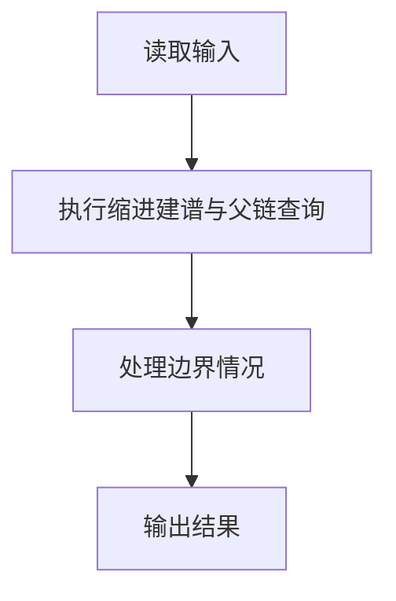
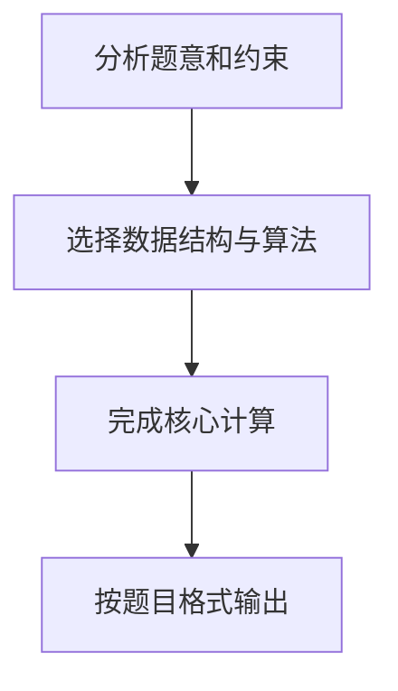

人类学研究对于家族很感兴趣，于是研究人员搜集了一些家族的家谱进行研究。实验中，使用计算机处理家谱。为了实现这个目的，研究人员将家谱转换为文本文件。下面为家谱文本文件的实例：

LaoLi
  DaLi
    XiaoMing
    XiaoHong
  ErLi
    MeiMei
家谱文本文件中，每一行包含一个人的名字。第一行中的名字是这个家族最早的祖先。家谱仅包含最早祖先的后代，而他们的丈夫或妻子不出现在家谱中。每个人的子女比父母多缩进 2 个空格。以上述家谱文本文件为例，LaoLi 是这个家族最早的祖先，他有两个孩子 DaLi 和 ErLi，DaLi 有两个孩子 XiaoMing 和 XiaoHong，ErLi 只有一个孩子 MeiMei。

在实验中，研究人员还收集了家庭文件，并提取了家谱中有关两个人关系的陈述语句。下面为家谱中关系的陈述语句实例：

LaoLi is the parent of DaLi （老李与大李是父子关系）
DaLi is a sibling of ErLi  （大李与二李是兄弟姊妹关系）
MeiMei is a descendant of DaLi （梅梅是大李的后代）
研究人员需要判断每个陈述语句是真还是假，请编写程序帮助研究人员判断。

输入格式:
输入第 1 行给出 2 个正整数 n（2≤n≤100）和 m（≤100），其中 n 为家谱中名字的数量，m 为家谱中陈述语句的数量。

接下来输入的每行不超过 70 个字符。名字的字符串由不超过 10 个英文字母组成。在家谱中的第一行给出的名字前没有缩进空格。家谱中的其他名字至少缩进 2 个空格，即他们是家谱中最早祖先（第一行给出的名字）的后代，且如果家谱中一个名字前缩进 k 个空格，则下一行中名字至多缩进 k+2 个空格。

在一个家谱中同样的名字不会出现两次，且家谱中没有出现的名字不会出现在陈述语句中。每句陈述语句格式如下（括号内为解释文字，不是格式的一部分），其中 X 和 Y 为家谱中的不同名字：

X is a child of Y （X是Y的孩子）
X is the parent of Y （X是Y的父母）
X is a sibling of Y （X是Y的兄弟姊妹）
X is a descendant of Y （X是Y的后代）
X is an ancestor of Y （X是Y的祖先）
输出格式:
对于测试用例中的每句陈述语句，如果陈述为真，在一行中输出 True；如果陈述为假，在一行中输出 False。

输入样例:
```in
6 5
LaoLi
  DaLi
    XiaoMing
    XiaoHong
  ErLi
    MeiMei
DaLi is a child of LaoLi
DaLi is an ancestor of XiaoHong
DaLi is a sibling of ErLi
ErLi is the parent of XiaoMing
LaoLi is a descendant of XiaoHong
```
输出样例:
```out
True
True
True
False
False
```

## 解题思路

本题采用缩进建谱与父链查询，围绕题目给出的数据结构和约束完成核心计算，并处理边界情况。

## 代码流程说明

1. 读取题目规定的输入数据。
2. 使用缩进建谱与父链查询完成主要处理。
3. 处理边界情况并整理结果。
4. 按指定格式输出结果。

## 代码实现


```c
/*
 * 7-27 家谱处理 - C语言实现
 *
 * 实现方式：
 * 1. 数据结构：
 *    - names[]: 存储所有名字（字符串数组）
 *    - depth[]: 存储每个名字的层级深度（缩进空格数/2）
 *    - parent[]: 存储每个名字的父节点索引（-1表示无父节点）
 *
 * 2. 构建家谱：
 *    - 逐行读取名字，计算缩进空格数sp，深度d = sp/2
 *    - 向前回溯找到第一个深度为d-1的节点作为父节点
 *
 * 3. 关系判断：
 *    - child: parent[X] == Y
 *    - parent: parent[Y] == X
 *    - sibling: parent[X] == parent[Y] 且 X != Y
 *    - descendant: 从X向上追溯能找到Y
 *    - ancestor: 从Y向上追溯能找到X
 */

#include <stdio.h>      // 标准输入输出库
#include <string.h>     // 字符串处理库
#include <stdlib.h>     // 标准库

#define MAX_N 105       // 最大名字数量
#define NAME_LEN 15     // 最大名字长度

char names[MAX_N][NAME_LEN];    // 存储所有名字
int depth[MAX_N];               // 存储每个名字的层级深度
int parent[MAX_N];              // 存储每个名字的父节点索引
int n, m;                       // n为名字数量，m为陈述语句数量
int cnt;                        // 当前已处理的名字数量

// 根据名字查找其在names数组中的索引
int findName(const char *name) {
    for (int i = 0; i < cnt; i++) {         // 遍历所有已存储的名字
        if (strcmp(names[i], name) == 0)    // 如果找到匹配的名字
            return i;                       // 返回其索引
    }
    return -1;                              // 未找到返回-1
}

// 判断a是否是b的祖先（从b向上追溯能否找到a）
int isAncestor(int a, int b) {
    int cur = b;                            // 从b开始向上追溯
    while (cur != -1) {                     // 当cur有父节点时继续
        if (cur == a)                       // 如果追溯到a
            return 1;                       // 返回1（是祖先）
        cur = parent[cur];                  // 向上移动到父节点
    }
    return 0;                               // 未追溯到a，返回0
}

int main() {
    char line[100];                         // 存储每行输入
    char buf[100];                          // 存储陈述语句
    int i;                                  // 循环变量

    scanf("%d %d", &n, &m);                 // 读入n和m
    getchar();                              // 吸收换行符

    cnt = 0;                                // 初始化计数器为0
    memset(parent, -1, sizeof(parent));     // 将所有父节点初始化为-1

    // 构建家谱：读取n个名字
    for (i = 0; i < n; i++) {
        fgets(line, sizeof(line), stdin);   // 读取一行
        line[strcspn(line, "\r\n")] = 0;    // 去除换行符
        int sp = 0;                         // 计算缩进空格数
        while (line[sp] == ' ')             // 统计前导空格
            sp++;
        char *nm = line + sp;               // 获取名字（跳过空格）
        strcpy(names[cnt], nm);             // 存储名字
        depth[cnt] = sp / 2;                // 计算层级深度（每2个空格为一层）

        // 如果深度大于0，需要找到父节点
        if (depth[cnt] > 0) {
            for (int j = cnt - 1; j >= 0; j--) {    // 向前回溯
                if (depth[j] == depth[cnt] - 1) {   // 找到深度为d-1的节点
                    parent[cnt] = j;                // 设置父节点索引
                    break;                          // 找到后退出循环
                }
            }
        }
        cnt++;                               // 名字计数增加
    }

    // 处理m个陈述语句
    for (i = 0; i < m; i++) {
        fgets(buf, sizeof(buf), stdin);      // 读取陈述语句
        buf[strcspn(buf, "\r\n")] = 0;       // 去除换行符
        char x[NAME_LEN], y[NAME_LEN], keyword[NAME_LEN];
        /* 关系句式为“X is a/the/an relation of Y”，目标姓名是第6个词。 */
        if (sscanf(buf, "%14s %*s %*s %14s %*s %14s", x, keyword, y) != 3)
            continue;

        int xi = findName(x);                // 查找x的索引
        int yi = findName(y);                // 查找y的索引
        int result = 0;                      // 存储判断结果

        // 根据关键词判断关系
        if (strcmp(keyword, "child") == 0) {
            result = (parent[xi] == yi);     // X是Y的孩子：parent[X]==Y
        } else if (strcmp(keyword, "parent") == 0) {
            result = (parent[yi] == xi);     // X是Y的父母：parent[Y]==X
        } else if (strcmp(keyword, "sibling") == 0) {
            result = (parent[xi] != -1 && parent[xi] == parent[yi]);   // X和Y是兄弟：有相同父节点
        } else if (strcmp(keyword, "descendant") == 0) {
            result = isAncestor(yi, xi) && xi != yi;   // X是Y的后代：Y是X的祖先
        } else if (strcmp(keyword, "ancestor") == 0) {
            result = isAncestor(xi, yi) && xi != yi;   // X是Y的祖先：X是Y的祖先
        }

        printf(result ? "True\n" : "False\n");   // 输出结果
    }
    return 0;                                // 程序结束
}
```

## 代码流程图



## 解题流程图


