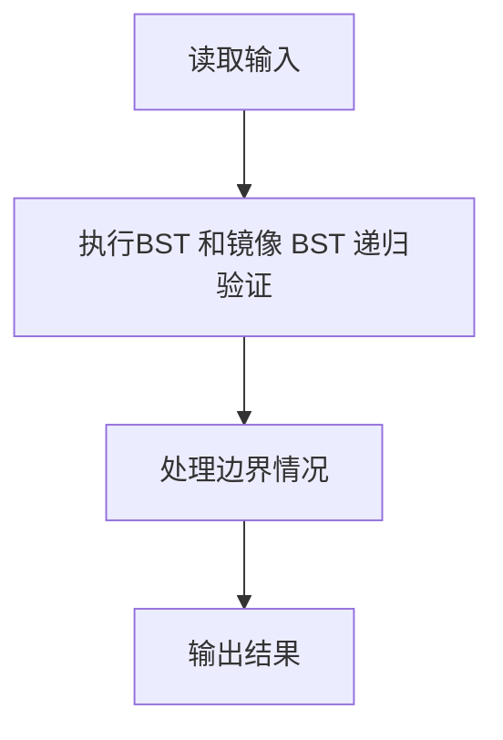
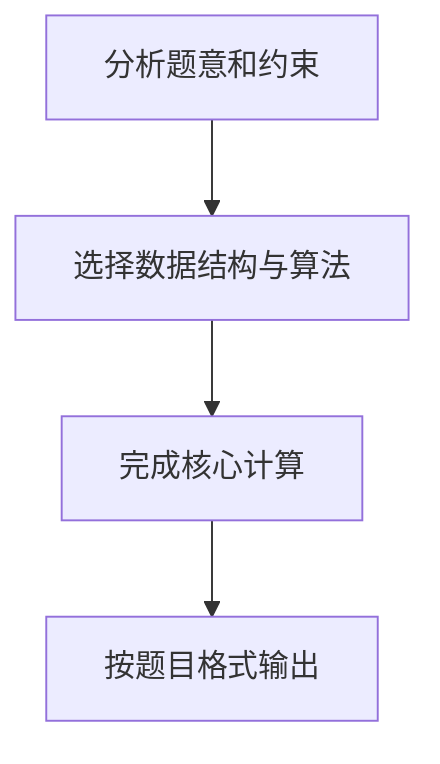

## 7-28 查找树判断

- **分值：** 25分

## 题目描述

对于二叉查找树，我们规定任一结点的左子树仅包含严格小于该结点的键值，而其右子树包含大于或等于该结点的键值。如果我们交换每个节点的左子树和右子树，得到的树叫做镜像二叉查找树。

现在我们给出一个整数键值序列，请编写程序判断该序列是否为某棵二叉查找树或某镜像二叉查找树的前序遍历序列，如果是，则输出对应二叉树的后序遍历序列。

## 输入格式

输入的第一行包含一个正整数 n（\le 1000），第二行包含 n 个整数，为给出的整数键值序列，数字间以空格分隔。

## 输出格式

输出的第一行首先给出判断结果，如果输入的序列是某棵二叉查找树或某镜像二叉查找树的前序遍历序列，则输出`YES`，否侧输出`NO`。如果判断结果是`YES`，下一行输出对应二叉树的后序遍历序列。数字间以空格分隔，但行尾不能有多余的空格。

## 输入样例1
```
7
8 6 5 7 10 8 11
```

## 输出样例1
```
YES
5 7 6 8 11 10 8
```

## 输入样例2
```
7
8 6 8 5 10 9 11
```

## 输出样例2
```
NO
```

## 解题思路

本题采用BST 和镜像 BST 递归验证，围绕题目给出的数据结构和约束完成核心计算，并处理边界情况。

## 代码流程说明

1. 读取题目规定的输入数据。
2. 使用BST 和镜像 BST 递归验证完成主要处理。
3. 处理边界情况并整理结果。
4. 按指定格式输出结果。

## 代码实现


```c
/*
 * 实现过程：
 * 本题判断给定整数序列是否为某棵二叉查找树（BST）或其镜像树的前序遍历序列，
 * 若是则输出对应二叉树的后序遍历序列，否则输出NO。采用"不建树直接递归划分"的方法。
 *
 * BST定义（本题规定）：
 * - 左子树仅包含严格小于该结点的键值
 * - 右子树包含大于或等于该结点的键值
 * 镜像BST：交换每个结点的左右子树后得到的树。
 *
 * 核心思路（利用前序遍历特性）：
 * 前序遍历序列形如：根 左子树 右子树
 * - 对BST：根之后先是一段"全部<根"的左子树，再是一段"全部>=根"的右子树
 * - 对镜像BST：根之后先是一段"全部>=根"的子树（原右子树），再是一段"全部<根"的子树（原左子树）
 * 据此可在序列上直接递归划分，无需真正建树。
 *
 * 判断过程（对区间[l,r)）：
 * 1. 区间为空 → 直接返回成功
 * 2. 取pre[l]为根，按BST/镜像规则找到左右子树分界点
 * 3. 校验分界点之后的所有元素都满足右子树的取值约束，不满足则该方案失败
 * 4. 递归处理左子树区间和右子树区间
 * 5. 递归返回后将根追加到后序序列（后序：左 右 根）
 *
 * 主流程：
 * - 先尝试按BST判断，成功则输出YES及后序序列
 * - 否则尝试按镜像BST判断，成功则输出YES及后序序列
 * - 都失败则输出NO
 *
 * 关键点：
 * - 无需建树，直接在原序列上做区间递归，空间和时间效率高。
 * - 后序序列在递归回溯时自然生成（左→右→根）。
 */

#include <stdio.h>   // 引入标准输入输出库

#define MAXN 1010    // 定义最大元素个数，留少量余量

int pre[MAXN];       // 存放前序遍历序列
int post[MAXN];      // 存放后序遍历序列
int postCnt;         // 后序序列当前长度（元素个数）

/* 判断区间[l,r)是否为合法BST前序序列，合法则把后序结果追加到post，返回1；否则返回0 */
int checkBST(int l, int r) {
    if (l >= r) return 1;            // 区间为空，视为合法
    int root = pre[l];               // 取区间首元素为根
    int i = l + 1;                   // 从根的下一个位置开始找右子树起点
    while (i < r && pre[i] < root) i++; // 跳过所有严格小于根的元素（左子树）
    int mid = i;                     // mid为左右子树分界点（右子树起点）
    while (i < r && pre[i] >= root) i++; // 校验右子树元素都>=根
    if (i != r) return 0;            // 右子树中存在不满足>=根的元素，方案失败
    if (!checkBST(l + 1, mid)) return 0; // 递归校验左子树区间，失败则整体失败
    if (!checkBST(mid, r)) return 0;     // 递归校验右子树区间，失败则整体失败
    post[postCnt++] = root;          // 左右子树处理完毕，将根追加到后序序列末尾
    return 1;                        // 本区间合法
}

/* 判断区间[l,r)是否为合法镜像BST前序序列，合法则把后序结果追加到post，返回1；否则返回0 */
int checkMirror(int l, int r) {
    if (l >= r) return 1;            // 区间为空，视为合法
    int root = pre[l];               // 取区间首元素为根
    int i = l + 1;                   // 从根的下一个位置开始找右子树起点
    while (i < r && pre[i] >= root) i++; // 镜像树中"左子树"对应原右子树，元素>=根
    int mid = i;                     // mid为左右子树分界点
    while (i < r && pre[i] < root) i++;  // 校验"右子树"（原左子树）元素都<根
    if (i != r) return 0;            // 存在不满足<根的元素，方案失败
    if (!checkMirror(l + 1, mid)) return 0; // 递归校验左子树区间
    if (!checkMirror(mid, r)) return 0;     // 递归校验右子树区间
    post[postCnt++] = root;          // 将根追加到后序序列末尾
    return 1;                        // 本区间合法
}

int main() {                         // 主函数
    int n;                           // 序列元素个数
    scanf("%d", &n);                 // 读取n
    for (int i = 0; i < n; i++)      // 读取n个整数构成前序序列
        scanf("%d", &pre[i]);        // 存入pre数组
    postCnt = 0;                     // 重置后序序列长度为0
    if (checkBST(0, n)) {            // 先尝试按BST判断
        printf("YES\n");             // 合法则输出YES
        for (int i = 0; i < postCnt; i++) // 依次输出后序序列
            printf("%d%c", post[i], i == postCnt - 1 ? '\n' : ' '); // 行尾无多余空格
    } else {                         // BST方案失败
        postCnt = 0;                 // 重置后序序列长度，准备尝试镜像方案
        if (checkMirror(0, n)) {     // 再尝试按镜像BST判断
            printf("YES\n");         // 合法则输出YES
            for (int i = 0; i < postCnt; i++) // 依次输出后序序列
                printf("%d%c", post[i], i == postCnt - 1 ? '\n' : ' '); // 行尾无多余空格
        } else {                     // 两种方案都失败
            printf("NO\n");          // 输出NO
        }
    }
    return 0;                        // 程序正常结束
}
```

## 代码流程图



## 解题流程图


