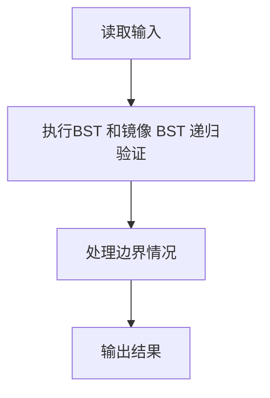
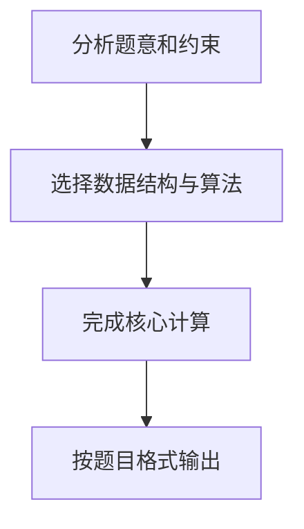

## 7-28 查找树判断

- **分值：** 25分

## 题目描述

对于二叉查找树，我们规定任一结点的左子树仅包含严格小于该结点的键值，而其右子树包含大于或等于该结点的键值。如果我们交换每个节点的左子树和右子树，得到的树叫做镜像二叉查找树。

现在我们给出一个整数键值序列，请编写程序判断该序列是否为某棵二叉查找树或某镜像二叉查找树的前序遍历序列，如果是，则输出对应二叉树的后序遍历序列。

## 输入格式

输入的第一行包含一个正整数 n（\le 1000），第二行包含 n 个整数，为给出的整数键值序列，数字间以空格分隔。

## 输出格式

输出的第一行首先给出判断结果，如果输入的序列是某棵二叉查找树或某镜像二叉查找树的前序遍历序列，则输出`YES`，否侧输出`NO`。如果判断结果是`YES`，下一行输出对应二叉树的后序遍历序列。数字间以空格分隔，但行尾不能有多余的空格。

## 输入样例1
```
7
8 6 5 7 10 8 11
```

## 输出样例1
```
YES
5 7 6 8 11 10 8
```

## 输入样例2
```
7
8 6 8 5 10 9 11
```

## 输出样例2
```
NO
```

## 解题思路

本题采用BST 和镜像 BST 递归验证，围绕题目给出的数据结构和约束完成核心计算，并处理边界情况。

## 代码流程说明

1. 读取题目规定的输入数据。
2. 使用BST 和镜像 BST 递归验证完成主要处理。
3. 处理边界情况并整理结果。
4. 按指定格式输出结果。

## 代码实现


```javascript
const fs = require("fs");
const raw = fs.readFileSync(0, "utf8");
const tokens = raw.trim() ? raw.trim().split(/\s+/) : [];
let at = 0;

// 递归按根切分前序序列：普通 BST 左侧 < 根、右侧 >= 根，镜像规则相反。
const n = Number(tokens[at++]),
  values = Array.from({ length: n }, () => Number(tokens[at++]));
function parse(sequence, mirror, postorder) {
  if (!sequence.length) return true;
  const root = sequence[0];
  let split = 1;
  const goesLeft = (value) => (mirror ? value > root : value < root);
  while (split < sequence.length && goesLeft(sequence[split])) split++;
  for (let i = split; i < sequence.length; i++)
    if (goesLeft(sequence[i])) return false;
  if (!parse(sequence.slice(1, split), mirror, postorder)) return false;
  if (!parse(sequence.slice(split), mirror, postorder)) return false;
  postorder.push(root);
  return true;
}
let postorder = [];
let ok = parse(values, false, postorder);
if (!ok) {
  postorder = [];
  ok = parse(values, true, postorder);
}
console.log(ok ? `YES\n${postorder.join(" ")}` : "NO");
```

## 代码流程图



## 解题流程图


