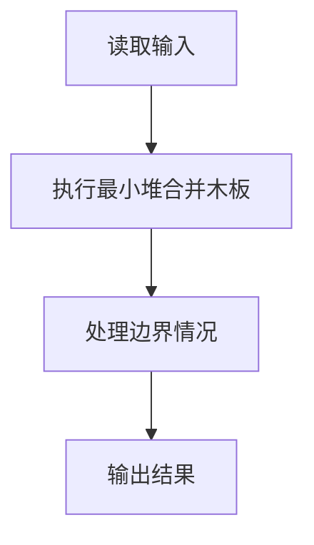
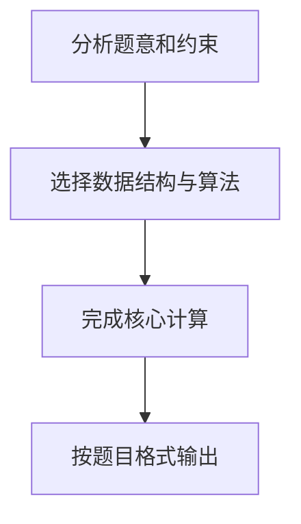

农夫要修理牧场的一段栅栏，他测量了栅栏，发现需要 *n* 块木头，每块木头长度为整数 $L_i$ 个长度单位，于是他购买了一条很长的、能锯成 *n* 块的木头，即该木头的长度是 $L_i$ 的总和。

但是农夫自己没有锯子，请人锯木的酬金跟这段木头的长度成正比。为简单起见，不妨就设酬金等于所锯木头的长度。例如，要将长度为 20 的木头锯成长度为 8、7 和 5 的三段，第一次锯木头花费 20，将木头锯成 12 和 8；第二次锯木头花费 12，将长度为 12 的木头锯成 7 和 5，总花费为 32。如果第一次将木头锯成 15 和 5，则第二次锯木头花费 15，总花费为 35（大于 32）。

请编写程序帮助农夫计算将木头锯成 *n* 块的最少花费。

## 输入格式

输入首先给出正整数 *n*（$\leq 10^4$），表示要将木头锯成 *n* 块。第二行给出 *n* 个正整数（$\leq 50$），表示每段木块的长度。

## 输出格式

输出一个整数，即将木头锯成 *n* 块的最少花费。

## 输入样例

```
8
4 5 1 2 1 3 1 1
```

## 输出样例

```
49
```

## 解题思路

本题采用最小堆合并木板，围绕题目给出的数据结构和约束完成核心计算，并处理边界情况。

## 代码流程说明

1. 读取题目规定的输入数据。
2. 使用最小堆合并木板完成主要处理。
3. 处理边界情况并整理结果。
4. 按指定格式输出结果。

## 代码实现


```c
/*
 * 实现原理（Huffman 编码 / 最优合并问题）：
 *
 * 问题描述：农夫需要将一根长木头锯成 n 块指定长度的小木头，每次锯木头的
 * 花费等于被锯木头的长度。求最小总花费。
 *
 * 解法思路：
 * - 该问题等价于"最优合并问题"，核心思想源自 Huffman 树（哈夫曼树）。
 * - 每次选择当前最短的两块木头进行合并（即锯开），花费为两者长度之和。
 * - 重复此过程直到只剩一块木头，累加每次合并的花费即为最小总花费。
 * - 使用最小堆（MinHeap）可以高效地每次取出最小的两个元素。
 *
 * 举例说明（输入样例：4 5 1 2 1 3 1 1）：
 *   初始：1,1,1,1,2,3,4,5
 *   ① 合并1+1=2 → 1,1,2,2,3,4,5    花费2
 *   ② 合并1+2=3 → 2,3,3,4,5         花费3
 *   ③ 合并2+3=5 → 3,4,5,5           花费5
 *   ④ 合并3+4=7 → 5,5,7             花费7
 *   ⑤ 合并5+5=10 → 7,10             花费10
 *   ⑥ 合并7+10=17 → 17              花费17
 *   总花费 = 2+3+5+7+10+17 = 49
 */

#include <stdio.h>
#include <stdlib.h>

// 最小堆结构体
typedef struct {
    int *data;      // 存储堆元素的数组，下标从1开始
    int size;       // 当前堆中元素个数
    int capacity;   // 堆的最大容量
} MinHeap;

// 创建容量为 capacity 的最小堆
MinHeap *createHeap(int capacity) {
    MinHeap *heap = (MinHeap *)malloc(sizeof(MinHeap));
    heap->data = (int *)malloc((capacity + 1) * sizeof(int)); // 多分配1个，下标从1开始
    heap->size = 0;
    heap->capacity = capacity;
    return heap;
}

// 向最小堆中插入元素 val
void push(MinHeap *heap, int val) {
    // 将新元素放到堆的末尾
    heap->data[++heap->size] = val;
    int i = heap->size;
    // 向上调整：如果当前节点比父节点小，则交换
    while (i > 1 && heap->data[i] < heap->data[i / 2]) {
        int temp = heap->data[i];
        heap->data[i] = heap->data[i / 2];
        heap->data[i / 2] = temp;
        i /= 2; // 上移到父节点位置
    }
}

// 删除并返回堆中的最小元素（堆顶）
int pop(MinHeap *heap) {
    // 取出堆顶元素（最小值）
    int minVal = heap->data[1];
    // 将最后一个元素移到堆顶，堆大小减1
    heap->data[1] = heap->data[heap->size--];

    // 向下调整：恢复最小堆性质
    int i = 1;
    while (2 * i <= heap->size) {            // 存在左孩子
        int child = 2 * i;                   // 左孩子下标
        // 如果右孩子存在且比左孩子小，则选择右孩子
        if (child < heap->size && heap->data[child + 1] < heap->data[child]) {
            child++;
        }
        // 如果当前节点已经比最小的子节点小，则调整结束
        if (heap->data[i] <= heap->data[child]) {
            break;
        }
        // 交换当前节点与较小的子节点
        int temp = heap->data[i];
        heap->data[i] = heap->data[child];
        heap->data[child] = temp;
        i = child; // 下移到子节点位置
    }

    return minVal;
}

int main() {
    int n;
    // 读取木头块数
    scanf("%d", &n);

    // 创建最小堆
    MinHeap *heap = createHeap(n);

    // 读取 n 块木头的长度，并插入最小堆
    for (int i = 0; i < n; i++) {
        int val;
        scanf("%d", &val);
        push(heap, val);
    }

    // 总花费，使用 long long 防止溢出
    long long total_cost = 0;

    // 每次取出最小的两块合并，直到只剩一块
    while (heap->size > 1) {
        int a = pop(heap);   // 取出最短的一块
        int b = pop(heap);   // 取出次短的一块
        int cost = a + b;    // 合并花费
        total_cost += cost;  // 累加到总花费
        push(heap, cost);    // 将合并后的长度放回堆中
    }

    // 输出最小总花费
    printf("%lld\n", total_cost);

    // 释放动态分配的内存
    free(heap->data);
    free(heap);

    return 0;
}
```

## 代码流程图



## 解题流程图


