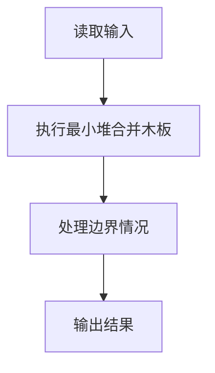
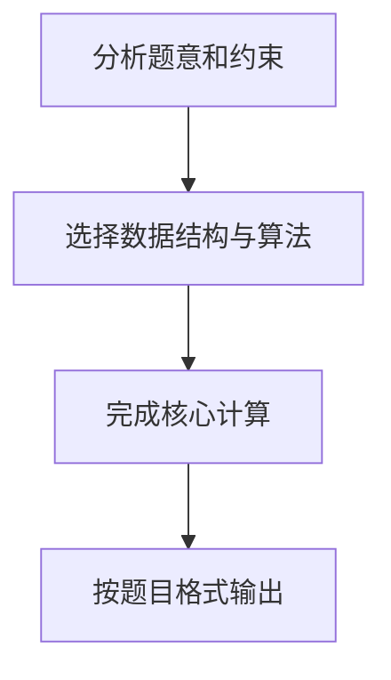

## 7-29 修理牧场

- **分值：** 25分

## 题目描述

农夫要修理牧场的一段栅栏，他测量了栅栏，发现需要 n 块木头，每块木头长度为整数 l_i 个长度单位，于是他购买了一条很长的、能锯成 n 块的木头，即该木头的长度是 l_i 的总和。

但是农夫自己没有锯子，请人锯木的酬金跟这段木头的长度成正比。为简单起见，不妨就设酬金等于所锯木头的长度。例如，要将长度为 20 的木头锯成长度为 8、7 和 5 的三段，第一次锯木头花费 20，将木头锯成 12 和 8；第二次锯木头花费 12，将长度为 12 的木头锯成 7 和 5，总花费为 32。如果第一次将木头锯成 15 和 5，则第二次锯木头花费 15，总花费为 35（大于 32）。

请编写程序帮助农夫计算将木头锯成 n 块的最少花费。

## 输入格式

输入首先给出正整数 n（\le 10^4），表示要将木头锯成 n 块。第二行给出 n 个正整数（\le 50），表示每段木块的长度。

## 输出格式

输出一个整数，即将木头锯成 n 块的最少花费。

## 输入样例
```
8
4 5 1 2 1 3 1 1
```

## 输出样例
```
49
```

## 解题思路

本题采用最小堆合并木板，围绕题目给出的数据结构和约束完成核心计算，并处理边界情况。

## 代码流程说明

1. 读取题目规定的输入数据。
2. 使用最小堆合并木板完成主要处理。
3. 处理边界情况并整理结果。
4. 按指定格式输出结果。

## 代码实现


```javascript
const fs = require("fs");
const raw = fs.readFileSync(0, "utf8");
const tokens = raw.trim() ? raw.trim().split(/\s+/) : [];
let at = 0;

// 每次合并当前最短的两段，符合 Huffman 合并原则并得到最小总费用。
const n = Number(tokens[at++]),
  heap = [];
function push(value) {
  heap.push(value);
  let i = heap.length - 1;
  while (i > 0) {
    const parent = (i - 1) >> 1;
    if (heap[parent] <= heap[i]) break;
    [heap[parent], heap[i]] = [heap[i], heap[parent]];
    i = parent;
  }
}
function pop() {
  const value = heap[0],
    last = heap.pop();
  if (heap.length) {
    heap[0] = last;
    for (let i = 0; ; ) {
      let child = i * 2 + 1;
      if (child >= heap.length) break;
      if (child + 1 < heap.length && heap[child + 1] < heap[child]) child++;
      if (heap[i] <= heap[child]) break;
      [heap[i], heap[child]] = [heap[child], heap[i]];
      i = child;
    }
  }
  return value;
}
for (let i = 0; i < n; i++) push(Number(tokens[at++]));
let answer = 0;
while (heap.length > 1) {
  const merged = pop() + pop();
  answer += merged;
  push(merged);
}
console.log(answer.toString());
```

## 代码流程图



## 解题流程图


