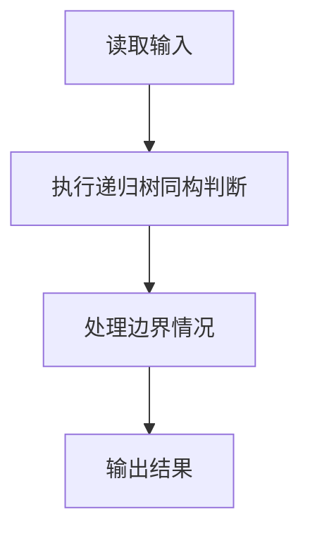
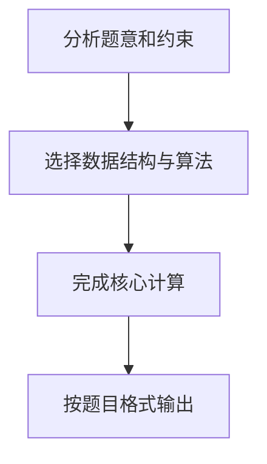

## 7-3 树的同构

- **分值：** 25分

## 题目描述

给定两棵树  T_1 和 T_2。如果 T_1 可以通过若干次左右孩子互换就变成 T_2，则我们称两棵树是“同构”的。例如图1给出的两棵树就是同构的，因为我们把其中一棵树的结点A、B、G的左右孩子互换后，就得到另外一棵树。而图2就不是同构的。

| 图1 | 图2 |
| :--: | :--: |
|  |  |

现给定两棵树，请你判断它们是否是同构的。

## 输入格式

输入给出2棵二叉树的信息。对于每棵树，首先在一行中给出一个非负整数 n (\le 10)，即该树的结点数（此时假设结点从 0 到 n -1 编号）；随后 n 行，第 i 行对应编号第 i 个结点，给出该结点中存储的 1 个英文大写字母、其左孩子结点的编号、右孩子结点的编号。如果孩子结点为空，则在相应位置上给出 “-”。给出的数据间用一个空格分隔。注意：题目保证每个结点中存储的字母是不同的。

## 输出格式

如果两棵树是同构的，输出“Yes”，否则输出“No”。

## 输入样例1（对应图1）
```
8
A 1 2
B 3 4
C 5 -
D - -
E 6 -
G 7 -
F - -
H - -
8
G - 4
B 7 6
F - -
A 5 1
H - -
C 0 -
D - -
E 2 -
```

## 输出样例1
```
Yes
```

## 输入样例2（对应图2）
```
8
B 5 7
F - -
A 0 3
C 6 -
H - -
D - -
G 4 -
E 1 -
8
D 6 -
B 5 -
E - -
H - -
C 0 2
G - 3
F - -
A 1 4
```

## 输出样例2
```
No
```

## 解题思路

本题采用递归树同构判断，围绕题目给出的数据结构和约束完成核心计算，并处理边界情况。

## 代码流程说明

1. 读取题目规定的输入数据。
2. 使用递归树同构判断完成主要处理。
3. 处理边界情况并整理结果。
4. 按指定格式输出结果。

## 代码实现


```javascript
const fs = require("fs");
const raw = fs.readFileSync(0, "utf8");
const tokens = raw.trim() ? raw.trim().split(/\s+/) : [];
let at = 0;

// 先根据孩子编号找根，再递归比较两棵树的结构和结点字符。
function readTree() {
  const n = Number(tokens[at++]);
  if (!n) return null;
  const nodes = Array.from({ length: n }, () => ({
    value: "",
    left: -1,
    right: -1,
  }));
  const child = Array(n).fill(false);
  for (let i = 0; i < n; i++) {
    nodes[i].value = tokens[at++];
    const left = tokens[at++],
      right = tokens[at++];
    nodes[i].left = left === "-" ? -1 : Number(left);
    nodes[i].right = right === "-" ? -1 : Number(right);
    if (nodes[i].left >= 0) child[nodes[i].left] = true;
    if (nodes[i].right >= 0) child[nodes[i].right] = true;
  }
  return { nodes, root: child.findIndex((x) => !x) };
}
function same(a, ia, b, ib) {
  if (ia < 0 || ib < 0) return ia === ib;
  if (a.nodes[ia].value !== b.nodes[ib].value) return false;
  return (
    same(a, a.nodes[ia].left, b, b.nodes[ib].left) &&
    same(a, a.nodes[ia].right, b, b.nodes[ib].right)
  );
}
const a = readTree(),
  b = readTree();
console.log(same(a, a.root, b, b.root) ? "Yes" : "No");
```

## 代码流程图



## 解题流程图


