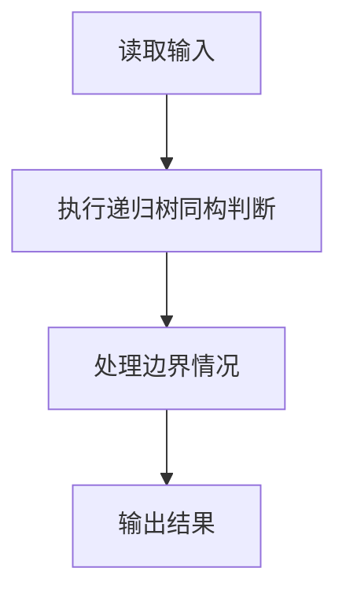
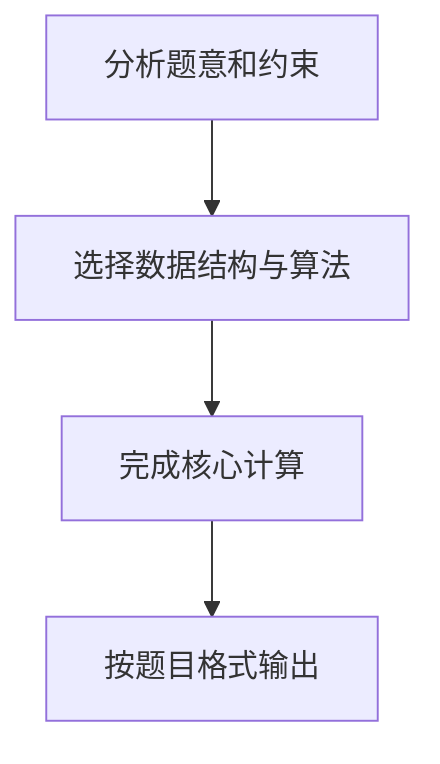

## 7-3 树的同构

- **分值：** 25分

## 题目描述

给定两棵树  T_1 和 T_2。如果 T_1 可以通过若干次左右孩子互换就变成 T_2，则我们称两棵树是“同构”的。例如图1给出的两棵树就是同构的，因为我们把其中一棵树的结点A、B、G的左右孩子互换后，就得到另外一棵树。而图2就不是同构的。

| 图1 | 图2 |
| :--: | :--: |
|  |  |

现给定两棵树，请你判断它们是否是同构的。

## 输入格式

输入给出2棵二叉树的信息。对于每棵树，首先在一行中给出一个非负整数 n (\le 10)，即该树的结点数（此时假设结点从 0 到 n -1 编号）；随后 n 行，第 i 行对应编号第 i 个结点，给出该结点中存储的 1 个英文大写字母、其左孩子结点的编号、右孩子结点的编号。如果孩子结点为空，则在相应位置上给出 “-”。给出的数据间用一个空格分隔。注意：题目保证每个结点中存储的字母是不同的。

## 输出格式

如果两棵树是同构的，输出“Yes”，否则输出“No”。

## 输入样例1（对应图1）
```
8
A 1 2
B 3 4
C 5 -
D - -
E 6 -
G 7 -
F - -
H - -
8
G - 4
B 7 6
F - -
A 5 1
H - -
C 0 -
D - -
E 2 -
```

## 输出样例1
```
Yes
```

## 输入样例2（对应图2）
```
8
B 5 7
F - -
A 0 3
C 6 -
H - -
D - -
G 4 -
E 1 -
8
D 6 -
B 5 -
E - -
H - -
C 0 2
G - 3
F - -
A 1 4
```

## 输出样例2
```
No
```

## 解题思路

本题采用递归树同构判断，围绕题目给出的数据结构和约束完成核心计算，并处理边界情况。

## 代码流程说明

1. 读取题目规定的输入数据。
2. 使用递归树同构判断完成主要处理。
3. 处理边界情况并整理结果。
4. 按指定格式输出结果。

## 代码实现


```c
/*
 * 实现过程：
 * 本题判断两棵二叉树是否同构，采用"静态数组存储 + 递归比较"的方法。
 *
 * 数据结构：
 * - 用结构体数组存储树，每个节点包含 data、left、right 三个字段。
 * - left/right 存储孩子在数组中的下标，-1（Null）表示空。
 * - 根节点通过"入度法"确定：遍历所有节点，未被任何节点指向的即为根。
 *
 * 同构判断算法（递归）：
 * 1. 两节点都为空 → 同构。
 * 2. 一个空一个非空 → 不同构。
 * 3. 两节点数据不同 → 不同构。
 * 4. 两节点左孩子都为空 → 只需递归比较右孩子。
 * 5. 两节点左孩子都存在且左孩子数据相同 → 不交换，左对左、右对右递归比较。
 * 6. 否则 → 交换左右子树，左对右、右对左递归比较。
 *
 * 关键思想：
 * - 同构允许左右子树交换，因此当左孩子数据不匹配时，
 *   需要尝试将一棵树的左右子树交换后再比较。
 */

#include <stdio.h> // 引入标准输入输出库，用于 scanf 和 printf 函数
#define MAXN 10 // 定义常量 MAXN 为 10，表示树中节点的最大数量（题目限制）
#define Null -1 // 定义常量 Null 为 -1，表示空节点（表示某个孩子不存在时的哨兵值）

typedef struct TreeNode { // 定义结构体类型 TreeNode，用于表示树的每个节点
    char data; // 节点存储的数据（字符类型）
    int left, right; // 左孩子的索引、右孩子的索引（都是数组下标，-1 表示空）
} Tree; // 给结构体起别名为 Tree

Tree T1[MAXN], T2[MAXN]; // 定义两个全局数组 T1 和 T2，分别存放两棵树的节点数据

int buildTree(Tree T[]) { // 定义函数 buildTree，从标准输入读入一棵树，构建到数组 T 中，返回根节点索引
    int n, i, root = Null; // 声明变量：n 为节点总数，i 为循环计数器，root 用于记录根节点索引，初始为 Null
    char cl, cr; // 用于存储左、右孩子的字符形式（可能是数字字符或 '-'）
    scanf("%d", &n); // 从输入读取节点总数 n
    if (n == 0) return Null; // 如果 n 为 0，说明是空树，直接返回 Null
    int check[MAXN] = {0}; // 定义 check 数组用于标记哪些节点是其他节点的孩子（标记为 1 表示是某个节点的孩子），初始均为 0
    for (i = 0; i < n; i++) { // 循环 n 次，依次读取每个节点的数据及其孩子
        scanf(" %c %c %c", &T[i].data, &cl, &cr); // 读取当前节点的数据、左孩子字符、右孩子字符（格式前加空格跳过空白字符）
        if (cl != '-') { // 如果左孩子字符不是 '-'，说明存在左孩子
            T[i].left = cl - '0'; // 将字符数字转换为整型索引，存入 T[i].left
            check[T[i].left] = 1; // 标记该节点为某个节点的孩子，不可能是根
        } else { // 否则（左孩子字符是 '-'）
            T[i].left = Null; // 左孩子为空，设置为 Null
        }
        if (cr != '-') { // 如果右孩子字符不是 '-'，说明存在右孩子
            T[i].right = cr - '0'; // 将字符数字转换为整型索引，存入 T[i].right
            check[T[i].right] = 1; // 标记该节点为某个节点的孩子，不可能是根
        } else { // 否则（右孩子字符是 '-'）
            T[i].right = Null; // 右孩子为空，设置为 Null
        }
    }
    for (i = 0; i < n; i++) { // 遍历所有节点，找出根节点
        if (check[i] == 0) { // 如果某个节点未被标记为孩子，说明它是根节点
            root = i; // 记录根节点索引
            break; // 找到即可退出循环
        }
    }
    return root; // 返回根节点索引
}

int isomorphic(int r1, int r2) { // 定义递归函数 isomorphic，判断以 r1 为根的树与以 r2 为根的树是否同构
    if (r1 == Null && r2 == Null) return 1; // 两个节点均为空，结构相同，返回 1（真）
    if ((r1 == Null) != (r2 == Null)) return 0; // 一个空一个非空，结构不同，返回 0（假）
    if (T1[r1].data != T2[r2].data) return 0; // 两节点的数据不相同，结构不同，返回 0（假）
    if (T1[r1].left == Null && T2[r2].left == Null) // 两个节点的左孩子均为空
        return isomorphic(T1[r1].right, T2[r2].right); // 只需比较右孩子是否同构
    if (T1[r1].left != Null && T2[r2].left != Null && // 两个节点的左孩子都存在且
        T1[T1[r1].left].data == T2[T2[r2].left].data) // 左孩子的数据相同
        return isomorphic(T1[r1].left, T2[r2].left) && // 则按原样比较：左对左，右对右
               isomorphic(T1[r1].right, T2[r2].right);
    else // 否则（左孩子不都存在或左孩子数据不匹配）
        return isomorphic(T1[r1].left, T2[r2].right) && // 尝试交换左右子树比较：左对右
               isomorphic(T1[r1].right, T2[r2].left); // 右对左
}

int main() { // 主函数，程序入口
    int r1, r2; // 声明两棵树的根节点索引
    r1 = buildTree(T1); // 调用 buildTree 构建第一棵树，存入 T1，返回根索引 r1
    r2 = buildTree(T2); // 调用 buildTree 构建第二棵树，存入 T2，返回根索引 r2
    if (isomorphic(r1, r2)) // 调用 isomorphic 判断两棵树是否同构
        printf("Yes\n"); // 若同构则输出 Yes
    else // 否则
        printf("No\n"); // 输出 No
    return 0; // 程序正常结束
}
```

## 代码流程图



## 解题流程图


