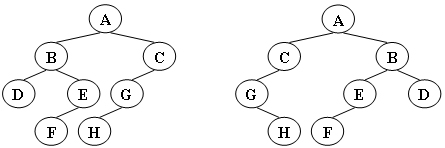
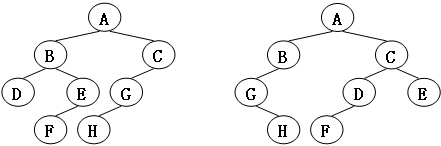

给定两棵树 T₁ 和 T₂。如果 T₁ 可以通过若干次左右孩子互换就变成 T₂，则我们称两棵树是"同构"的。例如图1给出的两棵树就是同构的，因为我们把其中一棵树的结点 A、B、G 的左右孩子互换后，就得到另外一棵树。而图2就不是同构的。

图1

图2

现给定两棵树，请你判断它们是否是同构的。


输入格式:
输入给出 2 棵二叉树的信息。对于每棵树，首先在一行中给出一个非负整数 n (≤10)，即该树的结点数（此时假设结点从 0 到 n−1 编号）；随后 n 行，第 i 行对应编号第 i 个结点，给出该结点中存储的 1 个英文大写字母、其左孩子结点的编号、右孩子结点的编号。如果孩子结点为空，则在相应位置上给出 "-"。给出的数据间用一个空格分隔。注意：题目保证每个结点中存储的字母是不同的。

输出格式:
如果两棵树是同构的，输出"Yes"，否则输出"No"。

输入样例1（对应图1）：
```in
8
A 1 2
B 3 4
C 5 -
D - -
E 6 -
G 7 -
F - -
H - -
8
G - 4
B 7 6
F - -
A 5 1
H - -
C 0 -
D - -
E 2 -
```
输出样例1:
```out
Yes
```
输入样例2（对应图2）：
```in
8
B 5 7
F - -
A 0 3
C 6 -
H - -
D - -
G 4 -
E 1 -
8
D 6 -
B 5 -
E - -
H - -
C 0 2
G - 3
F - -
A 1 4
```
输出样例2:
```out
No
```
