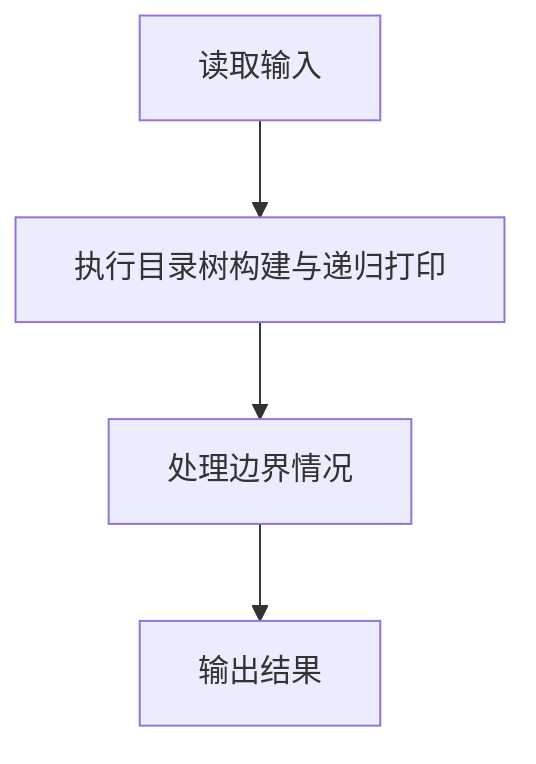
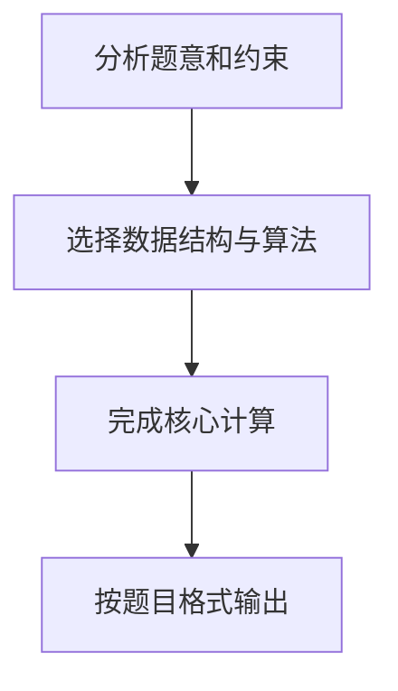

## 7-30 目录树

- **分值：** 30分

## 题目描述

在ZIP归档文件中，保留着所有压缩文件和目录的相对路径和名称。当使用WinZIP等GUI软件打开ZIP归档文件时，可以从这些信息中重建目录的树状结构。请编写程序实现目录的树状结构的重建工作。

## 输入格式

输入首先给出正整数N（\le 10^4），表示ZIP归档文件中的文件和目录的数量。随后N行，每行有如下格式的文件或目录的相对路径和名称（每行不超过260个字符）：

- 路径和名称中的字符仅包括英文字母（区分大小写）；
- 符号“\”仅作为路径分隔符出现；
- 目录以符号“\”结束；
- 不存在重复的输入项目；
- 整个输入大小不超过2MB。

## 输出格式

假设所有的路径都相对于root目录。从root目录开始，在输出时每个目录首先输出自己的名字，然后以字典序输出所有子目录，然后以字典序输出所有文件。注意，在输出时，应根据目录的相对关系使用空格进行缩进，每级目录或文件比上一级多缩进2个空格。

## 输入样例
```
7
b
c\
ab\cd
a\bc
ab\d
a\d\a
a\d\z\
```

## 输出样例
```
root
  a
    d
      z
      a
    bc
  ab
    cd
    d
  c
  b
```

## 解题思路

本题采用目录树构建与递归打印，围绕题目给出的数据结构和约束完成核心计算，并处理边界情况。

## 代码流程说明

1. 读取题目规定的输入数据。
2. 使用目录树构建与递归打印完成主要处理。
3. 处理边界情况并整理结果。
4. 按指定格式输出结果。

## 代码实现


```javascript
const fs = require("fs");
const raw = fs.readFileSync(0, "utf8");
const tokens = raw.trim() ? raw.trim().split(/\s+/) : [];
let at = 0;

// Map 让每一级目录只创建一次；目录和文件分别排序后递归打印。
class Dir {
  constructor(name) {
    this.name = name;
    this.dirs = new Map();
    this.files = [];
  }
}
const n = Number(tokens[at++]),
  root = new Dir("root");
for (let i = 0; i < n; i++) {
  const path = tokens[at++],
    isDir = path.endsWith("\\"),
    parts = path.replace(/\\$/, "").split("\\");
  let node = root;
  for (let j = 0; j < parts.length - (isDir ? 0 : 1); j++) {
    if (!node.dirs.has(parts[j])) node.dirs.set(parts[j], new Dir(parts[j]));
    node = node.dirs.get(parts[j]);
  }
  if (!isDir) node.files.push(parts.at(-1));
}
const out = ["root"];
function print(node, depth) {
  for (const child of [...node.dirs.values()].sort((a, b) =>
    a.name.localeCompare(b.name),
  )) {
    out.push(`${"  ".repeat(depth)}${child.name}`);
    print(child, depth + 1);
  }
  for (const file of node.files.sort())
    out.push(`${"  ".repeat(depth)}${file}`);
}
print(root, 1);
console.log(out.join("\n"));
```

## 代码流程图



## 解题流程图


