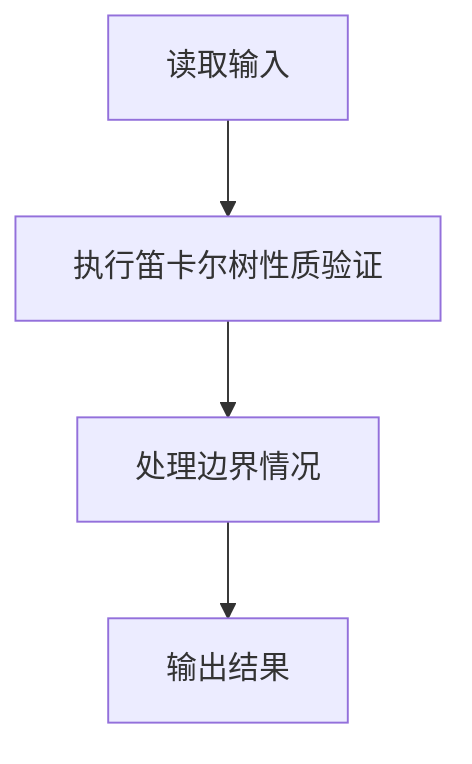
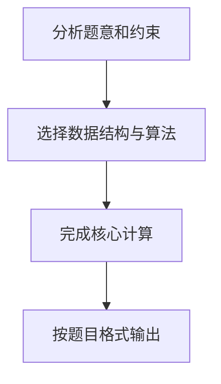

# 7-31 笛卡尔树

## 题目描述

笛卡尔树（Cartesian Tree）是一种特殊的二叉树，其每个结点包含两个关键字 `k1` 和 `k2`。笛卡尔树需要同时满足以下两个性质：

1. **二叉查找树性质**（以 `k1` 为关键字）：对于任意结点，其左子树中所有结点的 `k1` 值均小于该结点的 `k1` 值，右子树中所有结点的 `k1` 值均大于该结点的 `k1` 值。
2. **最小堆性质**（以 `k2` 为关键字）：对于任意结点，其 `k2` 值不大于其子树中所有结点的 `k2` 值。

给定一棵二叉树，请判断该树是否是一棵笛卡尔树。

## 输入格式

第一行给出正整数 `N`（≤ 1000），为树中结点的个数。

随后 `N` 行，每行给出一个结点的信息，格式为：

```
k1 k2 left right
```

其中 `k1` 和 `k2` 为该结点的两个关键字值，`left` 为左孩子结点编号，`right` 为右孩子结点编号。结点编号从 `0` 到 `N-1`。若某结点不存在孩子结点，则对应位置给出 `-1`。

## 输出格式

如果该树是一棵笛卡尔树，输出 `YES`；否则输出 `NO`。

## 样例

### 样例1

**输入：**
```
6
8 27 5 1
9 40 -1 -1
10 20 0 3
12 21 -1 4
15 22 -1 -1
5 35 -1 -1
```

**输出：**
```
YES
```

### 样例2

**输入：**
```
6
8 27 5 1
9 40 -1 -1
10 20 0 3
12 11 -1 4
15 22 -1 -1
50 35 -1 -1
```

**输出：**
```
NO
```

## 解题思路

1. **找根结点**：用一个数组标记每个结点是否作为某个结点的孩子出现过，没有作为孩子出现过的结点即为根。如果根不唯一或不存在，则不是树。
2. **验证 BST 性质**：对 `k1` 进行中序遍历，遍历序列必须严格递增（注意题目要求左子树值严格小于根，右子树值严格大于根）。
3. **验证最小堆性质**：遍历每个结点，若其 `k2` 值大于左孩子或右孩子的 `k2` 值，则不满足最小堆性质。

三个条件全部满足才是笛卡尔树。

## 代码流程说明

1. 读取题目规定的输入数据。
2. 使用笛卡尔树性质验证完成主要处理。
3. 处理边界情况并整理结果。
4. 按指定格式输出结果。

## 代码实现


```c
/*
 * ============================================================
 * 题目：7-31 笛卡尔树（Cartesian Tree）
 * 语言：C
 * ============================================================
 *
 * 【实现原理】
 *
 * 笛卡尔树需要同时满足两个性质：
 *   1. 二叉查找树（BST）性质 —— 以 k1 为关键字，左子树所有 k1 < 根 k1 < 右子树所有 k1
 *   2. 最小堆性质          —— 以 k2 为关键字，父结点 k2 <= 子结点 k2
 *
 * 判断算法分为三步：
 *
 *   Step 1 — 找根结点
 *     用一个数组 hasParent[] 标记每个结点是否被其他结点作为孩子引用过。
 *     没有被任何结点作为孩子引用过的结点即为根。
 *     如果根的数量不是恰好 1 个，说明输入不构成一棵合法的二叉树。
 *
 *   Step 2 — 验证 BST 性质
 *     BST 的中序遍历序列是严格递增的。
 *     对整棵树进行中序遍历，依次收集每个结点的 k1 值，
 *     然后检查这个序列是否严格递增（即每个元素 > 前一个元素）。
 *
 *   Step 3 — 验证最小堆性质
 *     递归遍历每个结点，检查父结点的 k2 值是否 <= 其左右孩子结点的 k2 值。
 *     如果任意位置违反，则不满足最小堆性质。
 *
 * 以上三个条件全部满足，才输出 YES，否则输出 NO。
 *
 * 时间复杂度：O(N)，空间复杂度：O(N)。
 */

#include <stdio.h>   /* 标准输入输出：scanf, printf */
#include <stdlib.h>  /* 标准库 */
#include <string.h>  /* 字符串操作：memset */

/* 最大结点数，题目保证 N <= 1000 */
#define MAXN 1000

/* 树结点结构体：两个关键字 k1、k2，以及左右孩子编号 */
typedef struct {
    int k1, k2;      /* 结点关键字 */
    int left, right; /* 左右孩子编号，-1 表示空 */
} Node;

Node tree[MAXN];           /* 存储所有结点的数组 */
int hasParent[MAXN];       /* hasParent[i] = 1 表示编号 i 的结点有父结点 */
int inorderSeq[MAXN];      /* 中序遍历收集的 k1 值序列 */
int idx;                   /* inorderSeq 的当前写入下标 */

/*
 * 中序遍历函数
 * 按照 "左子树 -> 根 -> 右子树" 的顺序遍历，
 * 将每个结点的 k1 值依次存入 inorderSeq[]。
 */
void inorder(int root) {
    if (root == -1) return;                 /* 空结点，直接返回 */
    inorder(tree[root].left);               /* 递归遍历左子树 */
    inorderSeq[idx++] = tree[root].k1;      /* 记录当前根结点的 k1 值 */
    inorder(tree[root].right);              /* 递归遍历右子树 */
}

/*
 * 检查最小堆性质
 * 对于每个结点，其 k2 值必须 <= 孩子结点的 k2 值。
 * 返回 1 表示满足，0 表示不满足。
 */
int checkMinHeap(int root) {
    if (root == -1) return 1;               /* 空结点，视为满足 */
    int l = tree[root].left;                /* 左孩子编号 */
    int r = tree[root].right;               /* 右孩子编号 */
    if (l != -1 && tree[root].k2 > tree[l].k2) return 0; /* 违反最小堆 */
    if (r != -1 && tree[root].k2 > tree[r].k2) return 0; /* 违反最小堆 */
    return checkMinHeap(l) && checkMinHeap(r); /* 递归检查子树 */
}

int main() {
    int n, i;

    /* 读取结点个数 N */
    scanf("%d", &n);

    /* 特殊情况：空树视为笛卡尔树 */
    if (n == 0) {
        printf("YES\n");
        return 0;
    }

    /* 初始化父结点标记数组为全 0 */
    memset(hasParent, 0, sizeof(hasParent));

    /* 读取每个结点的信息 */
    for (i = 0; i < n; i++) {
        scanf("%d %d %d %d",
              &tree[i].k1, &tree[i].k2,
              &tree[i].left, &tree[i].right);
        /* 如果该结点有左孩子，标记左孩子有父结点 */
        if (tree[i].left != -1) hasParent[tree[i].left] = 1;
        /* 如果该结点有右孩子，标记右孩子有父结点 */
        if (tree[i].right != -1) hasParent[tree[i].right] = 1;
    }

    /* ========== Step 1：找根结点 ========== */
    int root = -1;                          /* 根结点编号，初始化为 -1 */
    for (i = 0; i < n; i++) {
        if (!hasParent[i]) {                /* 结点 i 没有父结点 */
            if (root != -1) {               /* 发现第二个根 → 不是合法二叉树 */
                printf("NO\n");
                return 0;
            }
            root = i;                       /* 记录根结点编号 */
        }
    }
    if (root == -1) {                       /* 所有结点都有父结点 → 存在环 */
        printf("NO\n");
        return 0;
    }

    /* ========== Step 2：验证 BST 性质 ========== */
    idx = 0;                                /* 重置中序遍历序列下标 */
    inorder(root);                          /* 从根开始中序遍历 */
    for (i = 1; i < n; i++) {
        if (inorderSeq[i] <= inorderSeq[i - 1]) { /* 非严格递增 → 不是 BST */
            printf("NO\n");
            return 0;
        }
    }

    /* ========== Step 3：验证最小堆性质 ========== */
    if (!checkMinHeap(root)) {              /* 不满足最小堆性质 */
        printf("NO\n");
        return 0;
    }

    /* 三项检查全部通过，是笛卡尔树 */
    printf("YES\n");
    return 0;
}
```

## 代码流程图



## 解题流程图


