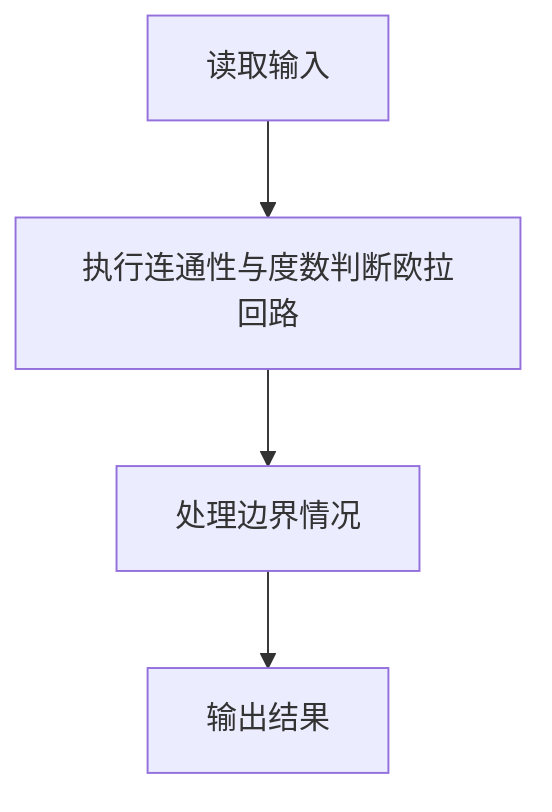
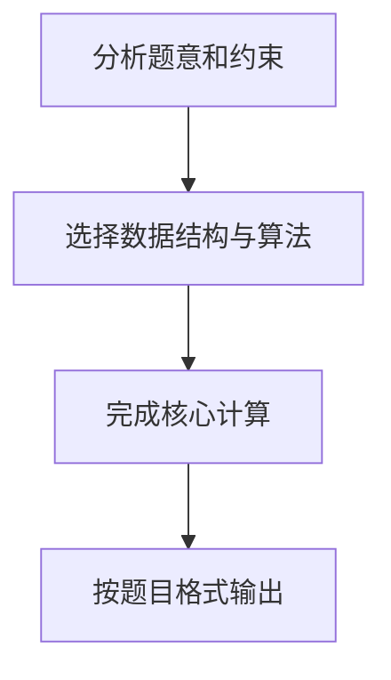

## 7-32 哥尼斯堡的“七桥问题”

- **分值：** 25分

## 题目描述

哥尼斯堡是位于普累格河上的一座城市，它包含两个岛屿及连接它们的七座桥，如下图所示。


可否走过这样的七座桥，而且每桥只走过一次？瑞士数学家欧拉(Leonhard Euler，1707—1783)最终解决了这个问题，并由此创立了拓扑学。

这个问题如今可以描述为判断欧拉回路是否存在的问题。欧拉回路是指不令笔离开纸面，可画过图中每条边仅一次，且可以回到起点的一条回路。现给定一个无向图，问是否存在欧拉回路？

## 输入格式

输入第一行给出两个正整数，分别是节点数 n （1\le n\le 1000）和边数 m；随后的 m 行对应 m 条边，每行给出一对正整数，分别是该条边直接连通的两个节点的编号（节点从1到 n 编号）。

## 输出格式

若欧拉回路存在则输出 1，否则输出 0。

## 输入样例1
```
6 10
1 2
2 3
3 1
4 5
5 6
6 4
1 4
1 6
3 4
3 6
```

## 输出样例1
```
1
```

## 输入样例2
```
5 8
1 2
1 3
2 3
2 4
2 5
5 3
5 4
3 4
```

## 输出样例2
```
0
```

## 解题思路

本题采用连通性与度数判断欧拉回路，围绕题目给出的数据结构和约束完成核心计算，并处理边界情况。

## 代码流程说明

1. 读取题目规定的输入数据。
2. 使用连通性与度数判断欧拉回路完成主要处理。
3. 处理边界情况并整理结果。
4. 按指定格式输出结果。

## 代码实现


```c
/*
 * 实现原理：
 * 无向图存在欧拉回路的充要条件：
 * 1. 图连通：所有度数 > 0 的节点必须在同一个连通分量中（孤立节点忽略）。
 * 2. 所有节点的度数均为偶数。
 *
 * 算法设计：
 * - 使用并查集（Union-Find / DSU）维护节点的连通关系。
 * - 使用 degree 数组记录每个节点的度数。
 * - 读入所有边：每读入一条边 (u, v)，degree[u]++、degree[v]++，并将 u 和 v 合并。
 * - 遍历所有节点：找到第一个 degree > 0 的节点作为连通分量代表，
 *   然后检查其余 degree > 0 的节点是否与之连通。
 * - 同时检查所有节点的 degree 是否为偶数。
 * - 两个条件都满足则输出 1，否则输出 0。
 */

#include <stdio.h>   // 标准输入输出：scanf, printf

#define MAXN 1002    // 节点数 n <= 1000，开 1002 留有余量

int parent[MAXN];    // parent[i]：节点 i 的父节点（并查集）
int degree[MAXN];    // degree[i]：节点 i 的度数

// 并查集初始化：每个节点自成一个集合
void init(int n) {
    int i;
    for (i = 1; i <= n; i++) {   // 节点编号从 1 到 n
        parent[i] = i;            // 父节点初始为自己（自环）
        degree[i] = 0;            // 度数初始为 0
    }
}

// 查找 x 所在集合的根节点（带路径压缩）
int find(int x) {
    if (parent[x] != x)                    // 若 x 不是根节点
        parent[x] = find(parent[x]);       // 递归找根，并将 x 直接挂到根下（路径压缩）
    return parent[x];                       // 返回根节点
}

// 合并 a 和 b 所在的集合
void unite(int a, int b) {
    int ra = find(a);                      // 找到 a 的根
    int rb = find(b);                      // 找到 b 的根
    if (ra != rb)                          // 若不在同一集合
        parent[ra] = rb;                   // 将 ra 的父节点设为 rb（合并）
}

int main() {
    int n, m;                              // n：节点数，m：边数
    scanf("%d %d", &n, &m);                // 读入 n 和 m

    init(n);                               // 初始化并查集和度数数组

    int i;
    for (i = 0; i < m; i++) {             // 读入 m 条边
        int u, v;
        scanf("%d %d", &u, &v);            // 读入边的两个端点
        degree[u]++;                       // u 的度数加 1
        degree[v]++;                       // v 的度数加 1
        unite(u, v);                       // 将 u 和 v 合并到同一连通分量
    }

    // 找到第一个度数 > 0 的节点作为连通分量的代表
    int root = -1;                         // root 记录连通分量的代表根
    for (i = 1; i <= n; i++) {
        if (degree[i] > 0) {               // 找到第一个有边的节点
            root = find(i);                // 以其所在连通分量的根为代表
            break;                         // 找到即退出
        }
    }

    // 条件 1：检查所有度数 > 0 的节点是否都在同一连通分量中
    int connected = 1;                     // 连通标志，默认连通
    for (i = 1; i <= n; i++) {
        if (degree[i] > 0 && find(i) != root) { // 若有度数的节点不属于同一个根
            connected = 0;                 // 说明图不连通
            break;                         // 提前退出
        }
    }

    // 条件 2：检查所有节点的度数是否均为偶数
    int all_even = 1;                      // 偶数度数标志，默认全部偶数
    for (i = 1; i <= n; i++) {
        if (degree[i] % 2 != 0) {          // 若某节点的度数为奇数
            all_even = 0;                  // 不满足欧拉回路条件
            break;                         // 提前退出
        }
    }

    // 两个条件都满足则存在欧拉回路
    if (connected && all_even)
        printf("1\n");                     // 存在欧拉回路
    else
        printf("0\n");                     // 不存在欧拉回路

    return 0;                              // 程序正常结束
}
```

## 代码流程图



## 解题流程图


